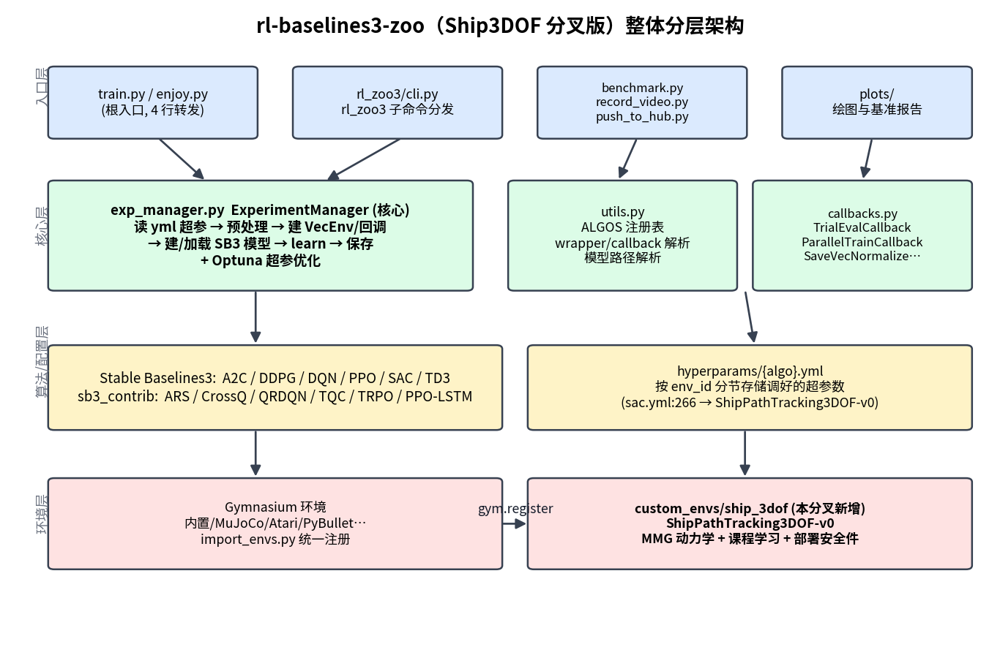
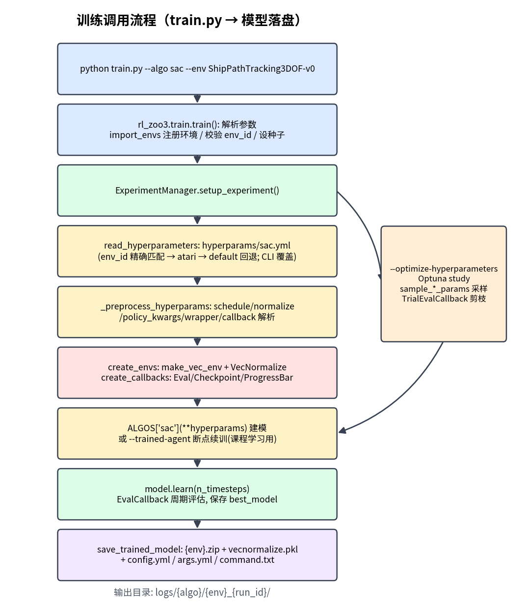
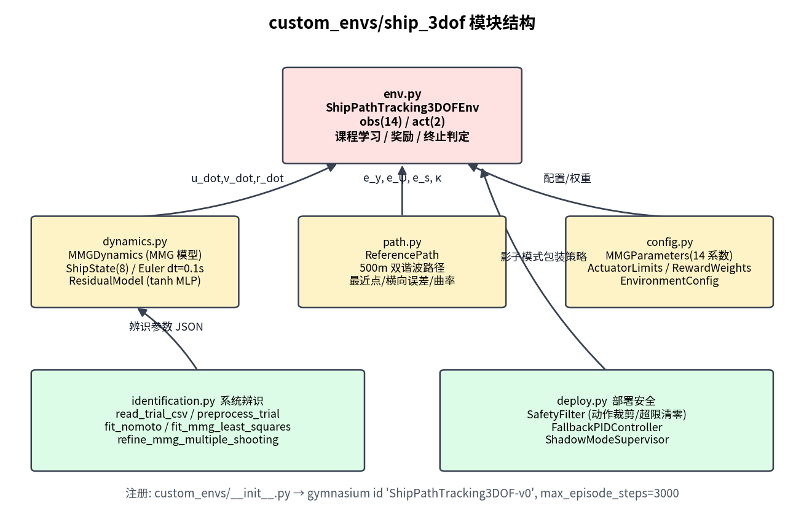
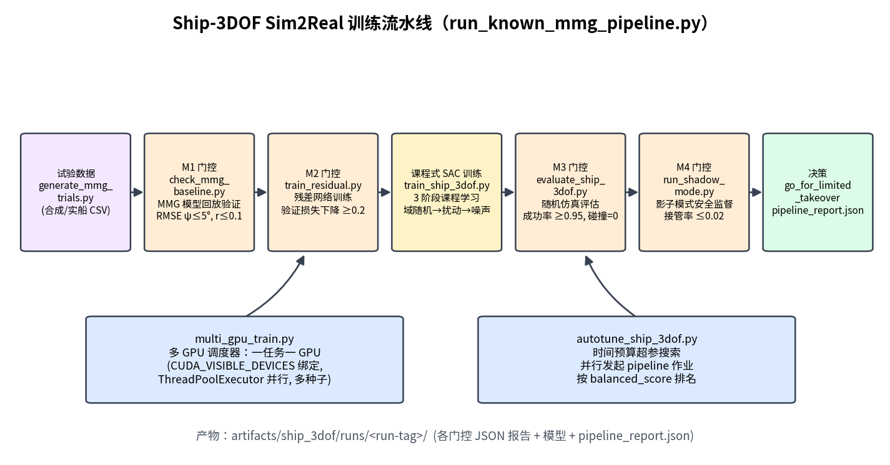
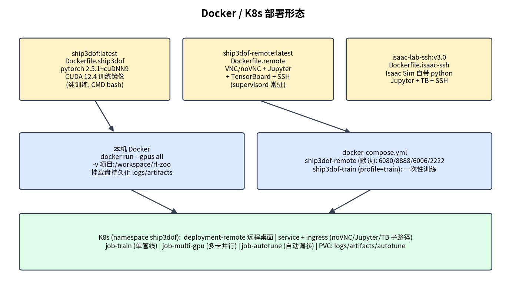

# RL-Baselines3-Zoo（Ship3DOF 分叉版）代码设计文档

> 版本：基于上游 rl-baselines3-zoo `2.9.1`（`rl_zoo3/version.txt`）
> 适用读者：需要理解、二次开发或部署本工程的算法/平台工程师
> 配套图表：`figures/` 目录下 5 张架构图，由 `generate_figures.py` 生成

---

## 1. 项目概述

本工程是 DLR-RM **rl-baselines3-zoo** 的分叉（fork）。上游是一个基于 **Stable Baselines3（SB3, >=2.9,<3.0）** 的强化学习训练框架，提供：训练（train）、评估回放（enjoy）、超参数优化（Optuna）、绘图、录像、HuggingFace Hub 上传/下载等能力。

本分叉在其之上新增了**船舶三自由度（3-DOF）路径跟踪**业务线：

- 自定义 Gymnasium 环境 `ShipPathTracking3DOF-v0`（`custom_envs/ship_3dof/`），基于 MMG 船舶操纵性模型；
- 一套 **Sim2Real 训练流水线**（`scripts/ship_3dof/`）：系统辨识 → 残差网络 → 课程式 SAC 训练 → 多级门控评估 → 影子模式安全验证；
- **多 GPU 并行调度**与**自主超参搜索**（autotune）；
- 完整的 **Docker / docker-compose / K8s** 部署设施（`docker/`、`k8s/`）。

上游 rl_zoo3 包本身只做了一处策略性改造：对 `sb3_contrib`、`optuna`、`huggingface_sb3` 等可选依赖全部改为 try/except 优雅降级（上游为硬导入），保证最小依赖下核心训练可用。

---

## 2. 整体架构

工程可分为四层：入口层 → 核心层（ExperimentManager）→ 算法/配置层 → 环境层。



### 2.1 顶层目录结构

```
rl-baselines3-zoo/
├── train.py / enjoy.py        # 根入口（仅 4 行，转发到 rl_zoo3.train/enjoy）
├── rl_zoo3/                   # 核心框架包（与上游同构）
│   ├── cli.py                 # `rl_zoo3` 命令行分发（train/enjoy/plot_*）
│   ├── train.py / enjoy.py    # 训练 / 评估主逻辑
│   ├── exp_manager.py         # ★ 核心：ExperimentManager（约 1080 行）
│   ├── utils.py               # ALGOS 注册表、wrapper/回调解析、模型路径解析
│   ├── callbacks.py           # 自定义回调（Optuna 剪枝、并行训练等）
│   ├── hyperparams_opt.py     # 各算法 Optuna 采样器
│   ├── wrappers.py            # 通用 env wrapper 集合
│   ├── import_envs.py         # 第三方/自定义环境的统一注册入口
│   ├── gym_patches.py         # TimeLimit.truncated 语义补丁
│   └── plots/                 # 基准绘图（rliable）
├── hyperparams/               # 各算法调好的超参数 yml（按 env_id 分节）
├── custom_envs/               # ★ 分叉新增：自定义环境包
│   └── ship_3dof/             #   船舶 3DOF 路径跟踪环境
├── scripts/
│   └── ship_3dof/             # ★ 分叉新增：训练流水线/多 GPU/调参脚本
├── docker/                    # ★ Dockerfile 变体 + entrypoint + supervisord
├── k8s/                       # ★ K8s 清单（Job/Deployment/Ingress/PVC）
├── tests/                     # pytest（含 test_ship_3dof_env.py）
├── logs_pipeline/             # 训练输出（rl_zoo3 标准目录布局）
├── logs_multi_gpu/            # 多 GPU 作业输出
└── artifacts/ship_3dof/       # 流水线产物（报告 JSON、模型、辨识参数）
```

### 2.2 入口与 CLI 接线

- 根目录 `train.py` / `enjoy.py` 只是转发器，实际逻辑在 `rl_zoo3/train.py:train()` 与 `rl_zoo3/enjoy.py:enjoy()`；
- `setup.py` 注册 console script `rl_zoo3 = rl_zoo3.cli:main`，`rl_zoo3/cli.py` 按 `sys.argv[1]` 分发到 `train / enjoy / plot_train / plot_from_file / all_plots` 子命令；
- 打包时 `setup.py` 会把 `hyperparams/` 临时拷贝进 `rl_zoo3/hyperparams` 作为包数据，使 pip 安装后仍能读到默认超参。

---

## 3. 核心框架设计（rl_zoo3）

### 3.1 模块职责

| 文件 | 职责 |
|---|---|
| `rl_zoo3/train.py` | `train()`：argparse 解析 → 校验 env 注册 → 种子/线程 → 可选 wandb → 构造 `ExperimentManager` → `setup_experiment()` → `learn()` + `save_trained_model()`（或转 Optuna 优化） |
| `rl_zoo3/exp_manager.py` | **核心类 `ExperimentManager`**：配置读取、超参预处理、环境/回调/模型创建、保存、Optuna 优化 |
| `rl_zoo3/utils.py` | `ALGOS` 注册表；`get_wrapper_class()`（从 yml 字符串解析 wrapper）；`create_test_env()`；`linear_schedule`；`get_model_path()`（final/best/checkpoint 解析）；`StoreDict`（CLI `key:value` → dict，值用 `eval` 解析） |
| `rl_zoo3/callbacks.py` | `TrialEvalCallback`（Optuna 评估+剪枝）、`SaveVecNormalizeCallback`、`ParallelTrainCallback`（SAC/TQC 收集与训练双线程）、`RawStatisticsCallback` |
| `rl_zoo3/hyperparams_opt.py` | 每算法一个 `sample_*_params(trial, ...)` 采样器，`HYPERPARAMS_SAMPLER` 映射 |
| `rl_zoo3/enjoy.py` | 模型路径解析（本地缺失且目录含 `rl-trained-agents` 时自动从 HF Hub 下载）→ 恢复 env_kwargs/normalize → 手动 rollout 统计 |
| `rl_zoo3/import_envs.py` | 逐个尝试 import 第三方环境包完成注册（pybullet、highway_env、**custom_envs** 等） |
| `rl_zoo3/wrappers.py` | `TruncatedOnSuccessWrapper`、`ActionNoiseWrapper`、`ActionSmoothingWrapper`、`HistoryWrapper`、`MaskVelocityWrapper` 等 |

支持的算法（`utils.py:58 ALGOS`）：SB3 的 A2C / DDPG / DQN / PPO / SAC / TD3，加 sb3_contrib 的 ARS / CrossQ / QRDQN / TQC / TRPO / PPO-LSTM（sb3_contrib 缺失时自动剔除，属分叉的容错改动）。

### 3.2 训练调用流程

一次 `python train.py --algo sac --env ShipPathTracking3DOF-v0` 的完整调用链：



关键步骤（均位于 `exp_manager.py`）：

1. `ExperimentManager.__init__`（:140）：确定配置路径（默认 `hyperparams/{algo}.yml`）、VecEnv 类型（dummy/subproc）、日志目录 `{log_folder}/{algo}/{env}_{run_id+1}`；
2. `read_hyperparameters()`（:401）：按 **env_id 精确匹配 → `atari` → `default`** 的顺序回退查找 yml 节；可被 Optuna trial 或 `--hyperparams` CLI 覆盖；
3. `_preprocess_hyperparams()`（:512）：把 yml 中的字符串还原为对象——schedule、`policy_kwargs`（`eval`）、`env_wrapper`/`callback`（类路径字符串）、`normalize` 等，并剔除非构造函数参数键；
4. `create_envs()`（:737）：`make_vec_env` + wrapper 链 + `VecNormalize` + 可选 `VecFrameStack`；
5. `create_callbacks()`（:637）：EvalCallback（周期评估并存 `best_model`）、CheckpointCallback、可选 ProgressBar；
6. 建模：`ALGOS[algo](env=..., **hyperparams)` 新建，或 `--trained-agent` 断点续训（课程学习各阶段靠它串联）；
7. `learn()`（:316）：调 SB3 `model.learn()`，捕获 `KeyboardInterrupt` 仍能保存现场；
8. `save_trained_model()`（:356）：落盘 `{env}.zip`、`vecnormalize.pkl`、可选 replay buffer；此前 `_save_config()` 已写入 `config.yml / args.yml / command.txt`，保证实验完全可复现。

### 3.3 超参数配置机制

`hyperparams/{algo}.yml` 顶层按 env_id 分节。本工程在 `hyperparams/sac.yml:266` 为船舶环境配置了专用节：

```yaml
ShipPathTracking3DOF-v0:
  n_timesteps: !!float 5e6
  policy: "MlpPolicy"
  normalize: "{'norm_obs': True, 'norm_reward': False}"
  learning_rate: !!float 3e-4
  buffer_size: 1000000
  batch_size: 256
  gamma: 0.99
  tau: 0.005
  ent_coef: "auto"
  train_freq: 4
  gradient_steps: 4
  learning_starts: 5000
  use_sde: True
  policy_kwargs: "dict(net_arch=[256, 256])"
```

特殊键的处理规则：

- `normalize`：bool 或 dict 字符串，控制 `VecNormalize`；
- `env_wrapper` / `vec_env_wrapper` / `callback`：类路径字符串或带 kwargs 的 dict 列表，由 `utils.get_wrapper_class()` 动态导入实例化；
- `policy_kwargs`、schedule 字符串：在预处理阶段 `eval` 还原；
- `noise_type/noise_std`、`frame_stack`、`n_envs`、`env_kwargs`：框架消费后不传给算法构造函数。

自定义脚本（如 `train_ship_3dof.py`）通过 `-params/--hyperparams key:value` 与 `--env-kwargs` 在 CLI 层覆盖 yml 值（`StoreDict` 解析），实现"一套 yml 基线 + 脚本化覆盖"的配置策略。

---

## 4. 自定义环境：custom_envs/ship_3dof

### 4.1 模块结构



环境经 `custom_envs/__init__.py` 注册：

```python
gymnasium.register(
    id="ShipPathTracking3DOF-v0",
    entry_point="custom_envs.ship_3dof.env:ShipPathTracking3DOFEnv",
    max_episode_steps=3000,
)
```

`rl_zoo3/import_envs.py` 在训练启动时 `import custom_envs` 触发注册，因此标准 CLI `--env ShipPathTracking3DOF-v0` 直接可用。

### 4.2 环境接口（env.py）

**动作空间** `Box(-1, 1, (2,))`：

| 维度 | 物理量 | 映射 |
|---|---|---|
| a0 | 舵角速率指令 | `dot_delta_cmd = a0 * 4°/s` |
| a1 | 主机转速速率指令 | `dot_n_cmd = a1 * 2.0 rpm/s` |

**观测空间** `Box(-5, 5, (14,))`——14 维归一化信号（按 `DEFAULT_OBS_SCALE` 缩放并裁剪到 ±5）：

`e_y`（横向偏差）、`e_psi`（航向偏差）、`e_s`（沿路径剩余距离）、`u, v, r`（纵荡/横荡/艏摇速度）、`beta`（漂角）、`delta`（舵角）、`n`（转速）、`dot_delta_prev, dot_n_prev`（上一步动作）、`kappa_l`（局部路径曲率）、`d_u_hat, d_v_hat`（带估计噪声的流扰估计）。

### 4.3 动力学（dynamics.py）

`ShipState` 含 8 个状态：`x, y, psi, u, v, r, delta, n`。`MMGDynamics._forces` 实现 MMG 风格多项式模型（14 个水动力系数见 `config.py:MMGParameters`）：

```
X = x_u·u + x_uu·|u|·u + x_n·n·|n|
Y = y_v·v + y_r·r + y_vv·|v|·v + y_delta·u²·δ
N = n_v·v + n_r·r + n_rr·|r|·r + n_delta·u²·δ
```

加速度由力除以质量/惯量（`m_u=35, m_v=45, i_z=18`）并叠加科氏项与残差：

```
u_dot = X/m_u + r·v + res[0]
v_dot = Y/m_v − r·u + res[1]
r_dot = N/i_z + res[2]
```

- 积分：显式欧拉，`dt = 0.1 s`；运动学中包含体坐标系流扰 `(d_u, d_v)`；
- 执行器约束：舵角 ±35°、转速 `n ∈ [0, 25]`、速率限幅，阶段 2 引入一阶滞后（lag 0.2 s）；
- `ResidualModel`：tanh MLP `5→64→64→3`（输入 `[u,v,r,delta,n]`），输出经 `[0.08, 0.08, 0.05]·tanh(·)` 缩放后叠加到加速度，用于补偿未建模水动力，权重从 `.npz` 加载；
- `apply_domain_randomization(rng, amplitude)`：每回合对所有 MMG 系数做 ±amplitude 乘性随机化。

### 4.4 参考路径（path.py）

`ReferencePath`：总长 1000 m、离散步长 1 m，x 轴直线叠加两个正弦谐波的横向偏移（幅值 12κL / 6κL，随机相位，κ≈0.0025）。提供带缓存窗口的 `closest_point` 搜索、按路径法线的有符号横向误差、基于 `np.gradient` 的航向/曲率，以及 `y_at_s` 弧长插值（环境出生时对齐路径起点用）。

### 4.5 课程学习（Curriculum）

按回合数自动升阶段（也可 `curriculum_stage` 固定）：

| 阶段 | 回合范围 | MMG 随机化 | 扰动 | 路径曲率 | 其他 |
|---|---|---|---|---|---|
| 0 | <300 | ±3% | 无 | ×0.65 | 紧致初始状态（y_std 0.2 m, ψ_std 1°） |
| 1 | <900 | ±8% | 0.55× | ×0.85 | 放宽初始状态 |
| 2 | ≥900 | ±15% | 全量（含随机游走漂移 ±0.6） | 全量 | 开传感器噪声 + 执行器一阶滞后 |

### 4.6 奖励与终止

```
reward = r_progress − r_track − r_heading − r_smooth − r_energy − r_safety
```

| 项 | 表达式 | 权重来源 |
|---|---|---|
| 进度 | `0.85 · clip(Δs, 0, 1.25)` | `RewardWeights`（config.py:34） |
| 跟踪 | `1.1·|e_y| + 0.35·e_y²` | 同上 |
| 航向 | `0.6·|e_psi| + 0.08·r²` | 同上 |
| 平滑 | `0.03·dot_delta² + 0.015·dot_n²` | 同上 |
| 能耗 | `0.005·n²` | 同上 |
| 安全 | `3.0·碰撞 + 4.0·(|e_y| > 8 出半航道)` | 同上 |

终止：`+50` 到达终点（`s ≥ final_s − 1`）；`−100` 失败（碰撞、`|e_y|>12`、`|r|>1.25`、`u∉[−0.5, 4.0]`、出航道）；截断：`step ≥ 3000`（即 300 s 航程，对应 1000 m 路径）。`info` 暴露 `reward_terms / curriculum_stage / collision / out_of_channel / success`，便于日志分析。

### 4.7 系统辨识与部署安全

- `identification.py`：从试验 CSV（列 `t,x,y,psi,u,v,r,delta,n`）出发的完整辨识链——重采样 + Hampel/Butterworth 预处理 → Nomoto（K,T）最小二乘 → MMG 分力解耦岭回归 → 多重打靶 L-BFGS-B 精修 → 回放验证（RMSE ψ/r、终点误差）；
- `deploy.py`：`SafetyFilter`（动作裁剪到执行器限幅，`|r|` 或 `|e_y|` 超限时动作清零）、`FallbackPIDController`（航向/横偏 PID 兜底）、`ShadowModeSupervisor`（影子模式接管率统计）；
- `accel.py`：`AccelerateCallback`（经 rl_zoo3 `callback` 超参注入，训练启动时启用 TF32 加速；`train_ship_3dof.py` 默认携带）。

---

## 5. 训练流水线（scripts/ship_3dof）

### 5.1 Sim2Real 全流程

`run_known_mmg_pipeline.py` 把整条链串成单命令，并通过 M1–M4 四级门控保证"可上船"：



| 阶段 | 脚本 | 产出 / 门控 |
|---|---|---|
| 试验数据 | `generate_mmg_trials.py` | 用已知参数 MMG 模型滚动生成 zigzag/回转试验 CSV（无实船数据时的引导数据） |
| **M1** | `check_mmg_baseline.py` | 试验数据回放验证模型：`rmse_psi ≤ 5°`、`rmse_r ≤ 0.1` → `mmg_baseline_report.json` |
| **M2** | `train_residual.py` | 训练残差 MLP 拟合模型与数据偏差；验证损失下降 ≥ 0.2（不达标则弃用残差）→ `residual_model.npz` + `residual_metrics.json` |
| 训练 | `train_ship_3dof.py` | 3 阶段课程 SAC：以子进程调根 `train.py`，每阶段用 `--trained-agent` 从上阶段模型热启动；CLI 注入 lr/batch/net_arch(512³) 等 |
| **M3** | `evaluate_ship_3dof.py` | 阶段 2 全难度确定性评估：成功率 ≥ 0.95 且碰撞 = 0 → `eval_metrics.json` |
| **M4** | `run_shadow_mode.py` | 影子模式：策略提议动作，SafetyFilter + 兜底 PID 监督；接管率 ≤ 0.02 且影子碰撞 = 0 → `shadow_mode_report.json` |

门控阈值集中定义在 `scripts/ship_3dof/sim2real_acceptance.json`。流水线最终计算 `balanced_score`（门控加分 + `120·成功率 − 100·碰撞 − 55·出航道 − 80·接管率 − 100·影子碰撞`），输出 `go_for_limited_takeover = M1∧M3∧M4` 决策，全部报告写入 `artifacts/ship_3dof/runs/<run-tag>/pipeline_report.json`。

### 5.2 多 GPU 与自动调参

- `multi_gpu_train.py`：**非数据并行**的任务级调度器——每个作业是独立种子/配置的完整训练，经 `CUDA_VISIBLE_DEVICES` 绑卡、`ThreadPoolExecutor` 并行；`--mode sac|pipeline`，支持 `--jobs-per-gpu`、`--smoke`（20k/20k/30k 步快速验证）；产物在 `logs_multi_gpu/<run-tag>/` 与 `artifacts/ship_3dof/multi_gpu/`；
- `autotune_ship_3dof.py`：按小时预算循环采样超参空间（learning_starts、批量、种子偏移等），并行发起 pipeline 作业，按 `balanced_score` 排名，`optimization_report.py` 输出每轮 markdown 报告与 `autotune_summary.json`；
- Shell 封装：`run_multi_gpu.sh`（宿主机）、`run_multi_gpu_docker.sh`（容器内）、`run_ship3dof_pipeline.sh`（Isaac 容器内用 `/isaac-sim/python.sh` 执行）。

### 5.3 产物目录布局

```
artifacts/ship_3dof/
├── trials/                      # 试验 CSV（zigzag_10_10 / turn_port / turn_starboard）
├── runs/<run-tag>/              # 单次流水线全部报告 + 模型
├── multi_gpu/{runs,run_logs}/   # 多 GPU 作业产物与 summary.json
logs_pipeline/<run-tag>/sac/ShipPathTracking3DOF-v0_{1..N}/   # rl_zoo3 标准训练目录
```

---

## 6. 部署设计



### 6.1 Docker 镜像变体（docker/）

| 镜像 | Dockerfile | 基础镜像 | 用途 |
|---|---|---|---|
| `ship3dof:latest` | `Dockerfile.ship3dof` | `pytorch/pytorch:2.5.1-cuda12.4-cudnn9-runtime` | 纯 GPU 训练（CMD bash；构建期含环境冒烟测试） |
| `ship3dof-remote:latest` | `Dockerfile.remote` | 同上 | 远程开发桌面：XFCE+VNC/noVNC(6080)+Jupyter(8888)+TensorBoard(6006)+SSH(22)，supervisord 常驻 |
| `isaac-lab-ssh:v3.0` | `Dockerfile.isaac-ssh` | 本地 `isaac-lab-base-koopman:v3.0` | Isaac Lab 环境 SSH 开发（无外网依赖） |
| `stablebaselines/rl-baselines3-zoo` | `Dockerfile`（上游） | `stablebaselines/stable-baselines3` | 上游官方镜像 |

`Dockerfile.ship3dof` 的构建要点：先拷 `requirements.txt/setup.py/version.txt` 装依赖吃层缓存，再 `COPY . .` 并二次 `pip install -e . --no-deps`；设 `PYTHONPATH=/workspace/rl-zoo` 使 `custom_envs` 可导入；构建期执行 `gym.make('ShipPathTracking3DOF-v0')` reset/step 冒烟测试。

### 6.2 docker-compose 与 K8s

- 根 `docker-compose.yml`：`ship3dof-remote`（默认 profile，映射 6080/8888/6006/2222，命名卷持久化 logs/artifacts，GPU 预留 + `shm_size: 8gb`）与 `ship3dof-train`（profile=`train`，一次性训练）；
- `k8s/`（namespace `ship3dof`）：`deployment-remote.yaml` 远程桌面常驻；`job-train.yaml` / `job-multi-gpu.yaml` / `job-autotune.yaml` 三种批处理 Job；`service.yaml` + `ingress.yaml` 暴露 noVNC 子域名与 `/jupyter`、`/tensorboard` 子路径；三个 PVC 持久化日志与产物。

### 6.3 挂载盘 Docker 环境（本次新增）

在 `/media/jim/jim_11/rl-zoo3-ship3dof-docker/` 下放置了一套自包含环境：

```
rl-zoo3-ship3dof-docker/
├── Dockerfile            # 与 docker/Dockerfile.ship3dof 等价，构建上下文指向项目根
├── docker-compose.yml    # train / dev / tensorboard 三服务
├── build.sh              # 构建 ship3dof:latest
├── run_dev.sh            # 交互式 GPU 容器
├── run_train.sh          # 一次性训练（默认 PPO smoke，可传参）
├── run_tensorboard.sh    # TensorBoard @ :6006
├── logs_pipeline/        # 训练日志（卷挂载持久化在挂载盘）
└── artifacts/            # 评估产物（同上）
```

特点：镜像构建上下文仍为项目源码目录（避免复制 199MB 源码），日志/产物经卷挂载落到挂载盘，不占用系统盘；源码以卷挂载进入容器，editable 安装使宿主机改代码即时生效。

---

## 7. 测试与质量

- `tests/test_ship_3dof_env.py`：环境冒烟测试——注册、`reset(seed=0)` 观测形状 `(14,)`、`curriculum_stage` 在 info 中、5 步零动作的 API 契约；
- 其余 `tests/`（test_train / test_enjoy / test_wrappers / test_callbacks / test_hyperparams_opt）为上游测试，Makefile 提供 `make pytest`、`make type`（mypy）、`make lint` / `check-codestyle`（ruff）；
- Dockerfile 构建期冒烟测试充当部署回归的第一道防线。

---

## 8. 相对上游的分叉修改清单

1. **`custom_envs/` 整包新增**：船舶 3DOF 环境 + MMG 辨识 + 部署安全件；
2. **`scripts/ship_3dof/` 整目录新增**：M1–M4 门控流水线、多 GPU 调度、autotune；
3. **可选依赖容错化**：`exp_manager.py` / `utils.py` 中 `optuna`、`huggingface_sb3`、`sb3_contrib`、`AsyncEval` 全部 try/except 降级；
4. **部署设施**：`docker/`（3 个自定义镜像变体）、`k8s/`、根 `docker-compose.yml`、`.env.example`、配套 shell 脚本与 Makefile 目标；
5. **配置与文档**：`hyperparams/sac.yml` 新增 `ShipPathTracking3DOF-v0` 节；README 中文化；`docs/guide/ship_3dof_*.md` 用户手册与技术报告；
6. **设计约束**：rl_zoo3 包内文件与上游保持同构——所有业务编排都放在 `scripts/ship_3dof/`，核心训练循环完全复用 `ExperimentManager`，便于后续 rebase 上游更新。

---

## 9. 常用命令速查

```bash
# 本机训练（需先 pip install -e .）
python train.py --algo sac --env ShipPathTracking3DOF-v0 --gym-packages custom_envs

# 完整流水线（M1→M4）
python scripts/ship_3dof/run_known_mmg_pipeline.py

# 多 GPU（示例：2 卡各 1 作业）
GPUS=0,1 MODE=pipeline bash scripts/ship_3dof/run_multi_gpu.sh

# Docker（挂载盘环境）
/media/jim/jim_11/rl-zoo3-ship3dof-docker/build.sh
/media/jim/jim_11/rl-zoo3-ship3dof-docker/run_train.sh --algo sac --env ShipPathTracking3DOF-v0 --gym-packages custom_envs

# 测试
pytest tests/test_ship_3dof_env.py -v
```
