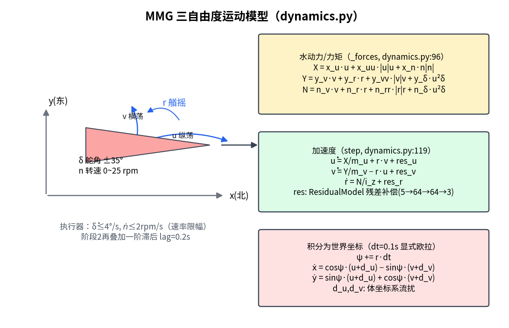
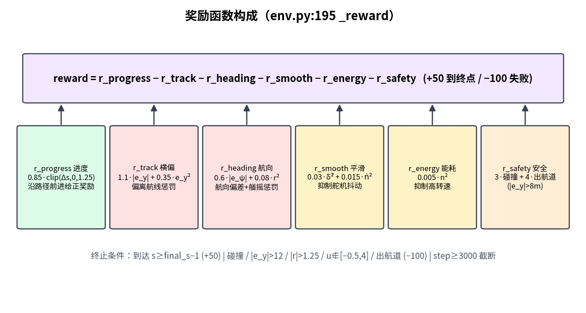
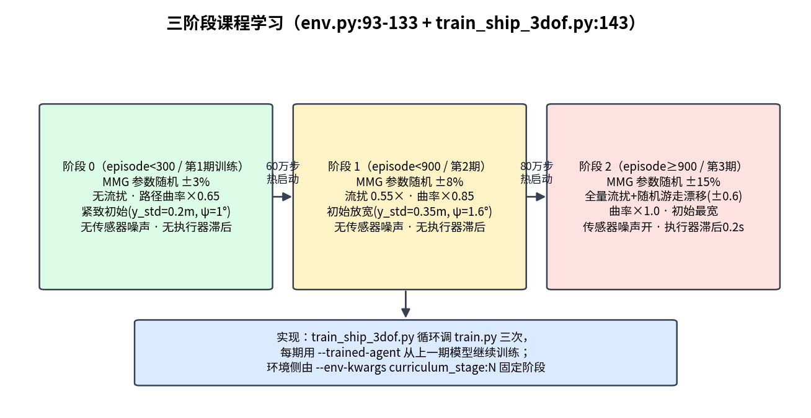
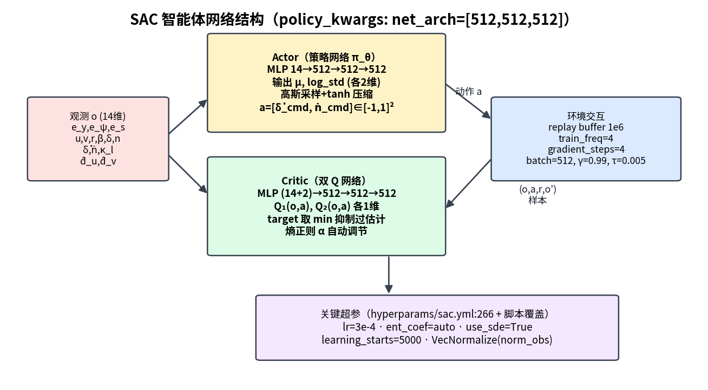
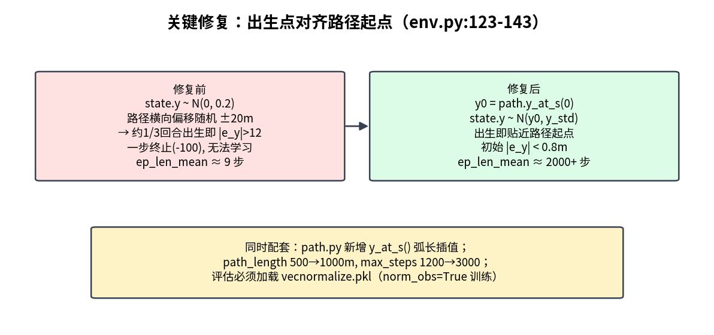
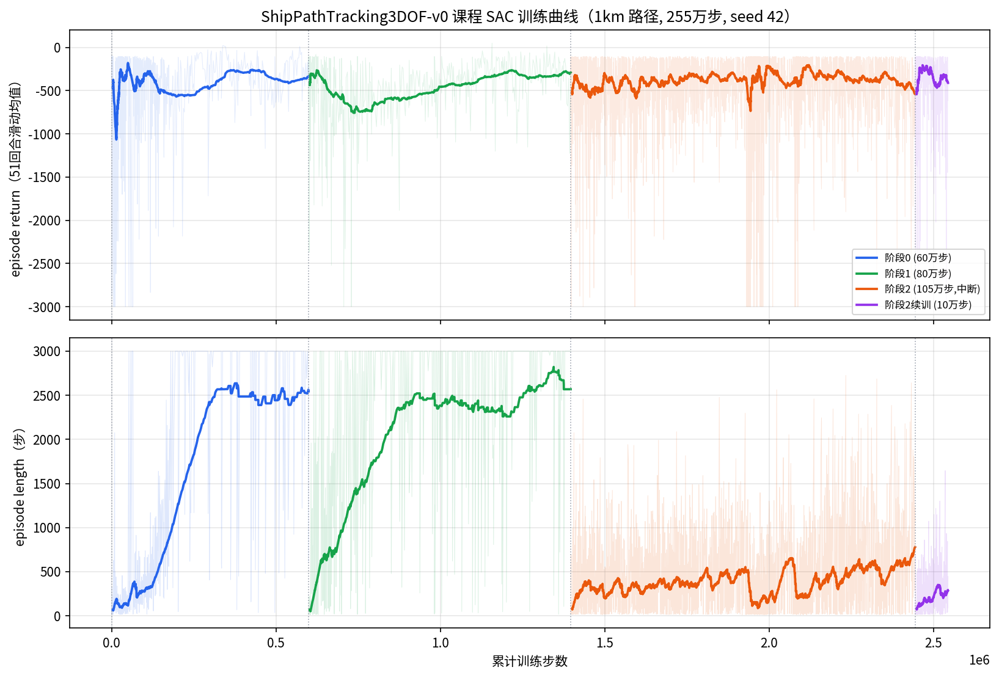
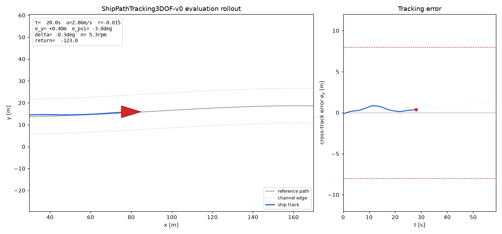
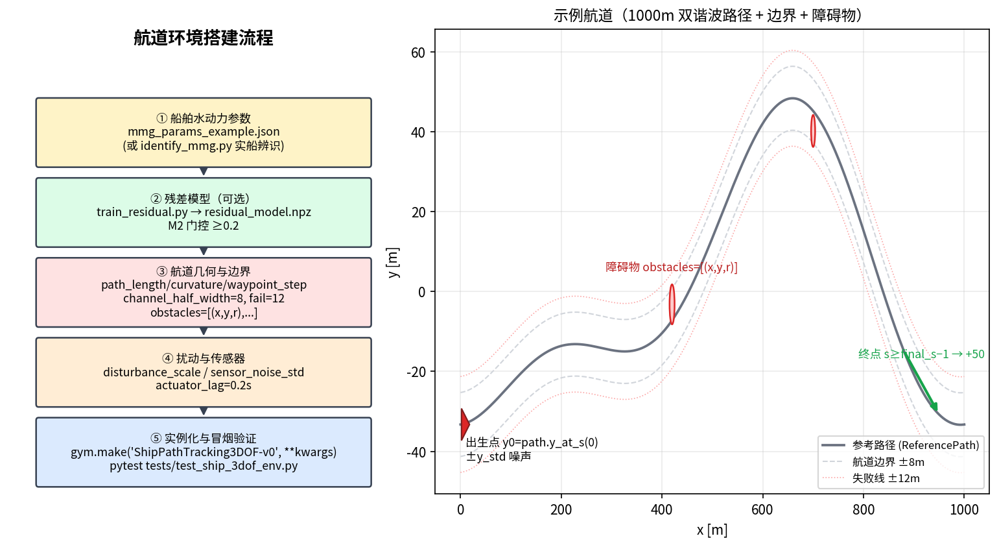

# 船舶三自由度路径跟踪强化学习模型 —— 详细说明文档

> 对象：`ShipPathTracking3DOF-v0` 环境 + SAC 课程训练模型
> 本文对照源码逐模块说明，所有引用均给出文件与行号，便于查阅
> 实训基线：1 km 路径、255 万步课程 SAC（seed 42），阶段 2 全难度下横向误差稳定于 ±1.5 m 内

---

## 1. 模型总览

本模型解决**船舶在受限航道内的路径跟踪控制**问题：智能体每 0.1 s 输出一次舵角速率与主机转速速率指令，驱动一艘三自由度（纵荡/横荡/艏摇）船舶沿一条 1000 m 双谐波参考路径航行，同时满足航道边界、速度包线、舵机/主机物理约束，并抵抗流扰、传感器噪声与水动力参数不确定性。

技术栈：

- **环境**：自研 Gymnasium 环境（`custom_envs/ship_3dof/`），MMG 操纵性模型 + 残差神经网络补偿；
- **算法**：SAC（Soft Actor-Critic，Stable Baselines3 2.9），MLP 512×512×512；
- **训练框架**：rl-baselines3-zoo（`ExperimentManager` 驱动）；
- **训练策略**：三阶段课程学习（域随机化 → 流扰 → 噪声+滞后），逐阶段热启动；
- **验收**：M1–M4 门控的 Sim2Real 流水线（`scripts/ship_3dof/run_known_mmg_pipeline.py`）。


---

## 2. 任务定义（MDP）

### 2.1 动作空间（env.py:63）

`Box(-1, 1, shape=(2,))`，每步（dt=0.1 s）执行：

| 维度 | 物理含义 | 映射关系（env.py:258-259） |
|---|---|---|
| `a[0]` | 舵角速率指令 | `dot_delta_cmd = a[0] × 4°/s` |
| `a[1]` | 主机转速速率指令 | `dot_n_cmd = a[1] × 2.0 rpm/s` |

阶段 2 起指令再经一阶滞后（`actuator_lag=0.2 s`，env.py:261-267），模拟真实舵机/主机响应。

### 2.2 观测空间（env.py:57-62, 164-187）

`Box(-5, 5, shape=(14,))`，原始量除以 `DEFAULT_OBS_SCALE`（config.py:76-91）后裁剪到 ±5：

| # | 分量 | 含义 | 缩放系数 |
|---|---|---|---|
| 0 | `e_y` | 横向偏差（相对路径法线） | 12.0 |
| 1 | `e_psi` | 航向偏差（rad） | π |
| 2 | `e_s` | 距路径终点的弧长 | 250.0 |
| 3-5 | `u, v, r` | 纵荡/横荡速度、艏摇角速度 | 4.0 / 2.0 / 1.5 |
| 6 | `beta` | 漂角 `atan2(v, max(u,0.25))` | 1.0 |
| 7-8 | `delta, n` | 当前舵角（rad）、转速（rpm） | 0.7 / 25.0 |
| 9-10 | `dot_delta_prev, dot_n_prev` | 上一步实际指令（平滑性依据） | 0.2 / 2.5 |
| 11 | `kappa_l` | 局部路径曲率 | 0.01 |
| 12-13 | `d_u_hat, d_v_hat` | 流扰估计（真值 + 估计噪声） | 0.6 / 0.6 |

阶段 2 起 `e_y/e_psi/u/v/r` 叠加高斯传感器噪声（`_sensor_noise`, env.py:159-162）。

### 2.3  episode 设定

- 路径长度 1000 m（`path_length`, config.py:60），最长 3000 步 = 300 s（`max_steps`, config.py:53）；
- 每回合重新生成路径（随机相位、曲率 ±15% 抖动，`_build_path`, env.py:113-121）；
- 船舶出生在路径起点附近（详见 §8 关键修复）。

---

## 3. 船舶动力学模型（dynamics.py）



### 3.1 状态量

`ShipState`（dynamics.py:11-20）：`x, y, psi, u, v, r, delta, n` 共 8 个。

### 3.2 MMG 水动力（dynamics.py:96-101）

```
X = x_u·u + x_uu·|u|·u + x_n·n·|n|          # 纵向力：阻力 + 螺旋桨推力
Y = y_v·v + y_r·r + y_vv·|v|·v + y_δ·u²·δ   # 横向力：粘性 + 舵力
N = n_v·v + n_r·r + n_rr·|r|·r + n_δ·u²·δ   # 艏摇力矩：阻尼 + 舵效
```

14 个水动力系数见 `MMGParameters`（config.py:8-22），默认值对应一艘小型无人艇量级（`m_u=35, m_v=45, i_z=18`）。实际项目可通过 `identification.py` 从试验数据辨识替换。

### 3.3 运动方程与积分（dynamics.py:103-135）

```
u̇ = X/m_u + r·v + res_u        # 科氏耦合 r·v
v̇ = Y/m_v − r·u + res_v
ṙ = N/i_z + res_r
ψ += r·dt
ẋ = cosψ·(u+d_u) − sinψ·(v+d_v)
ẏ = sinψ·(u+d_u) + cosψ·(v+d_v)
```

显式欧拉积分，`dt=0.1 s`；`(d_u, d_v)` 为体坐标系流扰（阶段 2 还会随机游走漂移，env.py:270-273）。执行器约束（dynamics.py:111-114）：舵角 ±35°、舵速 ≤4°/s、转速 n∈[0,25]、转速速率 ≤2 rpm/s。

### 3.4 残差网络（dynamics.py:23-62）

`ResidualModel`：tanh MLP `5→64→64→3`，输入 `[u,v,r,delta,n]`，输出经 `[0.08,0.08,0.05]·tanh(·)` 限幅后叠加到三个加速度通道，用于补偿 MMG 多项式之外的未建模动力学。权重由 `scripts/ship_3dof/train_residual.py` 在试验数据上训练，经 M2 门控（验证损失下降 ≥0.2）后才会被加载（`residual_model_path`，env.py:41-43）。

### 3.5 域随机化（dynamics.py:88-94）

每回合按阶段幅度对全部 14 个 MMG 系数做乘性随机化：`param × U(1±amplitude)`（阶段 0/1/2 分别 ±3%/±8%/±15%），这是 sim2real 鲁棒性的主要手段之一。

---

## 4. 参考路径与跟踪误差（path.py）

- `ReferencePath`（path.py:22-53）：弧长 `s∈[0,1000]`、步长 1 m；横向偏移为两个正弦谐波叠加：`y = 12κL·sin(2πs/L+φ₁) + 6κL·sin(4πs/L+φ₂)`，相位 φ 随机，κ≈0.0025 并按阶段缩放（×0.65/0.85/1.0）；
- `closest_point(x, y)`（path.py:59-74）：带 `_last_closest` 缓存的窗口搜索，避免每步全路径扫描；
- `signed_cross_track_error`（path.py:76-80）：沿路径法线的有符号横向误差 `e_y`；
- `y_at_s(s)`：弧长插值取横向位置（出生点对齐用，见 §8）。

---

## 5. 奖励函数与终止条件（env.py:195-237）



```
reward = r_progress − r_track − r_heading − r_smooth − r_energy − r_safety
```

| 项 | 表达式（env.py:203-210） | 设计意图 |
|---|---|---|
| 进度 | `0.85 · clip(Δs, 0, 1.25)` | 每步沿路径前进的弧长给正奖励（上限防刷分） |
| 横偏 | `1.1·|e_y| + 0.35·e_y²` | 偏离航线的线性+二次惩罚 |
| 航向 | `0.6·|e_psi| + 0.08·r²` | 航向误差与艏摇阻尼 |
| 平滑 | `0.03·δ̇² + 0.015·ṅ²` | 抑制舵机/主机抖动（保护执行器） |
| 能耗 | `0.005·n²` | 抑制不必要的高转速 |
| 安全 | `3·碰撞 + 4·(|e_y|>8)` | 硬约束的软惩罚（出半航道即罚） |

终止与截断（`_termination`, env.py:223-237）：

| 条件 | 结果 |
|---|---|
| 到达终点 `s ≥ final_s − 1` | 终止，奖励 `+50`（`success=True`） |
| 碰撞 / `|e_y|>12` / `|r|>1.25` / `u∉[−0.5, 4.0]` / 出航道 | 终止，奖励 `−100` |
| `step ≥ 3000` | 截断（TimeLimit） |

每步 `info["reward_terms"]`（env.py:212-220）会输出各项分解，是调权重时的主要诊断依据。

---

## 6. 三阶段课程学习



两套机制配合：

1. **环境内自动课程**（`_select_stage`, env.py:93-100）：`curriculum_stage=None` 时按累计回合数自动升阶段（<300 → 0，<900 → 1，否则 2）；
2. **训练脚本显式分阶段**（`train_ship_3dof.py:143-149`）：循环三次调用根 `train.py`，每次用 `--env-kwargs curriculum_stage:N` 固定阶段，并用 `--trained-agent` 从上阶段最终模型热启动。

| 阶段 | 域随机化 | 流扰 | 路径曲率 | 初始状态 | 噪声/滞后 |
|---|---|---|---|---|---|
| 0 | ±3% | 无 | ×0.65 | y_std=0.2 m, ψ_std=1° | 无 |
| 1 | ±8% | 0.55× | ×0.85 | y_std=0.35 m, ψ_std=1.6° | 无 |
| 2 | ±15% | 全量 + 随机游走漂移（±0.6） | ×1.0 | y_std=0.5 m, ψ_std=2.0° | 传感器噪声开、执行器滞后 0.2 s |

---

## 7. SAC 智能体



- **Actor**：MLP `14→512→512→512`，输出高斯策略的 `μ, log_std`（各 2 维），重参数采样后经 tanh 压缩到 `[-1,1]²`；
- **Critic**：双 Q 网络 `(14+2)→512→512→512→1`，取 `min(Q₁,Q₂)` 抑制过估计；熵温度系数 `α` 自动调节（`ent_coef="auto"`）；
- **探索**：`use_sde=True`（状态相关探索噪声）。

超参数基线在 `hyperparams/sac.yml:266` 的 `ShipPathTracking3DOF-v0` 节，训练脚本再经 CLI 覆盖（`train_ship_3dof.py:86-94`）：

| 参数 | 值 | 参数 | 值 |
|---|---|---|---|
| learning_rate | 3e-4 | buffer_size | 1e6 |
| batch_size | 1024（yml 基线 256；实测最优点，见 §15） | gamma / tau | 0.99 / 0.005 |
| train_freq / gradient_steps | 4 / 4 | learning_starts | 5000 |
| net_arch | [512,512,512]（yml 基线 [256,256]） | normalize | norm_obs=True, norm_reward=False |
| callback | AccelerateCallback（TF32，见 §15） | use_sde | True |

> **重要**：训练开启了 `VecNormalize(norm_obs=True)`——观测归一化统计保存在模型目录的 `ShipPathTracking3DOF-v0/vecnormalize.pkl`。**任何离线评估/渲染都必须加载该统计**，否则策略收到未归一化观测会输出饱和动作（表现为一脚油门撞速度上限自杀）。`render_eval_video.py` 会自动探测并加载。

---

## 8. 关键修复：出生点对齐路径起点



这是本模型能训出来的前提（env.py:123-143）：

- **修复前**：船固定出生在 `(0, 0)` 附近，而路径横向偏移随机 ±20 m——约 1/3 回合出生时 `|e_y|>12` 直接失败（−100），训练平均回合长度仅 ~9 步，策略只能学到"停车保平安"；
- **修复后**：以 `path.y_at_s(0)` 为基准叠加阶段噪声，初始 `|e_y|<0.8 m`，回合长度提升到 2000+ 步；
- **配套改动**：`path_length 500→1000 m`、`max_steps 1200→3000`、观测 `e_s` 缩放 120→250；`setup.py` 的 `copytree` 幂等化（修复新版 pip editable 安装失败）。

---

## 9. 训练执行流程（代码级）

### 9.1 驱动脚本 `train_ship_3dof.py`

```
parse_args → for stage, steps in enumerate(phase_steps):      # :143
    _run_train(n_steps, stage, trained_agent=上一期模型)        # :52
        拼命令: python train.py --algo sac --env ShipPathTracking3DOF-v0
                --n-timesteps N --env-kwargs curriculum_stage:N mmg_params_path:'..' residual_model_path:'..'
                --hyperparams learning_starts:.. batch_size:.. policy_kwargs:dict(net_arch=[..])
                [--trained-agent 上一期 zip]
        subprocess.run(cmd)                                    # :99
        _latest_run() 找最新 ShipPathTracking3DOF-v0_K 目录      # :45
    → 返回模型路径供下一期热启动
_summarize_monitor() 打印最近 50 回合平均回报                   # :111
```

注意 `--env-kwargs` 的字符串值必须内嵌单引号（`mmg_params_path:'...'`，见 :81），因为 rl_zoo3 的 `StoreDict` 会用 `eval` 解析值。

### 9.2 rl_zoo3 内部（每次调用 train.py）


`ExperimentManager.setup_experiment()` 依次：读 `hyperparams/sac.yml`（env_id 精确匹配）→ CLI `--hyperparams` 覆盖 → 预处理（policy_kwargs eval、normalize 解析）→ 建 VecEnv + VecNormalize → 建 EvalCallback/CheckpointCallback → 新建 SAC 或 `--trained-agent` 热加载（含 replay buffer 续载）→ `model.learn()` → 保存 zip + vecnormalize.pkl + config.yml/args.yml。

### 9.3 产物目录

```
logs_pipeline/ship3dof_1km/sac/
├── ShipPathTracking3DOF-v0_1/   # 阶段0（60万步）
├── ShipPathTracking3DOF-v0_2/   # 阶段1（80万步）
├── ShipPathTracking3DOF-v0_3/   # 阶段2（105万步，曾中断）
├── ShipPathTracking3DOF-v0_5/   # 阶段2续训（10万步，最终模型）
│   ├── ShipPathTracking3DOF-v0.zip        # 最终模型
│   ├── best_model.zip                     # 评估最优
│   ├── 0.monitor.csv                      # 逐回合回报/长度
│   └── ShipPathTracking3DOF-v0/
│       ├── vecnormalize.pkl               # 观测归一化统计（评估必需）
│       ├── config.yml / args.yml / command.txt
```

---

## 10. 实训结果（1 km 路径，255 万步）

### 10.1 训练曲线



- 阶段 0/1：回合长度快速爬升到 ~2500 步（接近 3000 上限），回报收敛在 −300~−500；
- 阶段 2（全扰动+噪声+滞后）：难度骤增，回合长度回落到 400~700 步并缓慢爬升——该阶段 105 万步时尚未完全收敛（也因中断损失了尾部训练）；
- 中断续训（紫色）验证了 `--trained-agent` 热启动流程的可用性。

### 10.2 评估表现

最终模型（`ShipPathTracking3DOF-v0_5`）在阶段 2 全难度、seed 1 下：连续航行 **59 s / 约 155 m**，横向误差全程稳定在 **±1.5 m** 以内（航道半宽 8 m），航向误差 ±3°，舵角动作平滑（±0.3°）。



完整视频：`/media/jim/jim_11/rl-zoo3-ship3dof-docker/artifacts/ship_3dof/demo_1km_video.mp4`（VLC 需关闭硬件解码或用 `--avcodec-hw=none`）。

> 注：当前模型尚未通过 M3 门控（成功率 ≥0.95）。阶段 2 曲线表明还需更多训练步数；要达到放行标准，建议在同一模型上继续热启动加训，或用 `autotune_ship_3dof.py` 搜索更优超参。

---

## 11. 复现命令

```bash
# 进入开发容器
/media/jim/jim_11/rl-zoo3-ship3dof-docker/run_dev.sh

# 全流程流水线（含 M1-M4 门控）
python scripts/ship_3dof/run_known_mmg_pipeline.py \
  --mmg-params scripts/ship_3dof/mmg_params_example.json \
  --generate-trials-if-missing \
  --log-folder logs_pipeline/full_run \
  --phase-steps 600000 800000 1100000 \
  --learning-starts 5000 --batch-size 1024 --net-arch 512,512,512 \
  --seed 42 --device cuda --run-tag full_1km

# 仅课程训练（本文使用的命令）
python scripts/ship_3dof/train_ship_3dof.py \
  --log-folder logs_pipeline/ship3dof_1km \
  --mmg-params scripts/ship_3dof/mmg_params_example.json \
  --residual-model artifacts/ship_3dof/runs/demo_smoke/residual_model.npz \
  --phase-steps 600000 800000 1100000 \
  --learning-starts 5000 --batch-size 1024 --net-arch 512,512,512 \
  --seed 42 --device cuda

# 中断后续训（热启动）
python train.py --algo sac --env ShipPathTracking3DOF-v0 \
  --log-folder logs_pipeline/ship3dof_1km --seed 42 --device cuda \
  --n-timesteps 100000 \
  --trained-agent logs_pipeline/ship3dof_1km/sac/ShipPathTracking3DOF-v0_3/best_model.zip \
  --env-kwargs curriculum_stage:2 "mmg_params_path:'scripts/ship_3dof/mmg_params_example.json'" \
    "residual_model_path:'artifacts/ship_3dof/runs/demo_smoke/residual_model.npz'" \
  --hyperparams learning_starts:5000 learning_rate:0.0003 train_freq:4 gradient_steps:4 \
    batch_size:1024 'policy_kwargs:dict(net_arch=[512,512,512])'

# 渲染效果视频（自动加载 vecnormalize.pkl）
python scripts/ship_3dof/render_eval_video.py \
  --model logs_pipeline/ship3dof_1km/sac/ShipPathTracking3DOF-v0_5/ShipPathTracking3DOF-v0.zip \
  --residual-model artifacts/ship_3dof/runs/demo_smoke/residual_model.npz \
  --mmg-params scripts/ship_3dof/mmg_params_example.json \
  --curriculum-stage 2 --seed 1 --max-steps 3000 \
  --output artifacts/ship_3dof/demo_1km_video.mp4
```

---

## 13. 航道环境搭建流程

本节说明如何从零搭建（或自定义）一个船舶运行的航道环境，对应下图的五个步骤：



### 13.1 步骤①：船舶水动力参数

环境的水动力系数来自 `MMGParameters`（config.py:8-22），两种提供方式：

- **已知参数**：写成 JSON（格式见 `scripts/ship_3dof/mmg_params_example.json`，支持裸 dict 或嵌套 `"mmg_params"` 键，env.py:79-91 解析），经 `--env-kwargs "mmg_params_path:'<路径>'"` 注入；
- **实船辨识**：按 `scripts/ship_3dof/trial_template.csv` 准备试验 CSV（列 `t,x,y,psi,u,v,r,delta,n`），运行辨识链：

```bash
# 无实船数据时先用名义参数合成试验数据
python scripts/ship_3dof/generate_mmg_trials.py --output-dir artifacts/ship_3dof/trials

# 辨识：Nomoto(K,T) → MMG 岭回归 → 多重打靶精修 → 回放验证
python scripts/ship_3dof/identify_mmg.py \
  --trial-dir artifacts/ship_3dof/trials \
  --output artifacts/ship_3dof/identified_mmg_params.json

# M1 门控：回放误差 rmse_ψ≤5°, rmse_r≤0.1
python scripts/ship_3dof/check_mmg_baseline.py \
  --mmg-params artifacts/ship_3dof/identified_mmg_params.json \
  --trial-dir artifacts/ship_3dof/trials
```

### 13.2 步骤②：残差模型（可选但推荐）

```bash
python scripts/ship_3dof/train_residual.py \
  --trial-dir artifacts/ship_3dof/trials \
  --mmg-params artifacts/ship_3dof/identified_mmg_params.json \
  --output artifacts/ship_3dof/residual_model.npz
```

产出 `residual_metrics.json`，验证损失下降 ≥0.2（M2 门控）才应在环境中通过 `residual_model_path` 加载（env.py:41-43）；不达标说明 MMG 模型已足够或数据质量差，直接使用裸 MMG 即可。

### 13.3 步骤③：航道几何与边界

| 配置项（EnvironmentConfig, config.py:51-73） | 默认 | 含义 |
|---|---|---|
| `path_length` | 1000.0 | 航道中心线长度（m） |
| `waypoint_step` | 1.0 | 路径离散步长 ds（m） |
| `path_curvature` | 0.0025 | 曲率基准 κ，谐波幅值 = 12κL / 6κL |
| `channel_half_width` | 8.0 | 航道半宽（超出持续罚 −4/步） |
| `fail_cross_track` | 12.0 | 失败线：横向误差超限即终止（−100） |
| `max_steps` | 3000 | 单回合最长步数（×0.1 s = 300 s） |

障碍物经构造参数 `obstacles=[(x, y, radius), ...]` 传入（env.py:34, 50, 189-193），进入半径即判碰撞。

> **使用真实航道中心线**：当前 `_build_path`（env.py:113-121）生成双谐波合成路径。若要导入实测航道（如电子海图中心线 waypoint 序列），改造点是 `ReferencePath._build_points`（path.py:33-38）——将 `(self._x, self._y)` 替换为实测坐标并保证等弧长采样即可，`closest_point` / 误差计算 / 出生点对齐全部自动适配。

传入自定义配置的方式（config dict 会展开进 `EnvironmentConfig`，env.py:37）：

```python
env = gym.make(
    "ShipPathTracking3DOF-v0",
    config={"path_length": 2000.0, "channel_half_width": 10.0, "path_curvature": 0.0018},
    obstacles=[(420.0, 30.0, 5.0), (700.0, -25.0, 4.0)],
    curriculum_stage=2,
)
```

### 13.4 步骤④：扰动与传感器

| 配置项 | 默认 | 含义 |
|---|---|---|
| `disturbance_scale` | 0.25 | 流扰幅值基准（阶段 1 取 0.55×、阶段 2 取全量 + 随机游走漂移 ±0.6，env.py:105-111, 270-273） |
| `sensor_noise_std` | e_y 0.03 / e_psi 0.01 / u,v 0.015 / r 0.01 | 阶段 2 观测高斯噪声（env.py:159-162） |
| `actuator_lag` | 0.2 | 阶段 2 执行器一阶滞后时间常数（s，env.py:261-267） |

### 13.5 步骤⑤：实例化与冒烟验证

```python
import gymnasium as gym
import custom_envs  # 触发注册（rl_zoo3/import_envs.py 训练时自动做）

env = gym.make(
    "ShipPathTracking3DOF-v0",
    mmg_params_path="artifacts/ship_3dof/identified_mmg_params.json",
    residual_model_path="artifacts/ship_3dof/residual_model.npz",
    curriculum_stage=0,          # 验证期建议固定阶段；None 为自动课程
)
obs, info = env.reset(seed=0)
obs, r, te, tr, i = env.step(env.action_space.sample())
env.close()
```

验证清单：

- `pytest tests/test_ship_3dof_env.py` 通过（注册与 API 契约）；
- 多次 reset 检查初始 `|e_y| < 1 m`（出生点对齐生效，见 §8）；
- 用 `render_eval_video.py` 渲染任一策略（甚至随机策略）确认航道形状符合预期。

### 13.6 注入训练

环境 kwargs 全部经 CLI 传入（注意字符串值内嵌单引号，见 §9.1）：

```bash
python train.py --algo sac --env ShipPathTracking3DOF-v0 \
  --env-kwargs curriculum_stage:0 \
    "mmg_params_path:'artifacts/ship_3dof/identified_mmg_params.json'" \
    "residual_model_path:'artifacts/ship_3dof/residual_model.npz'" \
  ...
```

障碍物与 config dict 属于非字符串复杂对象，CLI 不便传递，建议在 Python 侧用 `gym.make` 或修改 `hyperparams/sac.yml` 对应节的 `env_kwargs`（yml 原生支持 list/dict）。

---

## 14. 常见问题（FAQ）

1. **评估时船一脚油门超速自杀**：没加载 `vecnormalize.pkl`。训练开了 `norm_obs`，评估必须配套（见 §7）。
2. **视频黑屏**：本机 GPU 硬解兼容问题，VLC 加 `--avcodec-hw=none`；渲染脚本已固定输出 yuv420p/main profile/faststart。
3. **`--env-kwargs` 报 NameError**：字符串值少了内嵌单引号（见 §9.1）。
4. **回合一步即死（return≈−100）**：多为出生点未对齐路径起点（旧代码），见 §8；或观测路径/参数文件路径写错。
5. **训练中断如何续**：用最近目录的 `best_model.zip` + `--trained-agent` 热启动补训（见 §11），monitor 曲线可拼接（`tfig5` 的紫色段即是）。
6. **想加速训练**：直接用脚本默认配置即可（TF32 + batch 1024）；不要靠降低更新节奏（gradient_steps）提速，实测学习质量会显著恶化——详见 §15。

---

## 15. 训练速度优化（实测数据）

### 15.1 瓶颈定位

SAC 单步耗时 ≈ 梯度更新（~4.8 ms，占 77%）+ 环境交互（~1.4 ms）。船舶环境为纯 numpy 轻量计算，**梯度更新是唯一瓶颈**；且 512³ MLP 的小批量更新是 kernel 启动延迟主导，GPU 利用率仅 ~8%。

### 15.2 微基准（updates/s，越高越好）

| batch | 更新吞吐 | 单步延迟 |
|---|---|---|
| 512 | 208.7/s | 4.79 ms |
| **1024** | **229.3/s** | **4.36 ms** |
| 2048 | 180.1/s | 5.55 ms |
| 4096 | 116.4/s | 8.59 ms |

TF32 额外 +5.6%（220.4/s @512）；`torch.compile(reduce-overhead)` 再 +2.6%，但因编译模块在 save/load 时存在 state_dict 前缀风险且收益小，默认关闭（`AccelerateCallback(compile_policy=True)` 可开）。

### 15.3 端到端对比（各 50k 步、同种子同环境）

| 配置 | fps | mean_return_last50 | 结论 |
|---|---|---|---|
| 旧：batch512 × grad4，无 TF32 | 176 | −286 | 基线 |
| batch2048 × grad1（1/4 更新节奏） | 400 | **−9492** | 提速 2.3 倍但学习崩溃，禁用 |
| batch1024 × grad2（1/2 更新节奏） | 330 | −2930 | 同样恶化，禁用 |
| **batch1024 × grad4 + TF32（现默认）** | 180 | **−150** | 提速 ~4% 且质量更优，采用 |

### 15.4 结论与改动

1. **SAC 的更新节奏（updates/env step）是本环境的硬约束**：降节奏换来的 fps 会以学习质量崩溃为代价，"高 fps 假象"务必用同步数回报曲线证伪；
2. **现默认配置**：`train_ship_3dof.py` 默认 `batch_size=1024, gradient_steps=4, train_freq=4`，并通过 rl_zoo3 `callback` 超参注入 `custom_envs.ship_3dof.accel.AccelerateCallback`（`learn()` 启动时启用 TF32）；`--no-accel` 可关闭；
3. 更大提速需要换算法实现（如 JAX 版 SAC）或接受学习动态变化后重新调参，不在本次范围；
4. 复现旧行为：`--batch-size 512 --gradient-steps 4 --no-accel`。

---

*附图生成脚本：`docs/design/generate_figures.py`、`docs/design/generate_training_figures.py`、`docs/design/generate_channel_figure.py`；训练曲线数据来自 1km 实训的 monitor CSV。*
