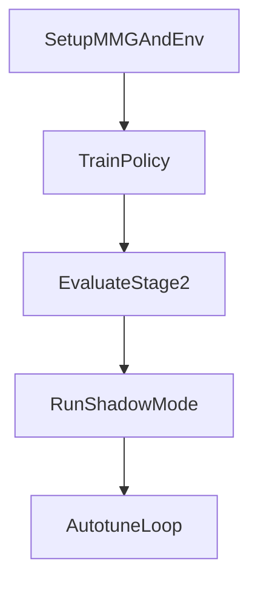

# 船舶 3-DOF 路径跟踪配方

本指南为 `ShipPathTracking3DOF-v0` 提供了直接训练管道：

- 具有路径相关误差和干扰估计的 14 维观测
- 具有执行器速率命令的 2 维连续动作
- MMG 3-DOF 动力学 + 可选残差模型
- 具有课程和领域随机化的 SAC 培训
- Sim2Real 通过阴影模式和后备控制器设置护栏

## 中文手册

完整中文分步操作指南（参数编辑+训练+调优）请参见：
[`docs/guide/ship_3dof_user_manual_zh.md`](docs/guide/ship_3dof_user_manual_zh.md)



## 环境设计

观察（标准化）：

1. `e_y`（跨轨错误）
2. `e_psi`（航向错误）
3. `e_s`（剩余路径进度）
4. ZXQ掩码0X
5. ZXQ掩码0X
6. ZXQ掩码0X
7. ZXQ掩码0X
8. ZXQ掩码0X
9. ZXQ掩码0X
10. ZXQ掩码0X
11. ZXQ掩码0X
12. ZXQ掩码0X
13. ZXQ掩码0X
14. ZXQ掩码0X

行动：

- `[-dot_delta_max, dot_delta_max]` 中的 `a[0] -> dot_delta_cmd`
- `[-dot_n_max, dot_n_max]` 中的 `a[1] -> dot_n_cmd`

### 参数修改索引

- MMG 默认值和奖励/环境配置：
[`custom_envs/ship_3dof/config.py`](custom_envs/ship_3dof/config.py)
- MMG JSON注入路径（`mmg_params_path`）和课程内部结构：
[`custom_envs/ship_3dof/env.py`](custom_envs/ship_3dof/env.py)
- 训练时超参数覆盖（`learning_starts`、`learning_rate`、`train_freq`、
`gradient_steps`、`batch_size`、`net_arch`）：
[`scripts/ship_3dof/train_ship_3dof.py`](scripts/ship_3dof/train_ship_3dof.py)

报酬：

ZXQ掩码0X

端子整形：

- `+R_goal` 成功
- `-R_fail` 发生冲突、超出通道或不稳定状态

## 识别管道

如果您已经知道 MMG 系数，则可以跳过拟合并直接使用它们传递它们
训练/评估脚本中的 `--mmg-params`。

### 1）MMG参数拟合

```bash
python scripts/ship_3dof/identify_mmg.py \
  --trials data/trials/zigzag_10_10.csv data/trials/turn_port.csv data/trials/turn_starboard.csv \
  --dt 0.1 \
  --output artifacts/ship_3dof/identification_result.json \
  --params-yaml artifacts/ship_3dof/mmg_params.json
```

### 2）残差模型拟合

```bash
python scripts/ship_3dof/train_residual.py \
  --trials data/trials/zigzag_10_10.csv data/trials/turn_port.csv data/trials/turn_starboard.csv \
  --mmg-params artifacts/ship_3dof/mmg_params.json \
  --output artifacts/ship_3dof/residual_model.npz
```

这还写入了具有验证损失减少功能的 `artifacts/ship_3dof/residual_metrics.json`（`M2` 门）。

### 3) 已知MMG重放基线检查(M1)

```bash
python scripts/ship_3dof/check_mmg_baseline.py \
  --mmg-params artifacts/ship_3dof/mmg_params.json \
  --trials data/trials/zigzag_10_10.csv data/trials/turn_port.csv data/trials/turn_starboard.csv \
  --output artifacts/ship_3dof/mmg_baseline_report.json
```

## SAC培训

使用课程阶段 (0 -> 1 -> 2)：

```bash
python scripts/ship_3dof/train_ship_3dof.py \
  --log-folder logs \
  --seed 42 \
  --mmg-params artifacts/ship_3dof/mmg_params.json \
  --learning-starts 5000 \
  --learning-rate 3e-4 \
  --train-freq 4 \
  --gradient-steps 4 \
  --batch-size 512 \
  --net-arch 512,512,512
```

单阶段训练：

```bash
python scripts/ship_3dof/train_ship_3dof.py --total-override 3000000
```

## 评估和阴影模式

评估政策：

```bash
python scripts/ship_3dof/evaluate_ship_3dof.py \
  --model logs/sac/ShipPathTracking3DOF-v0_1/ShipPathTracking3DOF-v0.zip \
  --mmg-params artifacts/ship_3dof/mmg_params.json \
  --episodes 30
```

影子模式安全评估：

```bash
python scripts/ship_3dof/run_shadow_mode.py \
  --model logs/sac/ShipPathTracking3DOF-v0_1/ShipPathTracking3DOF-v0.zip \
  --mmg-params artifacts/ship_3dof/mmg_params.json \
  --episodes 50
```

如果 `takeover_recommendation_rate < 0.02` 和影子片段是无碰撞的，
该政策是具有严格安全范围的有限接管测试的候选者。

## 端到端管道（称为 MMG）

```bash
python scripts/ship_3dof/run_known_mmg_pipeline.py \
  --mmg-params artifacts/ship_3dof/mmg_params.json \
  --generate-trials-if-missing \
  --run-tag exp_seed42 \
  --output-dir artifacts/ship_3dof/runs \
  --log-folder logs_pipeline \
  --phase-steps 20000 20000 30000 \
  --learning-starts 5000 \
  --learning-rate 3e-4 \
  --train-freq 4 \
  --gradient-steps 4 \
  --batch-size 512 \
  --net-arch 512,512,512 \
  --eval-episodes 30 \
  --shadow-episodes 50
```

每次运行时输出都是隔离的：
`artifacts/ship_3dof/runs/<run-tag>/`。

## 3小时自主调校

```bash
python scripts/ship_3dof/autotune_ship_3dof.py \
  --mmg-params artifacts/ship_3dof/mmg_params.json \
  --generate-trials-if-missing \
  --hours 3 \
  --max-parallel 0 \
  --jobs-per-gpu 2 \
  --batch-size 512 \
  --phase-steps 80000 100000 140000 \
  --eval-episodes 30 \
  --shadow-episodes 50 \
  --output-root artifacts/ship_3dof/autotune \
  --log-root logs_autotune
```

自动调谐运行器执行：
- 并行候选人培训/评估运行
- 平衡评分（`M3 + M4` 目标，带有门罚分）
- 候选人淘汰和精英重新播种
- 逐次迭代的 Markdown 报告和最终摘要

批量大小指导：
- 保守运行：`--batch-size 256` 或 `--batch-size 512`
- 积极的吞吐量：`--batch-size 512` 或 `--batch-size 1024`

## 故障排除

- 如果执行过程中缺少`autotune_summary.json`，则检查`run_logs/`并
首先是 `optimization_reports/`。自动调谐完成后会写入摘要。
- 如果输出文件归 `root` 所有，则重新运行容器
`--user $(id -u):$(id -g)`。
- 如果 GPU 功率低于上限但利用率很高，这通常是 RL 所期望的，因为
环境步骤 CPU 瓶颈。
