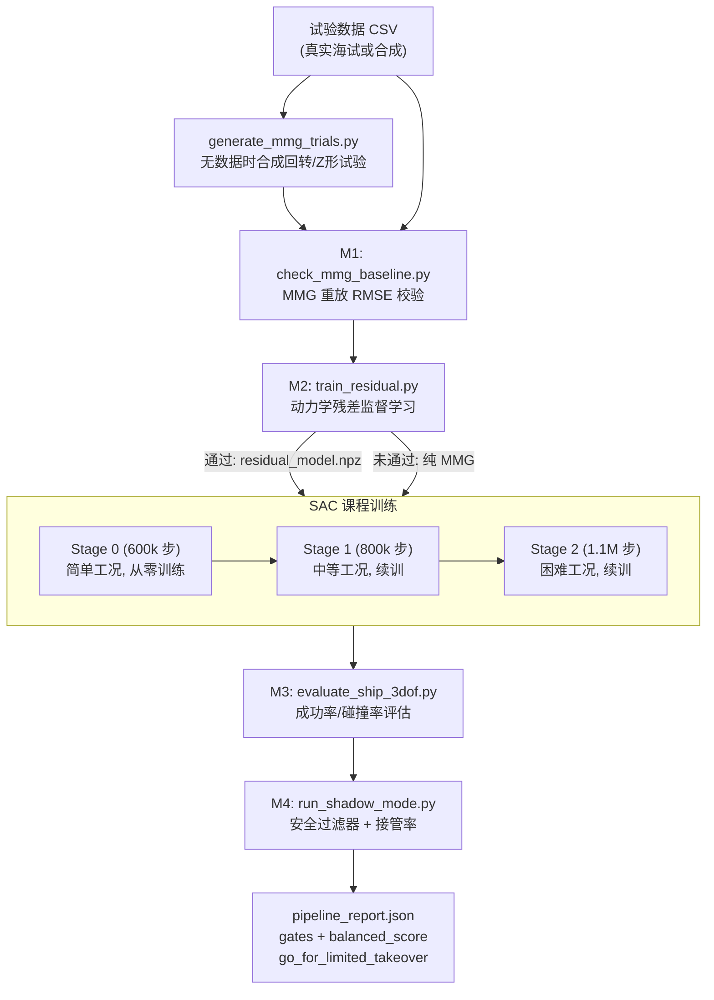
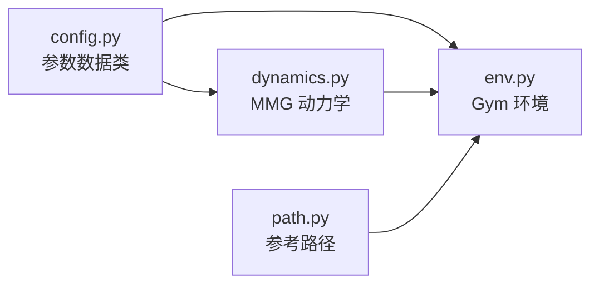
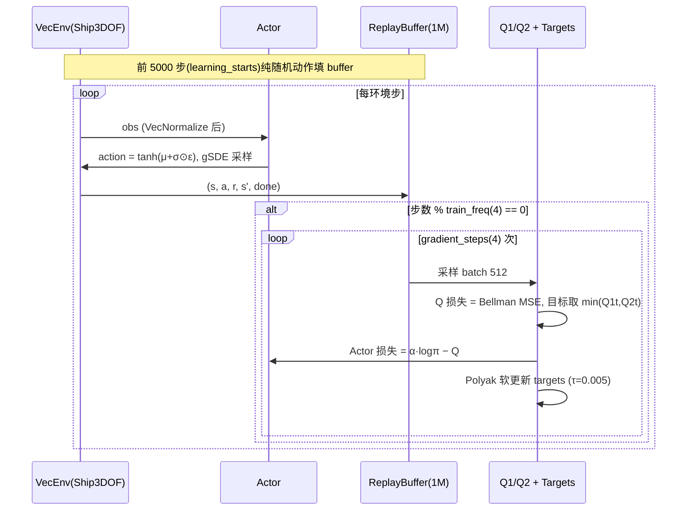
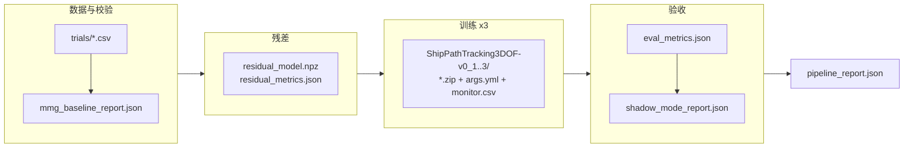

# Ship3DOF 强化学习实现流程详解

本文档以**流程为主线**，结合源码梳理本仓库 `ShipPathTracking3DOF-v0` 强化学习从「试验数据」到「部署验收」的完整实现链路。侧重回答"每一步代码里发生了什么、谁调用谁、产物是什么"。

相关文档：

- 网络结构专题（Actor/Q 拓扑、参数量、gSDE 等）：`ship_3dof_rl_network_architecture_zh.md`
- 日常使用命令：`ship_3dof_user_manual_zh.md`
- 数学推导（SAC 损失、MMG 辨识）：`ship_3dof_technical_report_zh.md`

---

## 目录

1. [全局流程总览](#1-全局流程总览)
2. [仿真环境层](#2-仿真环境层)
3. [环境注册与接入 RL Zoo](#3-环境注册与接入-rl-zoo)
4. [训练入口链路](#4-训练入口链路)
5. [SAC 训练过程](#5-sac-训练过程)
6. [M1：MMG 基线校验](#6-m1mmg-基线校验)
7. [M2：残差学习](#7-m2残差学习)
8. [M3/M4：评估与影子模式](#8-m3m4评估与影子模式)
9. [编排与并行](#9-编排与并行)
10. [端到端命令示例与产物索引](#10-端到端命令示例与产物索引)

---

## 1. 全局流程总览

### 1.1 流程图



整条链路由 `scripts/ship_3dof/run_known_mmg_pipeline.py` 一键编排（§9），也可单独运行任一阶段。

### 1.2 各阶段脚本与产物对照

| 阶段 | 脚本 | 输入 | 产物 | 验收指标 |
|------|------|------|------|----------|
| 数据 | `generate_mmg_trials.py` | MMG 参数 JSON | `trials/*.csv` | — |
| M1 | `check_mmg_baseline.py` | 参数 + trials | `mmg_baseline_report.json` | ψ RMSE ≤5°, r RMSE ≤0.1 |
| M2 | `train_residual.py` | 参数 + trials | `residual_model.npz` + metrics | 验证损失下降 ≥20% |
| 训练 | `train_ship_3dof.py` | 参数 + 残差(可选) | `ShipPathTracking3DOF-v0.zip` | — |
| M3 | `evaluate_ship_3dof.py` | 模型 zip | `eval_metrics.json` | 成功率 ≥95%, 碰撞率 =0 |
| M4 | `run_shadow_mode.py` | 模型 zip | `shadow_mode_report.json` | 接管率 ≤2%, 碰撞 =0 |
| 汇总 | `run_known_mmg_pipeline.py` | 以上全部 | `pipeline_report.json` | `go_for_limited_takeover` |

门槛值集中定义在 `scripts/ship_3dof/sim2real_acceptance.json`。

---

## 2. 仿真环境层

强化学习的"世界"由 `custom_envs/ship_3dof/` 四个模块组成：



### 2.1 `config.py`：所有可调参数的单一来源

四个数据类 + 一个观测尺度字典：

| 数据类 | 内容 | 影响 |
|--------|------|------|
| `MMGParameters` | 13 个水动力系数（质量、阻尼、舵力等） | 船怎么动 |
| `ActuatorLimits` | 舵角 ±35°、舵速 4°/s、转速 0~25 rps | 动作物理上限 |
| `RewardWeights` | 8 个奖励权重 + 终端 ±50/100 | 策略学什么 |
| `EnvironmentConfig` | dt=0.1s、航道半宽 8m、失败阈值等 | 回合边界 |

```76:91:custom_envs/ship_3dof/config.py
DEFAULT_OBS_SCALE = {
    "e_y": 12.0,
    "e_psi": 3.141592653589793,
    "e_s": 120.0,
    "u": 4.0,
    "v": 2.0,
    "r": 1.5,
    "beta": 1.0,
    "delta": 0.7,
    "n": 25.0,
    "dot_delta_prev": 0.2,
    "dot_n_prev": 2.5,
    "kappa_l": 0.01,
    "d_u_hat": 0.6,
    "d_v_hat": 0.6,
}
```

这个字典既决定观测归一化尺度，也隐式定义了 14 维观测的**顺序**。

### 2.2 `dynamics.py`：MMG 三自由度动力学

核心是 `MMGDynamics.step()`，每仿真步做四件事：限幅执行器 → 计算水动力 → 加残差修正 → 积分状态。

```103:126:custom_envs/ship_3dof/dynamics.py
    def step(
        self,
        state: ShipState,
        dot_delta_cmd: float,
        dot_n_cmd: float,
        dt: float,
        disturbance_body: tuple[float, float],
    ) -> ShipState:
        dot_delta = float(np.clip(dot_delta_cmd, -self.dot_delta_max, self.dot_delta_max))
        dot_n = float(np.clip(dot_n_cmd, -self.actuator_limits.dot_n_max, self.actuator_limits.dot_n_max))
        state.delta = float(np.clip(state.delta + dot_delta * dt, -self.delta_max, self.delta_max))
        state.n = float(np.clip(state.n + dot_n * dt, self.actuator_limits.n_min, self.actuator_limits.n_max))

        x_force, y_force, n_moment = self._forces(state)
        residual = self.residual_model.predict(state)

        u_dot = x_force / self.params.m_u + state.r * state.v + residual[0]
        v_dot = y_force / self.params.m_v - state.r * state.u + residual[1]
        r_dot = n_moment / self.params.i_z + residual[2]

        state.u += u_dot * dt
        state.v += v_dot * dt
        state.r += r_dot * dt
        state.psi += state.r * dt
```

两个训练关键机制：

- **域随机化** `apply_domain_randomization()`（L88–94）：每回合把 13 个 MMG 系数在 `1±amplitude` 内均匀扰动，逼迫策略对模型误差鲁棒；
- **残差注入**：`residual_model.predict(state)` 输出三维加速度修正（M2 产物，见 §7），未加载时权重全零、输出为 0。

### 2.3 `path.py`：随机参考路径

每回合生成一条**双正弦叠加**的曲线路径（相位随机），策略永远见不到重复路线：

```33:38:custom_envs/ship_3dof/path.py
    def _build_points(self, s: np.ndarray) -> tuple[np.ndarray, np.ndarray]:
        phase_1 = self.rng.uniform(0.0, 2.0 * np.pi)
        phase_2 = self.rng.uniform(0.0, 2.0 * np.pi)
        y = 12.0 * self.curvature * self.length * np.sin(2.0 * np.pi * s / self.length + phase_1)
        y += 6.0 * self.curvature * self.length * np.sin(4.0 * np.pi * s / self.length + phase_2)
        return s.copy(), y
```

两个供环境调用的查询接口：

- `closest_point()`（L59–74）：从上次索引附近做**局部窗口搜索**（`look_ahead=250`），O(窗口) 而非 O(全路径)，避免每步全量扫描；
- `signed_cross_track_error()`（L76–80）：切向量的左法向与位置差的点积 → **有符号**横向误差（左偏为正），策略由符号知道往哪边打舵。

### 2.4 `env.py`：Gym 环境主体

#### reset()：一回合的随机化流水线

```236:250:custom_envs/ship_3dof/env.py
    def reset(self, *, seed: int | None = None, options: dict[str, Any] | None = None) -> tuple[np.ndarray, dict[str, Any]]:
        super().reset(seed=seed)
        if seed is not None:
            self.rng = np.random.default_rng(seed)
        self.episode_count += 1
        self._stage = self._select_stage()
        self._setup_episode_randomization()
        self._build_path()
        self._reset_state()
        observation = self._observation()
        info = {
            "curriculum_stage": self._stage,
            "mmg_params": asdict(self.dynamics.params),
        }
        return observation, info
```

依次：选课程阶段 → 域随机化 + 扰动采样 → 生成随机路径 → 随机初始船态 → 输出首帧观测。

#### step()：单步交互

```252:298:custom_envs/ship_3dof/env.py
    def step(self, action: np.ndarray) -> ...:
        action = np.clip(action, -1.0, 1.0)
        dot_delta_cmd = float(action[0] * self.dot_delta_max)
        dot_n_cmd = float(action[1] * self.dot_n_max)

        alpha = self.dt / (self.cfg.actuator_lag + self.dt)
        if self._stage >= 2:
            self._cmd_delta = (1.0 - alpha) * self._cmd_delta + alpha * dot_delta_cmd
            ...
        self.state = self.dynamics.step(...)
        ...
        reward, reward_terms, collision, out_of_channel = self._reward(self._cmd_delta, self._cmd_n)
        terminated, truncated, goal = self._termination(collision, out_of_channel)
        if goal:
            reward += self.reward_cfg.r_goal
        if terminated and not goal:
            reward -= self.reward_cfg.r_fail
```

顺序：动作缩放 →（阶段 2 一阶执行器滞后 + 扰动随机游走）→ 动力学步进 → 奖励分解 → 终止判定 → 终端奖励。

#### 奖励分解（L192–218）

`reward = r_progress − r_track − r_heading − r_smooth − r_energy − r_safety`，各项含义与权重见网络架构文档 §2.4。`info["reward_terms"]` 每步返回分解值，便于事后分析哪一项主导。

#### 终止条件（L220–234）

- **成功**：沿路径进度到达终点前 1m 内；
- **失败**：碰撞 / 横向误差 >12m / |r|>1.25 / 速度越界 / 出航道；
- **截断**：超过 `max_steps=1200`（即 120 秒）。

#### 课程阶段（L93–111）

`curriculum_stage` 由 env_kwargs 显式指定（训练脚本总是指定）；未指定时按回合数自动升级（300/900 回合切换）。三阶段差异对照表见网络架构文档 §6.1。

---

## 3. 环境注册与接入 RL Zoo

自定义环境通过标准 Gymnasium 注册接入，RL Zoo 无需任何改动即可训练它：

```1:12:custom_envs/__init__.py
from gymnasium.envs.registration import register, registry


SHIP_ENV_ID = "ShipPathTracking3DOF-v0"


if SHIP_ENV_ID not in registry:
    register(
        id=SHIP_ENV_ID,
        entry_point="custom_envs.ship_3dof.env:ShipPathTracking3DOFEnv",
        max_episode_steps=1200,
    )
```

RL Zoo 侧在 `rl_zoo3/import_envs.py` 里 `import custom_envs`（L32–35），`rl_zoo3/train.py` 顶部导入该模块即完成注册。之后 `--env ShipPathTracking3DOF-v0` 即可像内置环境一样使用。

`max_episode_steps=1200` 由 Gym 的 `TimeLimit` wrapper 施加，与环境内部 `cfg.max_steps` 一致（双保险）。

---

## 4. 训练入口链路

一次训练的调用栈（以 pipeline 内第一阶段为例）：

```
run_known_mmg_pipeline.py
  └─ subprocess → train_ship_3dof.py
       └─ subprocess → train.py（仓库根，4 行入口）
            └─ rl_zoo3/train.py::train()
                 └─ ExperimentManager.setup_experiment()
                      └─ SAC(...) / SAC.load(...)
                 └─ exp_manager.learn(model)
                 └─ exp_manager.save_trained_model(model)
```

### 4.1 `train.py` → `rl_zoo3/train.py::train()`

仓库根的 `train.py` 只有 4 行，转发到 `rl_zoo3.train.train()`。后者做：

1. 校验 `env_id`（拼写错误会给出最近匹配提示）；
2. 处理 seed：`--seed -1` 时随机生成，否则 `set_random_seed(args.seed)` 统一固定 PyTorch/NumPy/random（L187–191）；
3. 构造 `ExperimentManager`（把全部 CLI 参数传入）；
4. `setup_experiment()` 拿到模型 → `learn()` 训练 → `save_trained_model()` 落盘。

### 4.2 CLI 超参解析：`StoreDict`

`--hyperparams` 与 `--env-kwargs` 的 `key:value` 语法由自定义 argparse Action 解析，value 部分直接 `eval()` 为 Python 对象：

```500:507:rl_zoo3/utils.py
    def __call__(self, parser, namespace, values, option_string=None):
        arg_dict = {}
        for arguments in values:
            key = arguments.split(":")[0]
            value = ":".join(arguments.split(":")[1:])
            # Evaluate the string as python code
            arg_dict[key] = eval(value)
        setattr(namespace, self.dest, arg_dict)
```

因此 `policy_kwargs:dict(net_arch=[512,512,512])`、`mmg_params_path:'scripts/...json'` 都必须是合法 Python 字面量。

### 4.3 `setup_experiment()`：八步装配

```269:314:rl_zoo3/exp_manager.py
    def setup_experiment(self) -> tuple[BaseAlgorithm, dict[str, Any]] | None:
        unprocessed_hyperparams, saved_hyperparams = self.read_hyperparameters()
        hyperparams, self.env_wrapper, self.callbacks, self.vec_env_wrapper = self._preprocess_hyperparams(
            unprocessed_hyperparams
        )
        ...
        self.create_log_folder()
        self.create_callbacks()

        n_envs = 1 if self.algo == "ars" or self.optimize_hyperparameters else self.n_envs
        env = self.create_envs(n_envs, no_log=False)

        self._hyperparams = self._preprocess_action_noise(hyperparams, saved_hyperparams, env)

        if self.continue_training:
            model = self._load_pretrained_agent(self._hyperparams, env)
        elif self.optimize_hyperparameters:
            env.close()
            return None
        else:
            # Train an agent from scratch
            model = ALGOS[self.algo](
                env=env,
                ...
                **self._hyperparams,
            )

        self._save_config(saved_hyperparams)
        return model, saved_hyperparams
```

逐步说明：

| 步骤 | 方法 | 对 Ship3DOF 的意义 |
|------|------|--------------------|
| 1 | `read_hyperparameters()` | 读 `hyperparams/sac.yml` 的 `ShipPathTracking3DOF-v0` 条目，再用 CLI `--hyperparams` **覆盖**（`hyperparams.update(custom_hyperparams)`，L433–435） |
| 2 | `_preprocess_hyperparams()` | `eval()` 字符串 `policy_kwargs`；提取 `normalize`/`n_timesteps` 等非构造参数 |
| 3 | `create_log_folder/callbacks` | 生成 `logs/<algo>/<env>_<N>/` 目录与 eval 回调 |
| 4 | `create_envs()` | `make_vec_env` 包 Monitor → **VecNormalize(norm_obs=True)**（`_maybe_normalize`，L700–735） |
| 5 | `_preprocess_action_noise()` | SAC 未配置 noise_type，此处仅记录动作维度 |
| 6 | 分支 | 续训 / 调参 / 从零三选一 |
| 7 | `ALGOS["sac"](...)` | **网络在此实例化**——SB3 按 `policy_kwargs.net_arch` 构建 Actor+双 Q |
| 8 | `_save_config()` | 把最终配置写入 `args.yml` / `config.yml`（复现依据） |

### 4.4 续训机制 `_load_pretrained_agent()`

课程第 2、3 阶段传 `--trained-agent 上一阶段.zip`，此时：

```816:823:rl_zoo3/exp_manager.py
    def _load_pretrained_agent(self, hyperparams: dict[str, Any], env: VecEnv) -> BaseAlgorithm:
        # Continue training
        print("Loading pretrained agent")
        # Policy should not be changed
        del hyperparams["policy"]

        if "policy_kwargs" in hyperparams.keys():
            del hyperparams["policy_kwargs"]
```

- `policy` / `policy_kwargs` 被删除，**网络结构与权重完全来自 checkpoint**（中途改 `--net-arch` 无效）；
- 若 checkpoint 目录有 `replay_buffer.pkl` 则加载（默认不保存）；
- 若有 `vecnormalize.pkl` 则恢复观测统计量（`_maybe_normalize`，L709–715），保证新阶段观测分布衔接。

---

## 5. SAC 训练过程

### 5.1 单阶段内的训练循环

`exp_manager.learn()` 调 `model.learn(n_timesteps)`，SB3 内部循环：



关键超参（`train_freq=4, gradient_steps=4`）意味着**采样与更新比 1:1**；`ent_coef: auto` 让温度 α 在线自适应。损失公式推导见技术报告 §6.1。

### 5.2 两层观测归一化

1. **环境内**：`_observation()` 除以 `DEFAULT_OBS_SCALE` 再 clip 到 `[-5,5]`（固定常数）；
2. **VecNormalize**：运行均值/方差在线标准化（可学习统计量，随训练更新）。

`norm_reward=False` 是刻意设计——终端 ±50/100 的量级不能被归一化抹平（`hyperparams/sac.yml` L269）。

### 5.3 三阶段课程：`train_ship_3dof.py`

```143:149:scripts/ship_3dof/train_ship_3dof.py
        for stage, steps in enumerate(args.phase_steps):
            model_path = _run_train(
                args,
                n_steps=steps,
                stage=stage,
                trained_agent=str(model_path) if model_path is not None else None,
            )
```

每个 stage 是一次独立的 `train.py` 子进程，衔接方式：

- `--env-kwargs curriculum_stage:{stage}`：切环境难度；
- `--trained-agent <上一阶段模型>`：权重续训（§4.4）；
- `_latest_run()`（L45–49）按目录 mtime 找出刚产出的 run 文件夹，取其中的 `.zip` 作为下一阶段输入。

超参数注入点（**工程侧唯一显式传 net_arch 的地方**）：

```86:93:scripts/ship_3dof/train_ship_3dof.py
    hyperparams = [
        f"learning_starts:{args.learning_starts}",
        f"learning_rate:{args.learning_rate}",
        f"train_freq:{args.train_freq}",
        f"gradient_steps:{args.gradient_steps}",
        f"batch_size:{args.batch_size}",
        f"policy_kwargs:dict(net_arch={net_arch})",
    ]
```

训练结束后 `_summarize_monitor()`（L111–133）解析 `0.monitor.csv` 打印最近 50 回合平均回报，便于快速判断收敛。

---

## 6. M1：MMG 基线校验

**目的**：在投入 RL 训练前，确认 MMG 参数能重放真实（或合成）试验轨迹——模型不准，训出来的策略也没有意义。

### 6.1 试验数据来源

有真实海试数据时直接给 `--trials`；没有时 `generate_mmg_trials.py` 用已知参数合成三条标准操纵性试验（180s，dt=0.1）：

| 文件 | 操纵 |
|------|------|
| `turn_port.csv` | +10° 定舵回转 |
| `turn_starboard.csv` | −10° 定舵回转 |
| `zigzag_10_10.csv` | 10°/10° Z 形试验 |

CSV 列 `t,x,y,psi,u,v,r,delta,n` 与辨识模块 `identification.py` 的读入格式一致。

### 6.2 校验流程

```39:50:scripts/ship_3dof/check_mmg_baseline.py
def main() -> None:
    args = parse_args()
    params = _load_mmg_params(args.mmg_params)
    trials = [preprocess_trial(read_trial_csv(path), dt=args.dt)[0] for path in args.trials]
    metrics = validate_parameters(trials, params=params, dt=args.dt)

    acceptance_payload = json.loads(Path(args.acceptance).read_text())
    m1_criteria = acceptance_payload["M1"]["criteria"]
    passed = (
        metrics["rmse_psi_deg"] <= float(m1_criteria["rmse_psi_deg_max"])
        and metrics["rmse_r"] <= float(m1_criteria["rmse_r_max"])
    )
```

`preprocess_trial`（`identification.py`）做重采样 + Hampel 异常值滤波 + 平滑求导；`validate_parameters` 用给定参数从各 trial 初值**开环重放**整条轨迹，统计航向角与角速度 RMSE。

> 当 MMG 参数未知时，`identify_mmg.py` 提供完整辨识管线：预处理 → Nomoto 先验 → MMG 线性最小二乘 → 多重射击细化 → 留出集验证，产出的 `mmg_params.json` 再进入本流程。数学推导见技术报告 §7。

---

## 7. M2：残差学习

**目的**：MMG 是简化模型，与数据总有系统性偏差。M2 用小型 MLP 学习这部分偏差，让训练仿真器更接近真实。

### 7.1 数据构造：一步预测误差作标签

```60:84:scripts/ship_3dof/train_residual.py
        for i in range(len(trial.t) - 1):
            state = ShipState(...)
            dot_delta = (trial.delta[i + 1] - trial.delta[i]) / dt
            dot_n = (trial.n[i + 1] - trial.n[i]) / dt
            pred = ShipState(**vars(state))
            pred = dynamics.step(pred, dot_delta_cmd=dot_delta, dot_n_cmd=dot_n, dt=dt, disturbance_body=(0.0, 0.0))
            eps = np.array(
                [
                    (trial.u[i + 1] - pred.u) / dt,
                    (trial.v[i + 1] - pred.v) / dt,
                    (trial.r[i + 1] - pred.r) / dt,
                ],
                dtype=np.float64,
            )
            features.append([state.u, state.v, state.r, state.delta, state.n])
            targets.append(eps)
```

逻辑：真实数据的第 i 步状态喂给**纯 MMG** 预测第 i+1 步 → 真实值与预测值之差除以 dt，即 MMG 漏掉的加速度 → 作为监督标签。

### 7.2 训练与门槛

- 网络：5→64→64→3 的 Tanh MLP，输出乘固定 `scale=[0.08,0.08,0.05]` 限幅（防止残差喧宾夺主）；
- 训练：Adam、MSE、60 epoch、按验证损失保存最优权重；
- **M2 门槛**：`validation_loss_reduction = (baseline_mse − best_mse) / baseline_mse ≥ 0.2`，即残差网络必须比"零残差"至少好 20%。

Pipeline 中的判定与降级逻辑：

```233:243:scripts/ship_3dof/run_known_mmg_pipeline.py
        min_reduction = float(acceptance["M2"]["criteria"]["validation_loss_reduction_min"])
        reduction = float(residual_metrics["validation_loss_reduction"])
        m2_passed = reduction >= min_reduction
        residual_gate = {
            "m2_validation_loss_reduction_min": min_reduction,
            "validation_loss_reduction": reduction,
            "m2_passed": m2_passed,
            "enabled": m2_passed,
        }
        if not m2_passed:
            residual_model_path = None
```

未通过时 `residual_model_path=None`，后续训练退回纯 MMG——**M2 失败不阻断流程，只降级**。

### 7.3 权重导出与注入

PyTorch 权重导出为 `.npz`（`save_residual_model`，L88–99），环境侧 `ResidualModel`（`dynamics.py` L23–62）用纯 NumPy 前向推理——训练环境**不依赖 PyTorch 的残差版本**，每个仿真步开销极小。注入路径：

```
train_ship_3dof.py --residual-model xxx.npz
  → train.py --env-kwargs residual_model_path:'xxx.npz'
    → ShipPathTracking3DOFEnv.__init__ → self.residual_model.load(path)
      → MMGDynamics.step() 内 residual_model.predict(state)
```

---

## 8. M3/M4：评估与影子模式

两个阶段都是**纯推理**（`SAC.load` + `deterministic=True`），不再更新任何网络。

### 8.1 M3：策略性能评估

`evaluate_ship_3dof.py` 在 **stage 2（最难工况）** 下跑 N 回合：

```43:59:scripts/ship_3dof/evaluate_ship_3dof.py
    env = gym.make("ShipPathTracking3DOF-v0", **env_kwargs)
    model = SAC.load(args.model)
    rng = np.random.default_rng(args.seed)
    ...
    for _ in range(args.episodes):
        obs, _ = env.reset(seed=int(rng.integers(0, 2**32 - 1)))
        ...
        while not (done or truncated):
            action, _ = model.predict(obs, deterministic=True)
            obs, reward, done, truncated, info = env.step(action)
```

注意评估 seed 默认 123（训练默认 42），**故意分离**训练与测试的随机场景。统计成功率、碰撞率、出航道率，比对 M3 门槛（成功率 ≥95%，碰撞率 =0）写入 `eval_metrics.json`。

### 8.2 M4：影子模式 + 安全层

模拟部署形态：策略提议动作 → 安全过滤器审查 → 越界时切 PID 兜底。安全组件在 `custom_envs/ship_3dof/deploy.py`：

| 组件 | 职责 |
|------|------|
| `SafetyFilter.filter_action`（L24–47） | 检查 \|r\|>1.1 或 \|e_y\|>8m → 返回零动作 + override 标志；否则按物理限幅修正动作 |
| `FallbackPIDController.action`（L63–75） | override 时接管：`dot_delta = −kp_ey·e_y − kp_epsi·e_psi − kd_r·r`，转速回归 8 rps |
| `ShadowModeSupervisor`（L78–91） | 统计 override 次数 / 总决策数 = **接管建议率** |

主循环（`run_shadow_mode.py`）：

```67:89:scripts/ship_3dof/run_shadow_mode.py
        while not (done or truncated):
            proposed, _ = model.predict(obs, deterministic=True)
            raw = env.unwrapped
            e_y, e_psi, _, _ = raw._tracking_error()
            safe_action, overridden = safety_filter.filter_action(
                action=np.asarray(proposed, dtype=np.float64),
                current_delta=raw.state.delta,
                current_n=raw.state.n,
                estimated_r=raw.state.r,
                estimated_e_y=e_y,
            )
            if overridden:
                safe_action = fallback.action(...)
                filtered_total += 1
            supervisor.observe(overridden)
            obs, _, done, truncated, info = env.step(safe_action)
```

**M4 门槛**：接管建议率 ≤2% 且影子碰撞数 =0。接管率高说明策略经常把船开到安全边界之外——即使 M3 成功率高也不可部署。

---

## 9. 编排与并行

### 9.1 `run_known_mmg_pipeline.py`：一键串联 M1–M4

`main()`（L179 起）按序 `subprocess` 调用各阶段脚本，每阶段计时，最终汇聚成一份报告：

```363:375:scripts/ship_3dof/run_known_mmg_pipeline.py
        "gates": {
            "M1": baseline_report["acceptance"],
            "M2": residual_gate,
            "M3": eval_report["acceptance"],
            "M4": shadow_report["acceptance"],
        },
        "balanced_score": balanced,
    }
    final_report["go_for_limited_takeover"] = bool(
        final_report["gates"]["M1"]["m1_passed"]
        and final_report["gates"]["M3"]["m3_passed"]
        and final_report["gates"]["M4"]["m4_passed"]
    )
```

要点：

- **`go_for_limited_takeover`** 只要求 M1/M3/M4 通过（M2 允许降级）；
- `_compute_balanced_score()`（L92–136）给出一个标量分：门槛通过/失败计 ±160/±120/±45/±15 分，再按成功率、碰撞率、接管率等连续指标加权——供 autotune 排序候选参数用；
- 输出隔离：`--run-tag` 决定 `artifacts/.../runs/<tag>/` 与 `logs_.../<tag>/`，多实验互不覆盖；
- trials 缺失时 `_resolve_trials()`（L139–165）自动调用合成脚本（需 `--generate-trials-if-missing`）。

### 9.2 `multi_gpu_train.py`：多卡并行独立实验

**不是** DDP 数据并行，而是"每张卡跑一个独立 seed 的完整实验"：

```222:226:scripts/ship_3dof/multi_gpu_train.py
    env = os.environ.copy()
    env["PYTHONPATH"] = str(PROJECT_ROOT) + (os.pathsep + env["PYTHONPATH"] if env.get("PYTHONPATH") else "")
    if gpu_id is not None:
        env["CUDA_VISIBLE_DEVICES"] = str(gpu_id)
```

每个 worker 通过 `CUDA_VISIBLE_DEVICES` 绑定一张卡，seed 按 `base_seed + idx` 递增，`ThreadPoolExecutor` 并发管理子进程，结果汇总到 `summary.json`。注意 `--gpus 0,1` 必须显式传参（环境变量 `GPUS=` 只对 shell 封装脚本有效）。

### 9.3 `autotune_ship_3dof.py`：限时超参搜索

在固定墙钟预算（默认 3 小时）内搜索 `learning_starts × learning_rate × train_freq × gradient_steps` 组合（`net_arch` 固定）：

1. 随机采样候选组合，每个跑一次缩短版 pipeline；
2. 按 `balanced_score` 排序，保留 `--elite-count` 个精英；
3. 精英组合追加 `--seed-offsets`（默认 +0/+13/+29）的多 seed 复验，排除运气因素；
4. 产出 `autotune_summary.json` 与逐轮迭代报告。

---

## 10. 端到端命令示例与产物索引

### 10.1 一次完整 pipeline（Isaac 容器内）

```bash
cd /workspace/rl-zoo
/isaac-sim/python.sh scripts/ship_3dof/run_known_mmg_pipeline.py \
  --python /isaac-sim/python.sh \
  --mmg-params scripts/ship_3dof/mmg_params_example.json \
  --generate-trials-if-missing \
  --run-tag exp_seed42 \
  --output-dir artifacts/ship_3dof/runs \
  --log-folder logs_pipeline \
  --phase-steps 600000 800000 1100000 \
  --learning-starts 5000 --learning-rate 3e-4 \
  --train-freq 4 --gradient-steps 4 \
  --batch-size 512 --net-arch 512,512,512 \
  --eval-episodes 50 --shadow-episodes 100 \
  --seed 42 --device cuda
```

### 10.2 执行时序与产物



| 产物路径（run-tag=exp_seed42） | 生成阶段 | 内容 |
|------|------|------|
| `artifacts/ship_3dof/trials/*.csv` | 数据 | 合成/真实试验轨迹 |
| `artifacts/ship_3dof/runs/exp_seed42/mmg_baseline_report.json` | M1 | 重放 RMSE + m1_passed |
| `artifacts/ship_3dof/runs/exp_seed42/residual_model.npz` | M2 | 残差网络权重 |
| `logs_pipeline/exp_seed42/sac/ShipPathTracking3DOF-v0_{1,2,3}/` | 训练 | 三阶段模型 zip、args.yml、monitor.csv |
| `artifacts/ship_3dof/runs/exp_seed42/eval_metrics.json` | M3 | 成功率/碰撞率 + m3_passed |
| `artifacts/ship_3dof/runs/exp_seed42/shadow_mode_report.json` | M4 | 接管率 + m4_passed |
| `artifacts/ship_3dof/runs/exp_seed42/pipeline_report.json` | 汇总 | gates、balanced_score、go_for_limited_takeover |

### 10.3 快速判读

```bash
# 最终结论
python3 -c "import json; r=json.load(open('artifacts/ship_3dof/runs/exp_seed42/pipeline_report.json')); print(r['go_for_limited_takeover'], r['balanced_score']['score'], r['balanced_score']['failure_reasons'])"

# 训练曲线（最近 50 回合平均回报，训练脚本结束时自动打印）
tail -5 logs_pipeline/exp_seed42/sac/ShipPathTracking3DOF-v0_3/0.monitor.csv
```

---

*文档版本：rl-baselines3-zoo v2.9.1 + Ship3DOF pipeline。最后更新：2026-07-15。*
