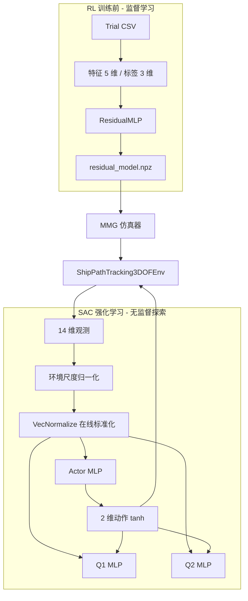
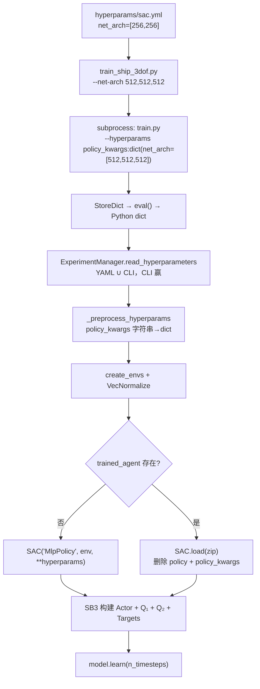

# Ship3DOF 强化学习网络架构说明

本文档说明本仓库 `ShipPathTracking3DOF-v0` 任务中**神经网络是如何构建、配置、训练与推理的**。面向需要理解代码结构、调整网络规模或排查训练问题的开发者。

相关文档：

- 使用手册：`ship_3dof_user_manual_zh.md`
- 算法与验收理论：`ship_3dof_technical_report_zh.md` §6

---

## 目录

1. [总览：两类神经网络](#1-总览两类神经网络)
2. [强化学习问题定义](#2-强化学习问题定义)
3. [SAC 策略网络架构](#3-sac-策略网络架构)
4. [配置传递与模型实例化](#4-配置传递与模型实例化)
5. [动力学残差网络](#5-动力学残差网络)
6. [课程学习与各阶段环境差异](#6-课程学习与各阶段环境差异)
7. [SAC 训练循环（单步视角）](#7-sac-训练循环单步视角)
8. [Pipeline 各阶段与网络的关系](#8-pipeline-各阶段与网络的关系)
9. [默认超参数与规模选择](#9-默认超参数与规模选择)
10. [推理、部署与 checkpoint](#10-推理部署与-checkpoint)
11. [如何修改网络](#11-如何修改网络)
12. [训练产物与日志](#12-训练产物与日志)
13. [排障与调参建议](#13-排障与调参建议)
14. [关键源文件索引](#14-关键源文件索引)
15. [常见误区](#15-常见误区)
16. [完整数据流示意图](#16-完整数据流示意图)

---

## 1. 总览：两类神经网络

本工程**没有自定义 SB3 Policy 类**，也没有自定义 Feature Extractor。与神经网络相关的模块分为两层：

| 网络 | 用途 | 实现位置 | 框架 | 与 RL 的关系 |
|------|------|----------|------|--------------|
| **SAC MlpPolicy** | 路径跟踪控制策略 | Stable-Baselines3 内置 | PyTorch（SB3） | **核心 RL 网络** |
| **ResidualMLP** | MMG 动力学残差修正 | `train_residual.py` | PyTorch（独立训练） | **仿真器增强**，不是策略 |



**关键结论**：SAC 策略网络由 SB3 根据 `policy_kwargs.net_arch` 在运行时自动构建；工程代码只负责把超参数从 YAML/CLI 传到 `SAC(...)` 构造函数，不手写 `nn.Module` 层定义。

---

## 2. 强化学习问题定义

网络输入输出维度由 Gymnasium 环境的空间定义直接决定。

### 2.1 观测空间：14 维向量

```57:63:custom_envs/ship_3dof/env.py
        self.observation_space = spaces.Box(
            low=-5.0,
            high=5.0,
            shape=(14,),
            dtype=np.float32,
        )
        self.action_space = spaces.Box(low=-1.0, high=1.0, shape=(2,), dtype=np.float32)
```

#### 观测分量详解

| 索引 | 符号 | 物理含义 | 单位/范围 | 尺度 `DEFAULT_OBS_SCALE` | 设计意图 |
|------|------|----------|-----------|--------------------------|----------|
| 0 | `e_y` | 横向跟踪误差 | m | 12.0 | 核心控制目标 |
| 1 | `e_psi` | 航向误差 | rad | π | 核心控制目标 |
| 2 | `e_s` | 剩余航程 | m | 120.0 | 终点逼近信号 |
| 3 | `u` | 纵向速度 | m/s | 4.0 | 船体运动状态 |
| 4 | `v` | 横向速度 | m/s | 2.0 | 船体运动状态 |
| 5 | `r` | 艏摇角速度 | rad/s | 1.5 | 船体运动状态 |
| 6 | `beta` | 漂角 arctan(v/u) | rad | 1.0 | 侧滑指示 |
| 7 | `delta` | 当前舵角 | rad | 0.7 | 执行器状态 |
| 8 | `n` | 螺旋桨转速 | rps | 25.0 | 执行器状态 |
| 9 | `dot_delta_prev` | 上一步舵速 | rad/s | 0.2 | 平滑性/惯性 |
| 10 | `dot_n_prev` | 上一步转速变化率 | rps/s | 2.5 | 平滑性/惯性 |
| 11 | `kappa_l` | 路径局部曲率 | 1/m | 0.01 | 前馈弯道信息 |
| 12 | `d_u_hat` | 纵向扰动估计 | — | 0.6 | 抗扰（阶段 1+） |
| 13 | `d_v_hat` | 横向扰动估计 | — | 0.6 | 抗扰（阶段 1+） |

构建逻辑（`env.py` `_observation()`）：

```161:184:custom_envs/ship_3dof/env.py
    def _observation(self) -> np.ndarray:
        e_y, e_psi, e_s, kappa_l = self._tracking_error()
        beta = float(np.arctan2(self.state.v, max(self.state.u, self.cfg.u_min_for_beta)))
        obs_raw = np.array([...], dtype=np.float64)
        scale = np.array(list(DEFAULT_OBS_SCALE.values()), dtype=np.float64)
        return np.clip(obs_raw / scale, -5.0, 5.0).astype(np.float32)
```

**阶段 2** 起对 `e_y, e_psi, u, v, r` 叠加传感器噪声（`_sensor_noise()`），使策略网络必须对噪声鲁棒。

### 2.2 动作空间：2 维连续控制

```252:256:custom_envs/ship_3dof/env.py
        action = np.clip(action, -1.0, 1.0)
        dot_delta_cmd = float(action[0] * self.dot_delta_max)
        dot_n_cmd = float(action[1] * self.dot_n_max)
```

| 维度 | 网络输出 | 物理指令 | 默认上限 |
|------|----------|----------|----------|
| 0 | `a₀ ∈ [-1,1]` | 舵速 `dot_delta` | 4°/s |
| 1 | `a₁ ∈ [-1,1]` | 转速变化率 `dot_n` | 2.0 rps/s |

SAC 策略输出经 `tanh` 压缩到 `[-1,1]`，与环境 `action_space` 完全对齐，无需额外缩放层。

**阶段 2** 执行器加入一阶滞后（`actuator_lag=0.2s`），网络输出的是"期望速率"，实际施加的是滤波后的 `_cmd_delta/_cmd_n`。

### 2.3 两层观测预处理

观测在进入 MLP 之前经历**两次归一化**，容易混淆：


| 阶段 | 位置 | 方式 | 是否可学习 |
|------|------|------|------------|
| ① 环境尺度 | `env._observation()` | 固定常数除法 + clip | 否 |
| ② 在线标准化 | `VecNormalize` | 运行均值/方差 | 否（统计量在线更新） |

配置（`hyperparams/sac.yml` + `exp_manager._maybe_normalize()`）：

```yaml
normalize: "{'norm_obs': True, 'norm_reward': False}"
```

**为何 `norm_reward=False`**：奖励含刻意设计的大额终端项（成功 +50、失败 -100），归一化会破坏 Q 网络对终止状态的量级感知。详见 `ship_3dof_technical_report_zh.md` §6.3。

续训时若存在 `vecnormalize.pkl`，会从 checkpoint 目录加载统计量（`exp_manager.py` L709–715），保证推理与训练分布一致。

### 2.4 奖励结构（影响 Q 网络学什么）

```200:208:custom_envs/ship_3dof/env.py
        reward = float(r_progress - r_track - r_heading - r_smooth - r_energy - r_safety)
```

| 项 | 公式概要 | 权重 | 对网络的影响 |
|----|----------|------|--------------|
| `r_progress` | 沿路径前进距离 × 0.85 | + | 鼓励向终点移动 |
| `r_track` | \|e_y\| 与 e_y² | −1.1 / −0.35 | 压低横向偏差 |
| `r_heading` | \|e_psi\| 与 r² | −0.6 / −0.08 | 压低航向偏差与摆头 |
| `r_smooth` | 舵速² + 转速变化² | −0.03 / −0.015 | 动作平滑，抑制抖动 |
| `r_energy` | n² | −0.005 | 节能倾向 |
| `r_safety` | 碰撞 / 出航道 | −3.0 / −4.0 | 安全约束 |
| 终端 `r_goal` | 到达终点 | +50 | 稀疏成功信号 |
| 终端 `r_fail` | 失败终止 | −100 | 强惩罚，塑造 Q 值悬崖 |

Q 网络拟合的是上述奖励的折扣回报；策略网络通过 Q 值梯度学习产生高回报动作。网络结构本身不含奖励建模模块（无逆动力学模型等）。

---

## 3. SAC 策略网络架构

### 3.1 策略类型与配置来源

| 属性 | 值 |
|------|-----|
| 算法 | SAC（Soft Actor-Critic） |
| 策略类 | `MlpPolicy`（SB3 字符串，映射到 `SACPolicy`） |
| 特征提取 | `FlattenExtractor`（14 维向量直通） |
| 激活函数 | 默认 `nn.ReLU`（未显式配置） |
| 探索 | `use_sde=True`（gSDE 状态相关探索） |

YAML 基线（`hyperparams/sac.yml` L266–280）：

```yaml
ShipPathTracking3DOF-v0:
  policy: "MlpPolicy"
  policy_kwargs: "dict(net_arch=[256, 256])"
  use_sde: True
  ent_coef: "auto"
  normalize: "{'norm_obs': True, 'norm_reward': False}"
```

Pipeline 通过 CLI **覆盖**为 `net_arch=[512,512,512]`、`batch_size=512`（见 §4.4 真实日志样例）。

### 3.2 网络拓扑（默认 `net_arch=[512, 512, 512]`）

本工程使用**扁平 `net_arch` 列表**，SB3 将其同时用于 Actor 和 Critic（Q）的共享 trunk 深度。

#### Actor（策略网络 π）

```
VecNormalize 输出 s ∈ R^14
    ↓
Linear(14 → 512) → ReLU
    ↓
Linear(512 → 512) → ReLU
    ↓
Linear(512 → 512) → ReLU
    ↓
┌─ 均值头 Linear(512 → 2) ─────────────────┐
└─ gSDE 噪声矩阵（状态相关，use_sde=True）─┘
    ↓
重参数化采样 ε ~ N(0,I)
    ↓
a = tanh(μ(s) + σ(s) ⊙ ε)   →  a ∈ [-1,1]²
```

- **训练目标**：最大化 $\mathbb{E}[Q(s,a) - \alpha \log\pi(a|s)]$
- **`ent_coef: auto`**：自动调节温度系数 α，维持目标熵

#### Twin Q 网络（Q₁、Q₂ 及各自 Target）

```
输入 x = concat(s, a) ∈ R^16
    ↓
Linear(16 → 512) → ReLU
    ↓
Linear(512 → 512) → ReLU
    ↓
Linear(512 → 512) → ReLU
    ↓
Linear(512 → 1)  →  标量 Q(s,a)
```

- **两套独立 Q** + **两套 Target Q**（Polyak 更新，τ=0.005）
- Bootstrap 目标取 $\min(Q_1^{target}, Q_2^{target})$，抑制高估
- **训练目标**：最小化 Bellman 残差 MSE

#### Actor vs Q 对比

| 属性 | Actor π | Q 网络 |
|------|---------|--------|
| 输入维度 | 14（仅状态） | 16（状态+动作） |
| 网络数量 | 1 | 2 在线 + 2 目标 |
| 输出 | 动作分布参数 | 标量 Q 值 |
| 是否参与环境交互 | 是（采样动作） | 否（仅训练） |
| 探索噪声 | gSDE | 无 |

> **高级用法**：`policy_kwargs:dict(net_arch=dict(pi=[256,256], qf=[512,512,512]))` 可让 Actor 更浅、Q 更深。当前 Ship3DOF 脚本未启用。

### 3.3 gSDE 探索机制（`use_sde=True`）

普通 SAC 使用固定或对角高斯噪声；本工程启用 **generalized State-Dependent Exploration (gSDE)**：

| 属性 | 普通高斯探索 | gSDE（本工程） |
|------|--------------|----------------|
| 噪声形态 | 各维独立、回合间不变 | 状态相关矩阵，回合内相关 |
| 对船舶控制的意义 | 舵/桨联合探索不协调 | 探索更平滑，适合耦合执行器 |
| 配置 | `use_sde: False` | `use_sde: True`（YAML + policy_kwargs） |

gSDE 在 Actor 隐藏层后额外学习噪声矩阵，使探索强度随状态变化。课程阶段越难，状态分布越宽，自适应探索有助于覆盖新扰动工况。

### 3.4 参数量估算（`net_arch=[512,512,512]`）

以下为 **MLP 主体近似参数量**（不含 gSDE 附加矩阵，实际略大）：

| 子网络 | 计算 | 参数量约 |
|--------|------|----------|
| Actor trunk | 14×512 + 512×512×2 + 512×2 | ~53 万 |
| 每个 Q 网络 | 16×512 + 512×512×2 + 512×1 | ~53 万 |
| **合计（1 Actor + 2 Q + 2 Target Q）** | | **~265 万** |

对比：

| 网络 | 参数量约 |
|------|----------|
| ResidualMLP (5→64→64→3) | ~4,800 |
| SAC `net_arch=[256,256]` | ~35 万 |
| SAC `net_arch=[512,512,512]` | ~265 万 |
| SAC `net_arch=[1024,1024,1024]` | ~1,050 万 |

参数量随隐藏层宽度 **平方级** 增长；RTX 4090 训练 `512×3` 的瓶颈通常在环境仿真步速，而非网络前向。

### 3.5 特征提取器

`MlpPolicy` 对 `Box(14,)` 观测使用 SB3 默认 **`FlattenExtractor`**：无卷积、无嵌入、无注意力，14 维向量直接接第一个 `Linear`。

工程中**未**传入 `features_extractor_class` 或 `features_extractor_kwargs`。

---

## 4. 配置传递与模型实例化

### 4.1 端到端传递链路



### 4.2 `train_ship_3dof.py`：工程侧唯一显式传 net_arch 处

```86:93:scripts/ship_3dof/train_ship_3dof.py
    hyperparams = [
        f"learning_starts:{args.learning_starts}",
        f"learning_rate:{args.learning_rate}",
        f"train_freq:{args.train_freq}",
        f"gradient_steps:{args.gradient_steps}",
        f"batch_size:{args.batch_size}",
        f"policy_kwargs:dict(net_arch={net_arch})",
    ]
```

`--net-arch` 解析（L35–42）：逗号分隔正整数列表，默认 `"512,512,512"`。

三阶段循环（L143–149）：每阶段调用一次 `train.py`，阶段 2/3 通过 `--trained-agent` 传入上一阶段 `.zip`。

### 4.3 CLI 超参解析：`StoreDict`

```488:507:rl_zoo3/utils.py
class StoreDict(argparse.Action):
    def __call__(self, parser, namespace, values, option_string=None):
        arg_dict = {}
        for arguments in values:
            key = arguments.split(":")[0]
            value = ":".join(arguments.split(":")[1:])
            arg_dict[key] = eval(value)  # Python 表达式求值
        setattr(namespace, self.dest, arg_dict)
```

因此命令行中必须写合法 Python 字面量：

```bash
--hyperparams policy_kwargs:dict(net_arch=[512,512,512])
# 错误示例：policy_kwargs:dict(net_arch=512,512,512)  ← 语法非法
```

### 4.4 真实训练日志样例（阶段 1，curriculum_stage=0）

来自 `logs_pipeline/exp_seed42/sac/ShipPathTracking3DOF-v0_1/.../args.yml`：

```yaml
env_kwargs:
  curriculum_stage: 0
  mmg_params_path: scripts/ship_3dof/mmg_params_example.json
  residual_model_path: artifacts/ship_3dof/runs/exp_seed42/residual_model.npz
hyperparams:
  batch_size: 512
  gradient_steps: 4
  learning_rate: 0.0003
  learning_starts: 5000
  policy_kwargs:
    net_arch: [512, 512, 512]
    use_sde: true
  train_freq: 4
n_timesteps: 600000
```

对应 `config.yml` 中完整 SAC 配置还包含 `buffer_size: 1e6`、`gamma: 0.99`、`tau: 0.005`、`ent_coef: auto` 等 YAML 字段（未被 CLI 覆盖的部分）。

### 4.5 续训时的网络行为

| 行为 | 说明 |
|------|------|
| 权重 | 从上一阶段 `.zip` 完整加载 |
| 结构 | 由 checkpoint 内 policy 定义，**忽略**新的 `policy_kwargs` |
| 优化器状态 | 随 `.zip` 恢复 |
| Replay buffer | 仅当存在 `replay_buffer.pkl` 时加载（默认不保存） |
| VecNormalize | 若存在 `vecnormalize.pkl` 则加载 |

```816:823:rl_zoo3/exp_manager.py
        del hyperparams["policy"]
        if "policy_kwargs" in hyperparams.keys():
            del hyperparams["policy_kwargs"]
```

**重要**：阶段 2/3 不能通过改 `--net-arch` 来改变网络深度；若要换结构必须从零训练。

---

## 5. 动力学残差网络

### 5.1 结构定义

```22:36:scripts/ship_3dof/train_residual.py
class ResidualMLP(nn.Module):
    def __init__(self):
        super().__init__()
        self.net = nn.Sequential(
            nn.Linear(5, 64), nn.Tanh(),
            nn.Linear(64, 64), nn.Tanh(),
            nn.Linear(64, 3), nn.Tanh(),
        )
        self.scale = nn.Parameter(torch.tensor([0.08, 0.08, 0.05]), requires_grad=False)
```

| 属性 | 值 |
|------|-----|
| 输入 | `[u, v, r, delta, n]` |
| 输出 | 加速度残差 `[ε_u, ε_v, ε_r]`，经 `scale` 限幅 |
| 损失 | MSE（监督学习，60 epoch，Adam lr=3e-4） |
| 导出 | `.npz` → `ResidualModel`（NumPy 推理，无 PyTorch 依赖） |

### 5.2 训练数据构造

对每个 trial CSV 的相邻时间步：

1. 用**当前 MMG 模型**（无残差）预测下一时刻状态
2. 真实状态与预测之差 ÷ dt → 残差加速度标签
3. 特征为当前 `[u, v, r, delta, n]`

```75:84:scripts/ship_3dof/train_residual.py
            eps = np.array([
                (trial.u[i + 1] - pred.u) / dt,
                (trial.v[i + 1] - pred.v) / dt,
                (trial.r[i + 1] - pred.r) / dt,
            ])
            features.append([state.u, state.v, state.r, state.delta, state.n])
            targets.append(eps)
```

### 5.3 仿真器中的推理

```57:62:custom_envs/ship_3dof/dynamics.py
    def predict(self, state: ShipState) -> np.ndarray:
        x = np.array([state.u, state.v, state.r, state.delta, state.n])
        h1 = np.tanh(x @ self.w1 + self.b1)
        h2 = np.tanh(h1 @ self.w2 + self.b2)
        y = h2 @ self.w3 + self.b3
        return self.scale * np.tanh(y)
```

修正加速度（L119–121）：

```
u_dot = MMG_u + ε_u
v_dot = MMG_v + ε_v
r_dot = MMG_r + ε_r
```

### 5.4 与 SAC 网络的关系

| 问题 | 答案 |
|------|------|
| 残差网络是策略的一部分吗？ | **否** |
| 残差权重会随 SAC 训练更新吗？ | **否**，M2 阶段固定后注入环境 |
| M2 未通过时会怎样？ | `residual_model_path=None`，纯 MMG 仿真 |
| SAC 需要为残差网络改结构吗？ | **否**，观测/动作维度不变 |

---

## 6. 课程学习与各阶段环境差异

三阶段课程（`train_ship_3dof.py`）使用**同一 SAC 网络**，逐阶段加载权重：

| 阶段 | `curriculum_stage` | 默认步数 | 累计步数 | 模型初始化 |
|------|-------------------|----------|----------|------------|
| 1 | 0（简单） | 600,000 | 600k | 从零 |
| 2 | 1（中等） | 800,000 | 1.4M | 加载阶段 1 `.zip` |
| 3 | 2（困难） | 1,100,000 | 2.5M | 加载阶段 2 `.zip` |

### 6.1 各阶段环境参数对照

| 环境特性 | Stage 0 | Stage 1 | Stage 2 |
|----------|---------|---------|---------|
| 域随机化幅度 | 3% | 8% | 15% |
| 外部扰动 | 关闭 | 55% 强度 | 100% 强度 |
| 传感器噪声 | 无 | 无 | 有（e_y, e_psi, u, v, r） |
| 执行器模型 | 直接速率 | 直接速率 | 一阶滞后 α=dt/(0.2+dt) |
| 初始横向偏差 σ_y | 0.2 m | 0.35 m | 0.5 m |
| 初始航向偏差 σ_ψ | 1.0° | 1.6° | 2.0° |
| 路径曲率缩放 | 0.65× | 0.85× | 1.0× |

**网络结构全程不变**；变难的是状态分布与动力学真实性，迫使已学策略泛化。

### 6.2 为何采用课程而非单次 2.5M 步

- 早期阶段奖励信号更清晰（无噪声、无滞后），Actor 先学基本跟踪
- Q 网络在简单分布上先收敛，避免困难工况下 Q 值发散
- 续训保留权重，比每次重启更高效（离策略 SAC 可复用 replay buffer，若保存的话）

---

## 7. SAC 训练循环（单步视角）

### 7.1 时间线

```mermaid
sequenceDiagram
    participant Env as Ship3DOF Env
    participant Actor as Actor MLP
    participant Buffer as Replay Buffer 1M
    participant Q as Q1/Q2 MLP
    participant TQ as Target Q

    Note over Env,Buffer: t < learning_starts(5000): 仅随机探索
    loop 每环境步 t
        Env->>Actor: 观测 s_t
        Actor->>Env: 动作 a_t (gSDE 采样)
        Env->>Buffer: 存储 (s_t, a_t, r_t, s_{t+1}, done)
        alt t % train_freq == 0 且 t >= learning_starts
            loop gradient_steps(4) 次
                Buffer->>Q: 采样 minibatch 512
                Q->>TQ: 计算 Bellman 目标
                Q->>Q: 更新 Q1, Q2
                Actor->>Q: 策略梯度更新 Actor
                TQ->>TQ: Polyak 软更新 τ=0.005
            end
        end
    end
```

### 7.2 关键超参对训练动力学的影响

| 超参 | 默认值 | 作用 | 调大效果 | 调小效果 |
|------|--------|------|----------|----------|
| `learning_starts` | 5000 | 预热步数 | 更随机探索后才开始学 | 更早学习，可能不稳定 |
| `train_freq` | 4 | 每 N 步触发训练 | 更频繁更新 | 样本效率降低 |
| `gradient_steps` | 4 | 每次训练的梯度步 | 更激进拟合 | 更新更保守 |
| `batch_size` | 512 | minibatch 大小 | 梯度更稳、显存更大 | 噪声更大 |
| `buffer_size` | 1M | 回放容量 | 覆盖更长历史 | 遗忘旧分布 |
| `tau` | 0.005 | 目标网络跟踪速度 | 目标更紧跟在线网络 | 目标更平滑 |
| `learning_rate` | 3e-4 | Adam 步长 | 收敛快/不稳定 | 收敛慢/更稳 |

### 7.3 损失函数概要

**Critic（Q 网络）**：

$$\mathcal{L}_Q = \mathbb{E}\left[\left(Q_\theta(s,a) - \left(r + \gamma \min_{i=1,2} Q_{\bar\theta_i}(s', a') - \alpha \log\pi(a'|s')\right)\right)^2\right]$$

**Actor（策略网络）**：

$$\mathcal{L}_\pi = \mathbb{E}\left[\alpha \log\pi(a|s) - Q_\theta(s,a)\right]$$

**温度 α**（`ent_coef: auto`）：自适应满足目标熵约束。

详细推导见 `ship_3dof_technical_report_zh.md` §6.1。

---

## 8. Pipeline 各阶段与网络的关系

```
M1 基线检查 ──→ 无神经网络
M2 残差训练 ──→ ResidualMLP（监督）
SAC 三阶段   ──→ SAC MlpPolicy（强化学习）
M3 评估      ──→ SAC.load 推理
M4 影子模式  ──→ SAC.load 推理
```

### 8.1 验收门槛（`sim2real_acceptance.json`）

| 门槛 | 指标 | 阈值 | 涉及网络 |
|------|------|------|----------|
| M1 | 纯 MMG 重放 RMSE | ψ<5°, r<0.1 | 无 |
| M2 | 残差验证损失下降 | ≥20% | ResidualMLP |
| M3 | RL 成功率 / 碰撞率 | ≥95% / 0% | SAC Actor |
| M4 | 影子模式接管率 | ≤2% | SAC Actor |

M3/M4 评估使用 `evaluate_ship_3dof.py` / `run_shadow_mode.py`，`SAC.load(model)` + `deterministic=True`，**不重新构建网络**。

### 8.2 `run_known_mmg_pipeline.py` 传参片段

```245:278:scripts/ship_3dof/run_known_mmg_pipeline.py
    train_cmd = [
        args.python, "scripts/ship_3dof/train_ship_3dof.py",
        ...
        "--net-arch", args.net_arch,
        "--phase-steps", str(args.phase_steps[0]), ...
    ]
    if residual_model_path is not None:
        train_cmd += ["--residual-model", residual_model_path]
```

---

## 9. 默认超参数与规模选择

### 9.1 有效默认值（pipeline）

| 超参 | Pipeline | YAML only | 备注 |
|------|----------|-----------|------|
| `net_arch` | **[512,512,512]** | [256,256] | CLI 覆盖 |
| `batch_size` | 512 | 256 | |
| `phase_steps` | 600k/800k/1.1M | n_timesteps=5M | 课程制 |
| 其余 SAC 参数 | YAML | YAML | gamma, tau, buffer 等 |

### 9.2 冒烟预设（`--smoke`）

| 参数 | 冒烟 | 正式 |
|------|------|------|
| `phase_steps` | 20k/20k/30k | 600k/800k/1.1M |
| `net_arch` | 256,256 | 512,512,512 |
| `batch_size` | 256 | 512 |

### 9.3 Autotune 搜索空间

`autotune_ship_3dof.py` **固定** `net_arch`（默认 `512,512,512`），搜索：

- `learning_starts` ∈ {2000, 5000, 10000}
- `learning_rate` ∈ {1e-4, 2e-4, 3e-4}
- `train_freq` ∈ {2, 4, 8}
- `gradient_steps` ∈ {2, 4, 8}

网络规模需在 autotune 启动前通过 `--net-arch` 指定，不在线搜索。

### 9.4 `net_arch` 选型建议

| 规模 | 适用场景 | 风险 |
|------|----------|------|
| `[256, 256]` | 冒烟、快速验证 | 表达能力不足，M3 难达标 |
| `[512, 512, 512]` | **默认生产** | 平衡性能与速度 |
| `[768, 768, 768]` | 高难工况/autotune 候选 | 训练慢，需更大 batch |
| `[1024, 1024, 1024]` | 极限精度尝试 | 显存/仿真步成为瓶颈 |

---

## 10. 推理、部署与 checkpoint

### 10.1 评估推理

```43:57:scripts/ship_3dof/evaluate_ship_3dof.py
    model = SAC.load(args.model)
    ...
    action, _ = model.predict(obs, deterministic=True)
```

| 模式 | 行为 |
|------|------|
| `deterministic=True` | 使用策略均值，无 gSDE 噪声（部署默认） |
| `deterministic=False` | 含探索噪声（仅调试） |

### 10.2 `.zip` checkpoint 内容

SB3 `model.save()` 打包：

| 组件 | 说明 |
|------|------|
| `policy` 权重 | Actor + Q1 + Q2 全部 `state_dict` |
| `policy` 结构 | 隐含 net_arch、use_sde 等实例化参数 |
| 优化器状态 | Adam 动量等 |
| `ent_coef` | 自动温度系数当前值 |

同目录可选：

| 文件 | 说明 |
|------|------|
| `vecnormalize.pkl` | 观测标准化统计量（推理必须匹配） |
| `replay_buffer.pkl` | 经验回放（续训用，默认不保存） |

### 10.3 部署注意

- 推理环境 `curriculum_stage` 应与评估一致（通常 stage=2）
- 若训练时启用了 `residual_model_path`，推理也需传入相同 `.npz`
- `mmg_params_path` 必须与训练一致

---

## 11. 如何修改网络

### 11.1 通过 pipeline（推荐）

```bash
/isaac-sim/python.sh scripts/ship_3dof/run_known_mmg_pipeline.py \
  --python /isaac-sim/python.sh \
  --net-arch 768,768,768 \
  --batch-size 512 \
  --mmg-params scripts/ship_3dof/mmg_params_example.json \
  ...
```

### 11.2 仅训练阶段

```bash
/isaac-sim/python.sh scripts/ship_3dof/train_ship_3dof.py \
  --python /isaac-sim/python.sh \
  --net-arch 512,512,512 \
  --mmg-params scripts/ship_3dof/mmg_params_example.json
```

### 11.3 分离 Actor / Q 结构

```bash
python train.py --algo sac --env ShipPathTracking3DOF-v0 \
  --hyperparams \
    policy_kwargs:dict(net_arch=dict(pi=[256,256],qf=[512,512,512]))
```

### 11.4 修改激活函数

```bash
policy_kwargs:dict(net_arch=[512,512,512],activation_fn=nn.Tanh)
```

---

## 12. 训练产物与日志

| 路径 | 内容 |
|------|------|
| `logs_<tag>/sac/ShipPathTracking3DOF-v0_<N>/ShipPathTracking3DOF-v0.zip` | 完整 SAC 模型 |
| `logs_<tag>/sac/.../args.yml` | 实际使用的 hyperparams（含 net_arch） |
| `logs_<tag>/sac/.../config.yml` | YAML ∪ CLI 合并后配置 |
| `logs_<tag>/sac/.../0.monitor.csv` | 回合回报曲线 |
| `artifacts/.../pipeline_report.json` | gates + balanced_score |
| `artifacts/.../residual_model.npz` | 残差权重 |

**确认实际 net_arch**：

```bash
grep -A5 'net_arch' logs_pipeline/exp_seed42/sac/ShipPathTracking3DOF-v0_*/args.yml
```

**TensorBoard**（若启用 `-tb`）：loss、Q 值、策略熵等标量，不含网络结构图。

---

## 13. 排障与调参建议

### 13.1 现象 → 可能原因 → 对策

| 现象 | 可能原因 | 建议 |
|------|----------|------|
| 回报长期不升 | `learning_starts` 太大或 lr 太小 | 降至 2000~3000；试 5e-4 |
| 回报剧烈震荡 | lr 太大或 batch 太小 | 降 lr；增大 batch 到 512 |
| Q 值爆炸/NaN | 奖励尺度过大 + lr 过高 | 确认 `norm_reward=False` 是刻意的；降 lr |
| M3 成功率低但训练回报高 | 过拟合 stage 0/1 | 延长 stage 2 步数；加大域随机化 |
| 舵角高频抖动 | 平滑惩罚权重相对太低 | 增大 `w_smooth_delta`（改 config.py） |
| 续训后性能下降 | VecNormalize 统计未加载 | 检查 `vecnormalize.pkl` |
| 改 net_arch 续训无效 | checkpoint 锁定旧结构 | 必须从零训练新结构 |
| GPU 利用率低 | 环境仿真瓶颈 | 正常；瓶颈在 MMG 步进非 MLP |

### 13.2 验证网络是否正确构建

```bash
# 1. 检查 args.yml 中 net_arch
cat logs_*/sac/ShipPathTracking3DOF-v0_*/args.yml | grep -A4 net_arch

# 2. Python 加载并打印结构
python3 - <<'PY'
from stable_baselines3 import SAC
m = SAC.load("logs_pipeline/exp_seed42/sac/ShipPathTracking3DOF-v0_3/ShipPathTracking3DOF-v0.zip")
print(m.policy)
PY

# 3. 单步推理维度检查
python3 - <<'PY'
import gymnasium as gym, custom_envs  # noqa
from stable_baselines3 import SAC
env = gym.make("ShipPathTracking3DOF-v0", curriculum_stage=2)
model = SAC.load("...")  # 替换路径
obs, _ = env.reset()
action, _ = model.predict(obs, deterministic=True)
assert obs.shape == (14,) and action.shape == (2,)
print("OK", obs.shape, action.shape)
PY
```

---

## 14. 关键源文件索引

| 文件 | 职责 |
|------|------|
| `hyperparams/sac.yml` | SAC 基线超参、`net_arch` YAML 默认 |
| `scripts/ship_3dof/train_ship_3dof.py` | 三阶段课程；`policy_kwargs` 注入 |
| `scripts/ship_3dof/run_known_mmg_pipeline.py` | M1~M4 编排 |
| `scripts/ship_3dof/train_residual.py` | ResidualMLP 定义与训练 |
| `scripts/ship_3dof/autotune_ship_3dof.py` | 固定 net_arch 的超参搜索 |
| `scripts/ship_3dof/multi_gpu_train.py` | 多 GPU 并行（含 smoke 预设） |
| `scripts/ship_3dof/evaluate_ship_3dof.py` | SAC 推理评估 |
| `scripts/ship_3dof/sim2real_acceptance.json` | M1~M4 门槛 |
| `rl_zoo3/train.py` | `train.py` CLI 入口 |
| `rl_zoo3/exp_manager.py` | 超参合并、`SAC()` 创建、VecNormalize |
| `rl_zoo3/utils.py` | `StoreDict` 解析 |
| `custom_envs/ship_3dof/env.py` | 观测/动作/奖励/课程 |
| `custom_envs/ship_3dof/config.py` | 尺度、MMG、奖励权重 |
| `custom_envs/ship_3dof/dynamics.py` | MMG + ResidualModel 推理 |

---

## 15. 常见误区

| 误区 | 事实 |
|------|------|
| "工程自定义了 Policy 类" | 没有；用的 SB3 `MlpPolicy` |
| "残差网络是策略残差" | 是**动力学**残差，与策略无关 |
| "YAML 里 net_arch=[256,256] 就是实际值" | Pipeline CLI 覆盖为 [512,512,512] |
| "改 --net-arch 可以中途换结构" | 续训时结构由 checkpoint 锁定 |
| "norm_reward 应该打开" | 会破坏终端奖励 ±50/100 的 deliberate 设计 |
| "观测只归一化一次" | 环境尺度 + VecNormalize 两层 |
| "冒烟通过 = M3 达标" | 冒烟只验证调度/跑通，不验证控制性能 |

---

## 16. 完整数据流示意图

```
  Trial CSV
      │
      ▼
┌─────────────────────┐
│ ResidualMLP (PyTorch)│  监督学习，~5k 参数
│  5 → 64 → 64 → 3    │
└─────────┬───────────┘
          ▼ .npz
┌─────────────────────────────────────────────────────────┐
│  ShipPathTracking3DOFEnv                                │
│  MMG + 残差 │ 课程 stage │ 扰动 │ 噪声 │ 执行器滞后    │
│                                                         │
│  obs: 14-d ─────────────────────────────────────────┐   │
│  action: 2-d ◄──────────────────────────────────────┘   │
└──────────────────────────┬──────────────────────────────┘
                           ▼
                  ┌─────────────────┐
                  │ VecNormalize    │  norm_obs=True
                  └────────┬────────┘
                           ▼
┌──────────────────────────────────────────────────────────┐
│  SAC MlpPolicy                                           │
│                                                          │
│  Actor:   R^14 → [512]×3 → ReLU → tanh → R^2           │
│           + gSDE 状态相关探索                             │
│                                                          │
│  Q₁,Q₂:   R^16 → [512]×3 → ReLU → R^1                  │
│  Target:  Polyak τ=0.005                                 │
│                                                          │
│  Buffer: 1M │ batch 512 │ train_freq 4 │ grad_steps 4   │
└──────────────────────────┬───────────────────────────────┘
                           ▼
              ShipPathTracking3DOF-v0.zip
                           ▼
         evaluate (M3) / shadow_mode (M4) / deploy
```

---

*文档版本：rl-baselines3-zoo v2.9.1 + Ship3DOF pipeline。最后更新：2026-07-15。*
