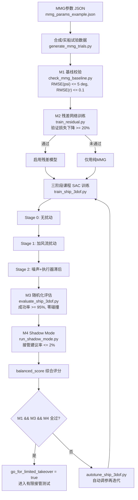
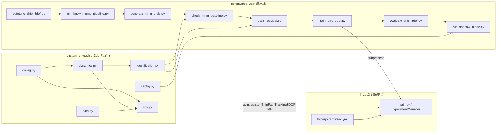

# Ship3DOF 技术报告：原理、代价函数设计与数学推导

本文是 `ShipPathTracking3DOF-v0` 项目的原理级技术文档，回答"系统为什么这样构建"。
面向"怎么操作"的内容请看配套手册：[ship_3dof_user_manual_zh.md](ship_3dof_user_manual_zh.md)。

对应代码：

| 模块 | 文件 | 职责 |
| --- | --- | --- |
| 动力学 | `custom_envs/ship_3dof/dynamics.py` | MMG 3-DOF 方程 + 残差网络 + 执行器约束 |
| 环境 | `custom_envs/ship_3dof/env.py` | Gymnasium 环境：观测/动作/奖励/课程/域随机化 |
| 路径 | `custom_envs/ship_3dof/path.py` | 参考路径生成、切向/曲率、横向误差 |
| 辨识 | `custom_envs/ship_3dof/identification.py` | 数据预处理、Nomoto/MMG 拟合、验证 |
| 部署 | `custom_envs/ship_3dof/deploy.py` | 安全滤波、PID 回退、shadow mode |
| 参数 | `custom_envs/ship_3dof/config.py` | 全部可调参数（动力学/执行器/奖励/环境） |
| 流水线 | `scripts/ship_3dof/*.py` | 数据生成、M1~M4 门禁、训练、评估、自动调参 |

---

## 1. 系统总览与构建流程

### 1.1 端到端构建流程图

整条流水线由 `scripts/ship_3dof/run_known_mmg_pipeline.py` 串联，核心思想是：
**先证明模型可信（M1/M2），再训练策略（课程 SAC），最后证明策略可上船（M3/M4）**。



### 1.2 模块依赖图



关键产物（每次 run 隔离在 `artifacts/ship_3dof/runs/<run-tag>/`）：

- `mmg_baseline_report.json`（M1）、`residual_metrics.json`（M2）
- `eval_metrics.json`（M3）、`shadow_mode_report.json`（M4）
- `pipeline_report.json`：汇总时间、资源、门禁结果和 `balanced_score`

---

## 2. MMG 3-DOF 动力学：原理与推导

### 2.1 从刚体平面运动到三通道方程

在船体坐标系（原点在船中，$x$ 轴指向船艏，$y$ 轴指向右舷）下，
设纵向速度 $u$、横向速度 $v$、艏摇角速度 $r$、艏向角 $\psi$。

牛顿-欧拉方程写在**随体旋转坐标系**中时，动量的时间导数要加上旋转修正项
$\boldsymbol{\omega} \times m\boldsymbol{v}$。平面运动中 $\boldsymbol{\omega} = (0,0,r)$，故：

$$
\boldsymbol{\omega} \times m\boldsymbol{v} =
m \begin{pmatrix} -r v \\ r u \\ 0 \end{pmatrix}
$$

将其移到方程右侧即得到**科氏/向心项**，这正是代码中 `+ r*v` 与 `- r*u` 的来源：

$$
\begin{aligned}
m_u \dot{u} &= X(u, n) + m_u\, r v \\
m_v \dot{v} &= Y(u, v, r, \delta) - m_v\, r u \\
I_z \dot{r} &= N(u, v, r, \delta)
\end{aligned}
$$

其中 $m_u = m + m_x$、$m_v = m + m_y$ 是**含附加质量的等效质量**
（船在水中加速时要同时推动周围水体，surge/sway 方向附加质量不同，所以 $m_u \ne m_v$；
默认值 `m_u=35, m_v=45` 正体现了横向附加质量大于纵向这一物理事实），
$I_z$ 为含附加转动惯量的等效惯量。

对应实现（`dynamics.py` 的 `step()`）：

```119:121:custom_envs/ship_3dof/dynamics.py
        u_dot = x_force / self.params.m_u + state.r * state.v + residual[0]
        v_dot = y_force / self.params.m_v - state.r * state.u + residual[1]
        r_dot = n_moment / self.params.i_z + residual[2]
```

### 2.2 水动力/推力/舵力的多项式展开

MMG（Maneuvering Modeling Group）方法的核心是把合外力按**物理来源分解**
（裸船体阻尼 + 螺旋桨推力 + 舵力），每一项再对状态量做低阶多项式展开。
本项目采用的展开式（`_forces()`）：

$$
\begin{aligned}
X &= X_u u + X_{uu}|u|u + X_n n|n| \\
Y &= Y_v v + Y_r r + Y_{vv}|v|v + Y_\delta u^2 \delta \\
N &= N_v v + N_r r + N_{rr}|r|r + N_\delta u^2 \delta
\end{aligned}
$$

各项物理意义与符号约定：

| 项 | 形式 | 物理意义 | 符号约定 |
| --- | --- | --- | --- |
| $X_u u$ | 线性 | 低速摩擦阻力 | $X_u < 0$（阻碍前进） |
| $X_{uu}\lvert u\rvert u$ | 二阶 | 高速兴波/形状阻力，写成 $\lvert u\rvert u$ 而非 $u^2$ 是为了**保号**（倒车时阻力反向） | $X_{uu} < 0$ |
| $X_n n\lvert n\rvert$ | 二阶 | 螺旋桨推力，$T \propto \rho n^2 D^4$ 的简化，保号处理支持倒车 | $X_n > 0$ |
| $Y_v v,\ N_v v$ | 线性 | 横漂产生的升力/力矩（船体像低展弦比机翼） | $Y_v < 0$（回复性） |
| $Y_r r,\ N_r r$ | 线性 | 回转引起的横向力/阻尼力矩 | $N_r < 0$（艏摇阻尼，是航向稳定性的主要来源） |
| $Y_{vv}\lvert v\rvert v,\ N_{rr}\lvert r\rvert r$ | 二阶 | 大漂角/大回转率下的非线性失速修正 | 与线性项同号 |
| $Y_\delta u^2\delta,\ N_\delta u^2\delta$ | 舵力 | 舵是安装在船尾的小机翼，升力 $\propto \frac{1}{2}\rho V^2 A_R C_L(\delta)$，小舵角下 $C_L \approx k\delta$，故 $\propto u^2 \delta$ | $N_\delta > 0$（右舵产生右转力矩） |

**舵力 $\propto u^2$ 是本模型最重要的非线性耦合**：船速越低舵效越差，
这直接决定了 RL 策略必须学会"先保速再修航向"，纯运动学模型给不出这个特性。

### 2.3 体坐标 → 大地坐标的运动学变换

大地坐标系下位置 $(x, y)$ 与艏向角 $\psi$ 的演化由旋转矩阵给出：

$$
\begin{pmatrix} \dot{x} \\ \dot{y} \end{pmatrix}
=
\begin{pmatrix} \cos\psi & -\sin\psi \\ \sin\psi & \cos\psi \end{pmatrix}
\begin{pmatrix} u + d_u \\ v + d_v \end{pmatrix},
\qquad \dot{\psi} = r
$$

其中 $(d_u, d_v)$ 是**体坐标系下的流扰动**（漂移速度），
建模为"运动学叠加"而非力扰动——这对应恒定海流的物理图像：
海流不改变船相对水的动力学，只平移船相对地面的轨迹。
Stage 2 中扰动带缓慢随机游走（每步 $\mathcal{N}(0, 0.01)$ 漂移，限幅 $\pm 0.6$ m/s），模拟阵性流。

### 2.4 数值积分与稳定性

采用显式欧拉法，$\Delta t = 0.1$ s：

$$
x_{k+1} = x_k + f(x_k, u_k)\,\Delta t
$$

显式欧拉稳定的充分条件是 $\Delta t < 2/|\lambda_{\max}|$（$\lambda$ 为系统雅可比特征值）。
本系统最快的模态是艏摇阻尼 $\lambda_r \approx N_r / I_z = -7.5/18 \approx -0.42\ \mathrm{s^{-1}}$
和横向阻尼 $\lambda_v \approx Y_v/m_v = -14/45 \approx -0.31\ \mathrm{s^{-1}}$，
时间常数约 2.4~3.2 s，远大于 $\Delta t = 0.1$ s（比值 > 24），欧拉法足够稳定，
无需 RK4（RK4 用在辨识的轨迹回放校验中意义更大，因为要做数百秒长程积分）。

$\Delta t = 0.1$ s 同时是**控制频率**（10 Hz），与真实自动舵指令周期同量级。

### 2.5 执行器模型

动作不直接设定舵角/转速，而是给出变化率命令，再做**积分 + 双重限幅**
（`dynamics.py` 第 111-114 行）：

$$
\begin{aligned}
\delta_{k+1} &= \mathrm{clip}\left(\delta_k + \mathrm{clip}(\dot\delta_{cmd}, \pm\dot\delta_{\max})\,\Delta t,\ \pm\delta_{\max}\right) \\
n_{k+1} &= \mathrm{clip}\left(n_k + \mathrm{clip}(\dot{n}_{cmd}, \pm\dot{n}_{\max})\,\Delta t,\ [n_{\min}, n_{\max}]\right)
\end{aligned}
$$

默认限幅：$\delta_{\max} = 35°$（IMO 常规舵限）、$\dot\delta_{\max} = 4°/\mathrm{s}$
（接近 SOLAS 要求的 65°/28s ≈ 2.3°/s 的舵机速率量级）、$n \in [0, 25]$、$\dot{n}_{\max} = 2\ \mathrm{rpm/s}$。

Stage 2 还叠加一阶滞后（见第 8 章）模拟舵机响应延迟。

---

## 3. 参考路径与误差几何

### 3.1 路径生成

每回合随机生成一条长 $L = 500$ m 的路径（`path.py` 的 `_build_points()`）：
$x(s) = s$，横向偏移为两个正弦的叠加：

$$
y(s) = 12\kappa L \sin\!\left(\frac{2\pi s}{L} + \phi_1\right) + 6\kappa L \sin\!\left(\frac{4\pi s}{L} + \phi_2\right)
$$

$\phi_1, \phi_2 \sim \mathcal{U}(0, 2\pi)$ 保证每回合路径形状不同（防止策略背题），
$\kappa$（`path_curvature`，默认 0.0025）控制弯曲程度，双频叠加产生"缓弯 + 急弯"组合。

### 3.2 切向与曲率的数值计算

对离散点列用中心差分（`np.gradient`）计算：

$$
\theta(s) = \operatorname{atan2}(y', x'), \qquad
\kappa(s) = \frac{x'y'' - y'x''}{\left(x'^2 + y'^2\right)^{3/2}}
$$

曲率公式来自平面曲线曲率的标准定义（切向角对弧长的导数），
分母加 $10^{-6}$ 下限防止退化点除零。前视曲率 $\kappa_L$ 作为观测量输入策略，
让策略**提前**知道前方要转弯——没有它，策略只能等横向误差出现后被动纠偏。

### 3.3 有符号横向误差的推导

设最近路径点 $\boldsymbol{p}_{ref}$，该点切向角 $\theta$，则单位切向量与**左法向量**为：

$$
\hat{\boldsymbol{t}} = (\cos\theta, \sin\theta), \qquad
\hat{\boldsymbol{n}} = (-\sin\theta, \cos\theta)
$$

横向误差是位置偏差在法向上的投影（`signed_cross_track_error()`）：

$$
e_y = (\boldsymbol{p} - \boldsymbol{p}_{ref}) \cdot \hat{\boldsymbol{n}}
$$

**符号携带方位信息**（$e_y > 0$ 表示船在路径左侧），这比无符号距离多一位关键信息——
策略无需从其他观测中推断该往哪边打舵。

最近点搜索用滑动窗口（上次索引 ±10/前视 250 点）而非全局 argmin，
既省算力，又防止路径自交/回折时误差跳变到错误的路径段。

### 3.4 航向误差的角度回卷

$$
e_\psi = \operatorname{wrap}(\psi - \theta) \in [-\pi, \pi], \qquad
\operatorname{wrap}(a) = ((a + \pi) \bmod 2\pi) - \pi
$$

必须回卷的原因：$\psi$ 由 $\dot\psi = r$ 积分而来会无界增长，
若不回卷，同一物理姿态（如 $359°$ 与 $-1°$）会给出完全不同的误差值，
奖励和观测都会出现虚假的不连续，策略无法学习。

---

## 4. MDP 建模：状态与动作设计原理

### 4.1 观测向量（14 维）及入选理由

RL 策略 $\pi(a|s)$ 只能看到观测 $s$，观测设计的目标是：
**在尽量低维的前提下逼近马尔可夫性**（当前观测足以预测下一步），
同时**去除与任务无关的绝对信息**以提升泛化。

| # | 观测 | 归一化尺度 | 入选理由 |
| --- | --- | --- | --- |
| 1 | $e_y$ 横向误差 | 12.0 m | 任务主误差，控制目标本身 |
| 2 | $e_\psi$ 航向误差 | $\pi$ | 决定误差演化方向（$\dot{e}_y \approx u\sin e_\psi$） |
| 3 | $e_s$ 剩余路程 | 120 m | 让策略知道离终点多远（临近终点行为可不同） |
| 4 | $u$ 纵向速度 | 4.0 m/s | 舵效 $\propto u^2$，进度 $\propto u$，动力学核心量 |
| 5 | $v$ 横向速度 | 2.0 m/s | 漂移状态，横向误差的直接导数分量 |
| 6 | $r$ 艏摇角速度 | 1.5 rad/s | 航向误差的导数，提供"D 项"信息 |
| 7 | $\beta = \operatorname{atan2}(v, \max(u, u_{\min}))$ | 1.0 | 侧滑角，$u$、$v$ 的无量纲组合，跨速度段泛化更好 |
| 8 | $\delta$ 当前舵角 | 0.7 rad | 执行器有积分状态，不给会破坏马尔可夫性 |
| 9 | $n$ 当前转速 | 25 rpm | 同上 |
| 10 | $\dot\delta_{prev}$ 上步舵速命令 | 0.2 | Stage 2 有一阶滞后，需要历史命令恢复马尔可夫性 |
| 11 | $\dot{n}_{prev}$ 上步转速命令 | 2.5 | 同上 |
| 12 | $\kappa_L$ 前视曲率 | 0.01 | 前馈信息：提前知道要转弯 |
| 13 | $\hat{d}_u$ 流扰动估计（纵向） | 0.6 | 让策略学会"带扰动补偿"，含估计噪声模拟真实观测器 |
| 14 | $\hat{d}_v$ 流扰动估计（横向） | 0.6 | 同上 |

两条关键设计原则：

1. **不输入全局坐标 $(x, y, \psi)$**。任务本质只依赖"相对路径的误差状态"，
   给全局坐标会让网络在训练路径的绝对位置上过拟合，换一条路径就失效。
   所有几何信息都以路径相对量（$e_y, e_\psi, e_s, \kappa_L$）表达，
   策略天然对路径的平移/旋转不变。
2. **执行器状态和历史命令必须入观测**。舵角/转速是有惯性的积分器，
   Stage 2 又叠加一阶滞后；若不给这些量，同一"船体状态"下最优动作会依赖隐藏的执行器状态，
   问题退化为 POMDP，值函数不再良定义。

### 4.2 归一化的推导逻辑

观测按 `DEFAULT_OBS_SCALE` 除以各自尺度后 clip 到 $[-5, 5]$：

$$
s_i^{norm} = \operatorname{clip}\!\left(\frac{s_i^{raw}}{c_i},\ -5,\ 5\right)
$$

尺度 $c_i$ 取"物理量的失效/饱和边界"：如 $e_y$ 取 12 m（`fail_cross_track`，超过即回合失败），
$u$ 取 4 m/s（`max_forward_speed`）。这样归一化后所有分量典型幅值都在 $[-1, 1]$ 附近，
神经网络各输入通道的梯度贡献均衡（否则 $e_s \sim 100$ 会淹没 $\kappa_L \sim 0.001$）。
训练时再套一层 `VecNormalize` 在线标准化（`norm_obs=True`），进一步校正运行分布。

### 4.3 动作：为什么输出"变化率"而非"绝对指令"

动作空间 $a \in [-1, 1]^2$，映射为：

$$
\dot\delta_{cmd} = a_1 \cdot \dot\delta_{\max}, \qquad
\dot{n}_{cmd} = a_2 \cdot \dot{n}_{\max}
$$

选择速率式（incremental control）而非位置式的三个理由：

1. **物理一致**：真实舵机本就是速率受限装置，速率式动作让约束在动作空间就自然满足，
   而位置式需要额外投影，且策略学到的激进指令上船后行为会不一致。
2. **探索噪声不产生阶跃舵令**：SAC 的随机策略每步采样带噪动作。位置式下噪声直接变成舵角
   抖动（一步从 $-35°$ 跳 $+35°$）；速率式下噪声被积分器天然低通滤波，探索轨迹平滑，
   既保护执行器又让回放数据更接近可部署行为。
3. **平滑惩罚有直接抓手**：奖励中的 $\dot\delta_{cmd}^2$ 项直接惩罚动作本身（见 5.3 节）。

---

## 5. 奖励（代价）函数设计【重点】

### 5.1 总公式与当前权重

每步奖励（`env.py` 的 `_reward()`，权重在 `config.py` 的 `RewardWeights`）：

$$
r_t = \underbrace{w_p\,\operatorname{clip}(\Delta s,\, 0,\, 1.25)}_{r_{progress}}
    - \underbrace{\left(w_{y1}|e_y| + w_{y2}e_y^2\right)}_{r_{track}}
    - \underbrace{\left(w_\psi|e_\psi| + w_r r^2\right)}_{r_{heading}}
    - \underbrace{\left(w_{d\delta}\dot\delta_{cmd}^2 + w_{dn}\dot{n}_{cmd}^2\right)}_{r_{smooth}}
    - \underbrace{w_n n^2}_{r_{energy}}
    - \underbrace{r_{safety}}_{\text{碰撞/出航道}}
$$

终端整形：到达终点 $+R_{goal}$；碰撞/出航道/失稳失败 $-R_{fail}$。

当前生效权重（`config.py` 实际值）：

| 权重 | 值 | | 权重 | 值 |
| --- | --- | --- | --- | --- |
| $w_p$ | 0.85 | | $w_{d\delta}$ | 0.03 |
| $w_{y1}$ | 1.1 | | $w_{dn}$ | 0.015 |
| $w_{y2}$ | 0.35 | | $w_n$ | 0.005 |
| $w_\psi$ | 0.6 | | $w_{col}$ | 3.0 |
| $w_r$ | 0.08 | | $w_{out}$ | 4.0 |
| $R_{goal}$ | 50 | | $R_{fail}$ | 100 |

### 5.2 进度项：为什么要 clip 且只取正

$$
r_{progress} = w_p \cdot \operatorname{clip}(\Delta s, 0, 1.25), \qquad
\Delta s = \max(0,\ s_k - s_{k-1})
$$

- **下限取 0（不惩罚倒退）**：若倒退给负奖励，配合最近点搜索的窗口机制，
  策略可能发现"在原地小幅震荡让最近点索引来回跳"之类的漏洞。
  只奖励前进 + 时间自然流逝（其他项都是负的）已足够产生前进压力。
- **上限 1.25 m/步**：对应 12.5 m/s。若不设上限，策略会发现"冲刺刷进度"的
  reward hacking 路径——把转速拉满获得高进度奖励，超速部分远超误差惩罚。
  上限值略高于 $u_{\max}\Delta t = 0.4$ m 的正常量程，
  实际约束的是异常情况（最近点跳变时 $\Delta s$ 突增）。
- **进度是唯一的正密集奖励**。这是"密集奖励"路线：若只有终点 $+R_{goal}$（稀疏路线），
  500 m 路径约 4000+ 步的信用分配几乎不可学；进度项相当于把终点奖励沿路径均匀"预支"，
  且总和 $\sum \Delta s \approx L$ 与路径长度守恒，不因绕路而增多——这天然防刷分。

### 5.3 跟踪项：$|e_y| + e_y^2$ 混合范数的道理

$$
r_{track} = 1.1|e_y| + 0.35 e_y^2
$$

单独用 L2（$e_y^2$）的问题：$e_y \to 0$ 时梯度 $2e_y \to 0$，
策略在小误差区几乎感受不到改进压力，收敛后会留有稳态"死区"漂移。
单独用 L1（$|e_y|$）的问题：处处等梯度，对大偏差惩罚不够陡，
策略可能长时间容忍中等偏差。

混合后：小误差区 L1 主导（梯度下界 $w_{y1}$，压死稳态误差），
大误差区 L2 主导（超线性增长，急偏差急修）。
这与 Huber 损失的动机相同但方向相反——Huber 是"小二次大线性"用于抗离群点，
这里是"小线性大二次"用于**同时要求稳态精度和大偏差响应**。

航向项 $0.6|e_\psi| + 0.08 r^2$ 同理，其中 $r^2$ 项相当于 PD 控制的 D 项：
惩罚艏摇角速度本身，抑制航向震荡（防止策略学出"快速甩头修正"的振荡策略）。

### 5.4 平滑与能耗项：控制代价的离散化

$$
r_{smooth} = 0.03\,\dot\delta_{cmd}^2 + 0.015\,\dot{n}_{cmd}^2, \qquad
r_{energy} = 0.005\, n^2
$$

平滑项惩罚的是**命令**而非状态变化，等价于最优控制中控制能量代价
$\int \|\boldsymbol{u}(t)\|_R^2\, dt$ 的离散和——这正是 LQR 目标
$J = \int (x^TQx + u^TRu)dt$ 中 $R$ 项的 RL 对应物。
它的作用：(a) 保护舵机减少磨损；(b) 正则化策略，抑制高频抖舵
（bang-bang 解在无平滑项时常是最优的，但不可部署）。

能耗项 $\propto n^2$ 近似螺旋桨功率消耗（实际 $P \propto n^3$，取二次是温和版本），
量级刻意压得很低（巡航 $n = 8$ 时罚 0.32/步）——它只用来在"多种可完成任务的转速"
中偏好低速，而不能强到让策略认为"不走最省"。

### 5.5 终端奖励与折扣因子的量级匹配推导

终端值必须和密集项的折扣累积量级匹配，否则要么被忽略、要么淹没一切。推导如下。

设 $\gamma = 0.99$，有效视界 $H_{eff} = \frac{1}{1-\gamma} = 100$ 步（10 秒）。
巡航状态下每步净奖励约：进度 $+0.85 \times 0.1 \approx +0.09$（$u \approx 1$ m/s 时
$\Delta s \approx 0.1$ m），减去小误差惩罚与能耗 $\approx -0.4$，
每步净值约 $-0.3 \sim 0$ 量级。则密集项的折扣总和量级为
$|r_{dense}| \cdot H_{eff} \approx 30$。

- $R_{goal} = 50$：与密集折扣和同量级偏上。若取 5，成功信号会被路上的惩罚噪声淹没；
  若取 5000，策略前期学到的全部梯度信息都来自极稀有的成功回合，方差爆炸。
- $R_{fail} = 100 > R_{goal}$：**失败比成功更贵**是安全任务的通用原则；
  且失败可在回合任意时刻发生（早失败折扣少、实际代价更大），
  高失败罚使策略宁可绕慢一点也不冒险贴近航道边界。
- 出航道边界（$|e_y| > 8$ m）先触发每步 $-4.0$ 的持续惩罚（`w_out`），
  同时该条件也在终止判定中——形成"边界带缓冲 + 终止"双层结构，
  失败面附近的值函数有平滑的预警坡度，而非悬崖。

### 5.6 已知的 reward hacking 风险与对策

| 风险 | 对策（已实现） |
| --- | --- |
| 冲刺刷进度 | $\Delta s$ 上限 1.25；超速 $u > 4$ m/s 直接判失败 |
| 倒退-前进循环刷分 | $\Delta s$ 下限 0；最近点单调窗口搜索 |
| 高频抖舵逼近 bang-bang | $\dot\delta_{cmd}^2$ 平滑项 + 速率式动作天然低通 |
| 贴航道边缘走捷径 | 路径是随机生成的且奖励以 $e_y$ 定义，无捷径可走；边界带惩罚 |
| 甩头快修航向 | $r^2$ 项惩罚艏摇角速度 |

### 5.7 调参次序原则

耦合权重不可同时调。推荐次序（每次只动一组）：

1. **先能走通**：提高 $w_p$ 或降低所有惩罚，直到成功率显著非零（信用分配成立）；
2. **再压误差**：逐步升 $w_{y1}/w_\psi$，观察 `reward_terms` 日志中 `r_track` 占比；
3. **最后提品质**：升 $w_{d\delta}/w_n$ 改善平滑性与能耗，此时不应损伤成功率。

`info["reward_terms"]` 每步输出六项分解值，这是诊断"哪一项主导了行为"的第一工具。

---

## 6. SAC 算法原理与本项目适配

### 6.1 最大熵 RL 目标

SAC（Soft Actor-Critic）优化的不是普通期望回报，而是**熵正则回报**：

$$
J(\pi) = \sum_t \mathbb{E}_{(s_t, a_t) \sim \rho_\pi}
\left[ r(s_t, a_t) + \alpha \mathcal{H}\big(\pi(\cdot|s_t)\big) \right],
\qquad \mathcal{H}(\pi) = -\mathbb{E}_{a\sim\pi}[\log \pi(a|s)]
$$

熵项奖励"保持随机"，好处：探索由目标函数内生驱动（无需外加噪声过程）、
避免过早坍缩到次优确定性策略、对多模态最优解（左绕/右绕都行）保持覆盖。

对应的 **soft Bellman 方程**：

$$
Q(s_t, a_t) = r_t + \gamma\, \mathbb{E}_{s_{t+1}}\!\left[
V(s_{t+1})\right], \qquad
V(s) = \mathbb{E}_{a \sim \pi}\left[ Q(s, a) - \alpha \log\pi(a|s) \right]
$$

三个工程要点：

- **双 Q 网络**：取 $\min(Q_1, Q_2)$ 作为目标，抑制 Q 值高估偏差
  （max 操作系统性偏乐观，min 是廉价的悲观修正）；
- **重参数化**：$a = \tanh(\mu_\theta(s) + \sigma_\theta(s)\odot\epsilon)$，
  $\epsilon\sim\mathcal{N}(0,I)$，使策略梯度可以从 Q 网络直接反传（低方差）；
  $\tanh$ 压缩恰好匹配本环境 $[-1,1]$ 动作界；
- **自动温度**：把熵约束 $\mathcal{H} \ge \bar{\mathcal{H}}$ 做拉格朗日对偶，
  在线调 $\alpha$（配置里 `ent_coef: auto`），免去手工调探索强度。

### 6.2 为什么选 SAC 而不是 PPO

| 维度 | SAC（选用） | PPO |
| --- | --- | --- |
| 样本效率 | 离策略，replay buffer 复用样本，本环境单步仿真成本不低，效率优先 | 在策略，采完即弃 |
| 连续动作 | 原生高斯 + tanh，重参数化梯度 | 可用但对连续小动作的方差控制较弱 |
| 探索 | 熵内生，适合本任务"成功奖励靠后"的结构 | 依赖策略方差自然衰减，易早熟 |
| 课程续训 | replay buffer + 目标网络平滑过渡到新阶段 | 换环境后旧数据全废 |

### 6.3 超参与配置对应

`hyperparams/sac.yml` 中 `ShipPathTracking3DOF-v0` 条目 + `train_ship_3dof.py` 的覆盖：

| 超参 | 值 | 说明 |
| --- | --- | --- |
| `gamma` | 0.99 | 视界 100 步 = 10 s，覆盖一次完整转弯机动 |
| `tau` | 0.005 | 目标网络 Polyak 平滑系数，时间常数约 200 次更新 |
| `learning_rate` | 3e-4 | Adam 默认量级 |
| `buffer_size` | 1e6 | 约 250 个完整回合，覆盖三个课程阶段的分布 |
| `batch_size` | 256~512 | |
| `train_freq / gradient_steps` | 4/4 | 每采 4 步做 4 次梯度更新，更新采样比 1:1 |
| `learning_starts` | 5000 | 纯随机预热填充 buffer，避免早期过拟合少量数据 |
| `use_sde` | True | 状态相关探索噪声，回合内噪声相关性更平滑 |
| `net_arch` | 512×3 | 由 autotune 实验确定的默认规模 |
| `normalize` | norm_obs=True, norm_reward=False | 奖励不归一化——终端 ±50/100 的量级设计是刻意的，归一化会破坏它 |

---

## 7. 模型辨识流水线的数学推导【重点】

辨识回答的问题：给定实船试验数据 $\{t, x, y, \psi, u, v, r, \delta, n\}$，
求 MMG 参数 $\theta$ 使模型预测与数据一致。实现在 `identification.py`，
流程为：预处理 → Nomoto 先验 → MMG 线性最小二乘 → 多重射击细化 → 留出集验证 → 残差学习。

### 7.1 预处理

**(a) Hampel 滤波（异常值剔除）**。对滑窗（半宽 7）内数据计算中位数 $m$ 与
中位绝对偏差 $\mathrm{MAD} = \operatorname{median}(|x_i - m|)$。
对高斯分布有 $\sigma = 1.4826\,\mathrm{MAD}$（因 $\Phi^{-1}(0.75) \approx 0.6745$，
$1/0.6745 \approx 1.4826$），故判据：

$$
|x_i - m| > 3 \times 1.4826\,\mathrm{MAD} \ \Rightarrow\ x_i \leftarrow m
$$

比"均值 ± 3σ"稳健：中位数和 MAD 本身不被离群点污染（击穿点 50%）。

**(b) Butterworth 低通（2 阶，截止 0.35×Nyquist，`filtfilt` 零相位）**。
滤波必须在求导**之前**：微分是高通操作，频率 $\omega$ 的噪声分量经微分后幅值放大 $\omega$ 倍，
不滤波直接差分会让加速度估计被噪声主导。`filtfilt` 前后各滤一遍消除相位滞后，
避免滤波引入的时间偏移污染回归。

**(c) Savitzky-Golay 导数估计**。在窗口（9 点）内做 3 次多项式局部最小二乘拟合，
取拟合多项式的解析导数作为中心点导数。相比两点差分（只用 2 个点，噪声方差放大 $2/\Delta t^2$），
SG 用 9 个点平均，等效于"先局部平滑再求导"，是从带噪序列估计 $\dot{u}, \dot{v}, \dot{r}$
的标准做法。

### 7.2 Nomoto 一阶模型拟合（yaw 通道先验）

Nomoto 模型是航向动力学的一阶近似：

$$
T\dot{r} + r = K\delta
\quad\Longleftrightarrow\quad
\dot{r} = -\frac{1}{T} r + \frac{K}{T}\delta
$$

令 $a = 1/T$、$b = K/T$，问题化为**对 $(a, b)$ 线性**的回归：

$$
\dot{r}_i = \begin{pmatrix} -r_i & \delta_i \end{pmatrix}
\begin{pmatrix} a \\ b \end{pmatrix}, \qquad
\min_{a,b} \sum_i \left(\dot{r}_i + a r_i - b\delta_i\right)^2
$$

用 `np.linalg.lstsq` 求解后还原 $T = 1/a$、$K = bT$（`fit_nomoto()`，
含 $T \ge 0.1$ 下限保护）。Nomoto 参数本身不进入最终模型，
它的作用是**快速的物理合理性检查**（$K, T$ 有大量船型经验值可对照）
和 yaw 通道时间尺度的先验。

### 7.3 MMG 参数的线性最小二乘

关键观察：MMG 方程对**参数**是线性的（非线性只在状态量上）。
把已知项移到等号左边，构造三通道独立回归。以 surge 为例：

$$
\underbrace{m_u(\dot{u}_i - r_i v_i)}_{\text{目标 } b_i}
= \underbrace{\begin{pmatrix} u_i & |u_i|u_i & n_i|n_i| \end{pmatrix}}_{\text{回归行 } \boldsymbol{\phi}_i^T}
\begin{pmatrix} X_u \\ X_{uu} \\ X_n \end{pmatrix}
$$

sway/yaw 同理（`fit_mmg_least_squares()` 第 138-143 行），
目标分别为 $m_v(\dot{v} + ru)$ 与 $I_z\dot{r}$，
回归量为 $(v, r, |v|v, u^2\delta)$。等效质量 $(m_u, m_v, I_z)$ 不参与回归
（与其他系数乘性耦合，联合估计不可辨识），固定为船检/经验值。

求解用**岭回归**：

$$
\hat{\boldsymbol{\theta}} = \left(\Phi^T\Phi + \lambda I\right)^{-1}\Phi^T \boldsymbol{b},
\qquad \lambda = 10^{-4}
$$

$\lambda I$ 的作用：试验若激励不足（如只有小舵角数据），$\Phi^T\Phi$ 接近奇异
（$v$ 与 $r$ 在稳态回转中强相关），岭项保证数值可解并把病态方向的系数收缩向零。
这也是数据采集要求"必须覆盖 zigzag + 转圈 + 变速"的数学原因——
**每种机动激励回归矩阵的不同列**，共同保证 $\Phi$ 满秩。

### 7.4 多重射击细化

线性最小二乘的缺陷：拟合目标是**单步导数**，小的导数偏差经长时间积分会累积成大轨迹偏差
（且导数本身来自数值微分，有残余噪声）。细化步骤直接优化**轨迹回放误差**
（`refine_mmg_multiple_shooting()`）：

$$
L(\theta) = \frac{1}{|\mathcal{T}|}\sum_{\tau \in \mathcal{T}}
\frac{1}{T_\tau}\sum_{i}
\left[\big(\psi_i^{pred}(\theta) - \psi_i^{meas}\big)^2 + \big(r_i^{pred}(\theta) - r_i^{meas}\big)^2\right]
+ \lambda_\theta \|\theta - \theta_0\|^2
$$

其中 $\psi^{pred}$ 由从每段试验初值起完整积分模型得到；
$\lambda_\theta = 10^{-3}$ 的邻近正则把解锚定在线性最小二乘初值 $\theta_0$ 附近
（防止长程积分损失的多个局部极小把参数拉到物理不合理区域）。
用 L-BFGS-B 求解（目标对 $\theta$ 非凸，好初值是收敛的关键——这正是 7.3 节存在的意义）。

按试验段分别积分（而非把所有数据接成一条）即"多重射击"思想：
限制单次积分长度，避免误差指数累积导致的梯度病态。

### 7.5 残差学习（MMG + 神经网络混合模型）

物理模型结构固定，必然有未建模项（高阶耦合、浅水效应、污底等）。定义**加速度残差**：

$$
\boldsymbol{\varepsilon}_i = \frac{\boldsymbol{x}_{i+1}^{meas} - f_{MMG}(\boldsymbol{x}_i, \boldsymbol{u}_i)}{\Delta t}
\in \mathbb{R}^3 \quad (\text{对应 } \dot{u}, \dot{v}, \dot{r})
$$

用小 MLP 拟合 $\hat{\boldsymbol{\varepsilon}} = g_\phi(u, v, r, \delta, n)$
（5→64→64→3，tanh 激活，MSE 损失，Adam），最终混合模型：

$$
\dot{\boldsymbol{x}} = f_{MMG}(\boldsymbol{x}, \boldsymbol{u}) + \boldsymbol{s} \odot \tanh\big(g_\phi(\boldsymbol{x}, \boldsymbol{u})\big),
\qquad \boldsymbol{s} = (0.08,\ 0.08,\ 0.05)
$$

**tanh 输出限幅是稳定性保证**：残差修正被硬性限制在 $\pm s$ 内
（约为典型加速度的 10~20%），无论网络在分布外输入上多离谱，
都不可能反转物理模型的耗散性（阻尼项主导地位不被破坏）。
这是混合建模相对纯黑盒的核心优势——**物理模型提供全局稳定的骨架，网络只做有界微调**。

M2 门禁指标（`train_residual.py`）：

$$
\text{validation\_loss\_reduction} = \frac{\mathrm{MSE}_{baseline} - \mathrm{MSE}_{best}}{\mathrm{MSE}_{baseline}} \ge 0.2
$$

其中 $\mathrm{MSE}_{baseline} = \mathbb{E}[\|\boldsymbol{\varepsilon}\|^2]$ 是"零残差模型"
（即纯 MMG）在留出集上的误差。含义：残差网络必须把纯 MMG 的验证误差至少降低 20% 才被启用，
否则流水线自动回退到纯 MMG（`run_known_mmg_pipeline.py` 中 `m2_passed=False` 时
`residual_model_path=None`）——**学不到东西的网络宁可不要**，避免引入过拟合噪声。

### 7.6 验证指标（M1 门禁）

留出试验上做完整轨迹回放（`validate_parameters()`），验收判据：

- $\mathrm{RMSE}(\psi) \le 5°$：航向是路径跟踪最敏感的通道；
- $\mathrm{RMSE}(r) \le 0.1$ rad/s：艏摇速率误差约束模型的动态保真度；
- 另报告终点位置误差（长程积分漂移的综合体现）。

---

## 8. 课程学习与域随机化

### 8.1 三阶段课程设计

难度递进的核心逻辑：**先在简单环境中建立"会跟路径"的基本技能，
再逐步引入扰动逼迫策略学出鲁棒性**，避免一开始就面对全难度导致的探索失败。

| 维度 | Stage 0 | Stage 1 | Stage 2 |
| --- | --- | --- | --- |
| MMG 域随机化幅度 | ±3% | ±8% | ±15% |
| 流扰动幅度 | 0 | 0.55×0.25 m/s | 1.0×0.25 m/s + 随机游走 |
| 扰动估计噪声 σ | 0.01 | 0.025 | 0.05 |
| 传感噪声 | 无 | 无 | 全通道开启 |
| 执行器一阶滞后 | 无 | 无 | τ = 0.2 s |
| 路径曲率倍率 | 0.65 | 0.85 | 1.0 |
| 初始误差分布 | 窄 | 中 | 宽 |

训练脚本按阶段依次训练（默认 60/80/110 万步），
每阶段用 `--trained-agent` 加载上一阶段模型继续训练（权重与 replay 经验平滑迁移）。

### 8.2 执行器一阶滞后的离散化推导

连续一阶滞后 $\tau\dot{y} + y = u$ 用后向欧拉离散（步长 $\Delta t$）：

$$
\tau\frac{y_{k+1} - y_k}{\Delta t} + y_{k+1} = u_k
\ \Rightarrow\
y_{k+1} = (1-\alpha)y_k + \alpha u_k, \qquad
\alpha = \frac{\Delta t}{\tau + \Delta t}
$$

代码中 $\tau = 0.2$ s、$\Delta t = 0.1$ s，得 $\alpha = 1/3$（`env.py` 第 258 行）。
后向欧拉对任意 $\Delta t$ 无条件稳定（$0 < \alpha < 1$ 恒成立）。
物理意义：策略发出的舵速命令要经约 2 个控制周期才充分生效，
模拟舵机液压响应延迟——这是 sim2real 差距的主要来源之一，必须在训练中出现过。

### 8.3 域随机化的意义

每回合以标称参数 $\theta^{base}$ 为中心做乘性随机
（`dynamics.py` 的 `apply_domain_randomization()`）：

$$
\theta_i^{episode} = \theta_i^{base} \cdot \mathcal{U}(1-A,\ 1+A)
$$

策略优化的实际目标从"单一模型下的期望回报"变为**模型分布下的期望回报**：

$$
\max_\pi\ \mathbb{E}_{\theta \sim p(\theta)}\, \mathbb{E}_{\tau \sim \pi, f_\theta}[R(\tau)]
$$

若真实船舶参数落在随机化分布的支撑内（辨识误差 < ±15%），
则真实船是策略"见过"的一种模型实现，性能有分布内保证。
以 `base_params` 为中心（而非每次在已随机化的参数上再随机）保证分布不随时间漂移。

注意随机化的量与观测的关系：MMG 参数摄动**不出现在观测中**（策略必须学出对参数不敏感
的控制律，即鲁棒控制），而流扰动**以带噪估计的形式出现在观测中**
（策略可以做自适应补偿，即增益调度）——两类不确定性的处理方式刻意不同。

---

## 9. 安全层与 Sim2Real 门禁体系

### 9.1 安全滤波（动作屏蔽）

`deploy.py` 的 `SafetyFilter` 在策略与执行器之间做两级防护：

1. **限幅投影**：把动作按硬约束投影回可行域
   （$|\delta| \le 35°$、$\dot\delta \le 4°/s$、$n \in [0, 25]$），再折算回归一化动作；
2. **状态包络检查**：若 $|r| > 1.1$ rad/s 或 $|e_y| > 8$ m（进入危险包络），
   直接判定违例、丢弃策略动作并触发回退。

### 9.2 PID 回退控制器

违例时切换到经典控制（`FallbackPIDController`）：

$$
\dot\delta = -k_{p,y}\, e_y - k_{p,\psi}\, e_\psi - k_d\, r
\qquad (k_{p,y}=0.25,\ k_{p,\psi}=0.9,\ k_d=0.4)
$$

稳定性直觉：航向小偏差时 $\dot{e}_y \approx u\, e_\psi$、$\dot{e}_\psi = r$，
误差链是 $\delta \to r \to e_\psi \to e_y$ 的三级积分链。
$-k_d r$ 提供最内环阻尼，$-k_{p,\psi}e_\psi$ 闭中环，$-k_{p,y}e_y$ 闭外环——
即串级 P-PD 结构，增益从内到外递减（0.9 → 0.25）符合频带分离原则
（内环带宽须高于外环 3~5 倍）。转速通道简单地把 $n$ 拉回巡航值 8 rpm。

该控制器性能远逊于 RL 策略，但行为可预期、可人工审计——回退层要的是**可证性**而非性能。

### 9.3 Shadow Mode 统计

上线前策略先"影子运行"：每步照常推理，`ShadowModeSupervisor` 统计安全滤波的
干预率（takeover recommendation rate）。该指标的含义是
**"若真让策略开船，人/回退层需要接管的频率"**，是从仿真通往实船的最后一道量化门。

### 9.4 M1–M4 门禁与综合评分

阈值定义在 `scripts/ship_3dof/sim2real_acceptance.json`：

| 门禁 | 检验内容 | 通过判据 | 脚本 |
| --- | --- | --- | --- |
| M1 | 纯 MMG 能复现试验轨迹 | RMSE(ψ) ≤ 5°，RMSE(r) ≤ 0.1 | `check_mmg_baseline.py` |
| M2 | 残差网络确有增益 | 验证损失下降 ≥ 20%（不过则弃用残差） | `train_residual.py` |
| M3 | 策略在最难阶段鲁棒 | 成功率 ≥ 95% 且零碰撞（stage 2 评估） | `evaluate_ship_3dof.py` |
| M4 | 安全层几乎不需干预 | 接管建议率 ≤ 2% 且影子碰撞为 0 | `run_shadow_mode.py` |

`run_known_mmg_pipeline.py` 的 `_compute_balanced_score()` 给出连续综合分
（用于 autotune 排序候选超参，比布尔门禁提供更细的梯度）：

$$
\begin{aligned}
\text{score} =\ & 160\,[M3] + 120\,[M4] + 45\,[M1] + 15\,[M2] \quad (\text{未过则取负分}) \\
& + 120\times\text{成功率} - 100\times\text{碰撞率} - 55\times\text{出航道率} \\
& - 80\times\text{接管率} - 100\times\text{影子碰撞率}
\end{aligned}
$$

权重设计：M3/M4（策略质量与安全性）主导，M1/M2（建模质量）次之；
碰撞类指标的罚分斜率最陡。最终放行条件是硬性的：

```371:375:scripts/ship_3dof/run_known_mmg_pipeline.py
    final_report["go_for_limited_takeover"] = bool(
        final_report["gates"]["M1"]["m1_passed"]
        and final_report["gates"]["M3"]["m3_passed"]
        and final_report["gates"]["M4"]["m4_passed"]
    )
```

即 **M1 ∧ M3 ∧ M4 全过才允许进入有限接管测试**（M2 是可选增强，不设为放行前提）。

---

## 10. 附录

### 10.1 符号表

| 符号 | 含义 | 单位 |
| --- | --- | --- |
| $u, v$ | 体坐标纵向/横向速度 | m/s |
| $r$ | 艏摇角速度 | rad/s |
| $\psi$ | 艏向角（大地系） | rad |
| $x, y$ | 大地系位置 | m |
| $\delta$ | 舵角（右舵为正） | rad |
| $n$ | 螺旋桨转速 | rpm（标幺） |
| $e_y$ | 有符号横向误差（左侧为正） | m |
| $e_\psi$ | 航向误差（wrap 后） | rad |
| $e_s$ | 剩余路径弧长 | m |
| $s$ | 沿路径弧长（进度） | m |
| $\kappa_L$ | 前视点曲率 | 1/m |
| $\beta$ | 侧滑角 | rad |
| $d_u, d_v$ | 体坐标系流扰动 | m/s |
| $m_u, m_v, I_z$ | 等效质量/惯量（含附加质量） | - |
| $\theta$ | MMG 参数向量 | - |
| $\gamma, \alpha$ | 折扣因子 / SAC 熵温度 | - |

### 10.2 可调参数速查（均在 `custom_envs/ship_3dof/config.py`）

| 类 | 内容 | 覆盖方式 |
| --- | --- | --- |
| `MMGParameters` | 14 个动力学系数 | JSON 文件 + `--mmg-params` / env kwarg `mmg_params_path` |
| `ActuatorLimits` | 舵角/转速上下限与速率 | 改 dataclass 默认值 |
| `RewardWeights` | 12 个奖励权重 | env kwarg `reward` 字典 |
| `EnvironmentConfig` | dt、航道宽、路径长、噪声、滞后 | env kwarg `config` 字典 |
| `DEFAULT_OBS_SCALE` | 14 个观测归一化尺度 | 改模块常量 |

### 10.3 产物 JSON 字段说明

**`pipeline_report.json`**（总报告）：
`timing`（各阶段耗时）、`resources`（GPU 快照）、`inputs`（全部输入超参）、
`artifacts`（各文件路径）、`gates.M1~M4`（各门禁明细）、
`balanced_score`（综合分与失败原因列表）、`go_for_limited_takeover`（最终放行布尔）。

**`mmg_baseline_report.json`**（M1）：
`metrics.rmse_psi_deg / rmse_r / endpoint_error_m`、`acceptance.m1_passed`。

**`residual_metrics.json`**（M2）：
`baseline_val_mse`（纯 MMG 残差能量）、`best_val_mse`、
`validation_loss_reduction`（下降比例，门禁量）。

**`eval_metrics.json`**（M3）：
`success_rate / collision_rate / out_of_channel_rate`、`mean_return ± std`。

**`shadow_mode_report.json`**（M4）：
`takeover_recommendation_rate`、`shadow_mode_collision_*`、`ready_for_limited_takeover`。

### 10.4 延伸阅读建议

- MMG 标准方法：Yasukawa & Yoshimura (2015), *Introduction of MMG standard method for ship maneuvering predictions*, J. Marine Science and Technology
- SAC：Haarnoja et al. (2018), *Soft Actor-Critic: Off-Policy Maximum Entropy Deep RL with a Stochastic Actor*
- 域随机化：Tobin et al. (2017), *Domain Randomization for Transferring Deep Neural Networks*
- Nomoto 模型与船舶控制：Fossen (2011), *Handbook of Marine Craft Hydrodynamics and Motion Control*
