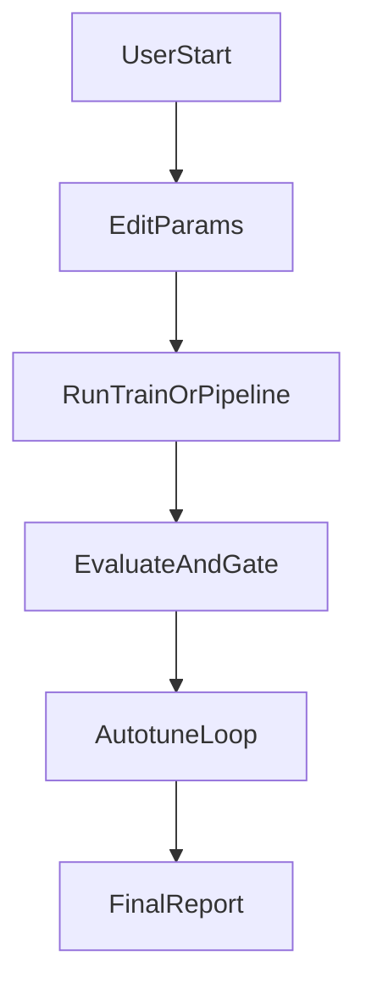
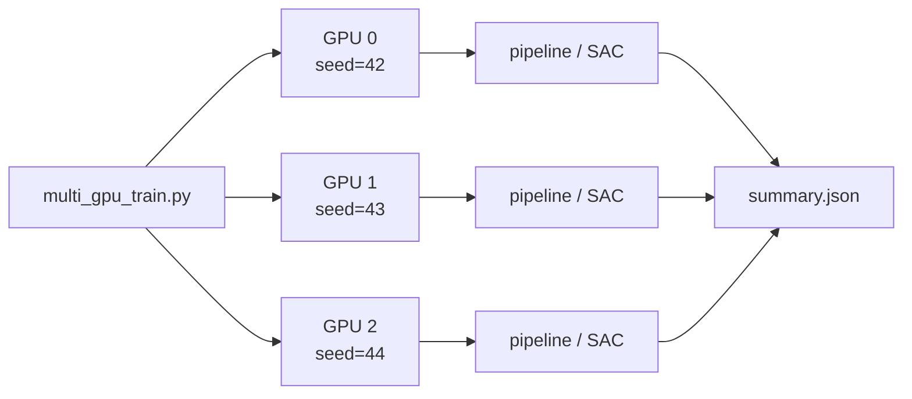
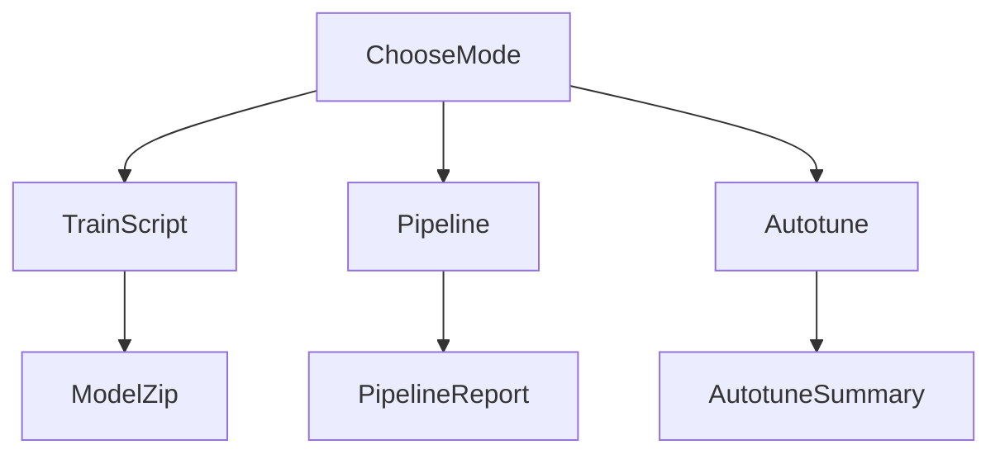

# Ship3DOF 使用说明（中文）

本文档面向本仓库 `ShipPathTracking3DOF-v0` 的日常使用者，重点覆盖三件事：

- 如何修改船舶动力学参数（MMG、环境、奖励）
- 如何启动训练（单次训练 / 一键 pipeline / 3 小时自主调参）
- 如何修改训练参数（学习率、learning starts、batch size、网络规模、并行搜索）

对应实现文件：

- 环境与参数定义：`custom_envs/ship_3dof/config.py`
- 环境参数注入逻辑：`custom_envs/ship_3dof/env.py`
- 训练入口：`scripts/ship_3dof/train_ship_3dof.py`
- 一键 pipeline：`scripts/ship_3dof/run_known_mmg_pipeline.py`
- 自主调参：`scripts/ship_3dof/autotune_ship_3dof.py`
- RL 网络架构说明：`docs/guide/ship_3dof_rl_network_architecture_zh.md`
- RL 实现流程详解：`docs/guide/ship_3dof_rl_implementation_flow_zh.md`

## 1. 快速开始



### 1.1 最短可执行命令（单次 pipeline）

在宿主机任意目录执行（推荐绝对路径）：

```bash
docker run --rm -it --gpus all -e ACCEPT_EULA=Y \
  -v /home/elane/intelligent_shipping_ws/rl-baselines3-zoo:/workspace/rl-zoo \
  --entrypoint bash isaac-lab-base-koopman:v3.0 -lc "\
  cd /workspace/rl-zoo && \
  /isaac-sim/python.sh scripts/ship_3dof/run_known_mmg_pipeline.py \
    --python /isaac-sim/python.sh \
    --mmg-params scripts/ship_3dof/mmg_params_example.json \
    --generate-trials-if-missing \
    --run-tag exp_seed42 \
    --output-dir artifacts/ship_3dof/runs \
    --log-folder logs_pipeline \
    --phase-steps 600000 800000 1100000 \
    --learning-starts 5000 \
    --learning-rate 3e-4 \
    --train-freq 4 \
    --gradient-steps 4 \
    --batch-size 512 \
    --net-arch 512,512,512 \
    --eval-episodes 50 \
    --shadow-episodes 100 \
    --seed 42 \
    --device cuda"
```

### 1.2 三小时自主调参命令

```bash
docker run --rm -it --gpus all -e ACCEPT_EULA=Y \
  -v /home/elane/intelligent_shipping_ws/rl-baselines3-zoo:/workspace/rl-zoo \
  --entrypoint bash isaac-lab-base-koopman:v3.0 -lc "\
  cd /workspace/rl-zoo && \
  /isaac-sim/python.sh scripts/ship_3dof/autotune_ship_3dof.py \
    --python /isaac-sim/python.sh \
    --mmg-params scripts/ship_3dof/mmg_params_example.json \
    --generate-trials-if-missing \
    --hours 3 \
    --max-parallel 2 \
    --jobs-per-gpu 2 \
    --batch-size 512 \
    --net-arch 768,768,768 \
    --phase-steps 40000 50000 70000 \
    --eval-episodes 12 \
    --shadow-episodes 15 \
    --learning-starts-space 1000 3000 5000 8000 \
    --learning-rate-space 8e-5 1e-4 2e-4 3e-4 5e-4 \
    --train-freq-space 2 4 8 16 \
    --gradient-steps-space 2 4 8 16 \
    --seed-offsets 0 7 13 \
    --elite-count 8 \
    --device cuda \
    --output-root artifacts/ship_3dof/autotune_5070ti_768 \
    --log-root logs_autotune_5070ti_768"
```

### 1.3 服务器部署（推荐脚本）

代码上传到服务器后，使用项目根目录的绝对路径做 **bind mount**（不要用 Docker 命名卷）。

**SSH 开发容器**（基于本地 `isaac-lab-base-koopman:v3.0`，SSH + Jupyter + TensorBoard）：

```bash
cd /home/lijiming/rl-baselines3-zoo   # 换成你的服务器路径

# 1. 导入基础镜像（首次，从 tar 包）
docker load -i isaac-lab-base-koopman_v3.0.tar
# 或: ./scripts/load_isaac_image.sh

# 2. 创建 SSH 容器（自动在本地 isaac 镜像上构建 isaac-lab-ssh:v3.0，无需外网）
./scripts/create_ssh_container.sh create

# 3. 查看连接信息
./scripts/create_ssh_container.sh status

# 4. 从你的电脑 SSH 进入容器（isaac 环境默认用户 root）
ssh root@<服务器IP> -p 2222
# 默认密码: ship3dof

# 5. 进入容器后启动训练
cd /workspace/rl-zoo
/isaac-sim/python.sh scripts/ship_3dof/run_known_mmg_pipeline.py \
  --python /isaac-sim/python.sh \
  --mmg-params scripts/ship_3dof/mmg_params_example.json \
  --generate-trials-if-missing \
  --run-tag exp_seed42 \
  --device cuda
```

> 有外网的环境仍可使用完整远程桌面镜像：`IMAGE=ship3dof-remote:latest ./scripts/create_ssh_container.sh create`

**一次性训练**（`isaac-lab-base-koopman:v3.0`，适合后台长时间跑）：

```bash
cd /home/lijiming/rl-baselines3-zoo

# 前台运行
./scripts/ship_3dof/run_ship3dof_pipeline.sh

# 后台运行
./scripts/ship_3dof/run_ship3dof_pipeline.sh --detach --run-tag exp_seed42
tail -f /tmp/ship3dof_exp_seed42.log

# 指定项目路径（脚本默认自动检测，也可手动覆盖）
PROJECT_DIR=/home/lijiming/rl-baselines3-zoo \
  ./scripts/ship_3dof/run_ship3dof_pipeline.sh --detach
```

**容器管理命令：**

| 命令 | 功能 |
|------|------|
| `./scripts/create_ssh_container.sh create` | 创建/启动 SSH 容器 |
| `./scripts/create_ssh_container.sh stop` | 停止 |
| `./scripts/create_ssh_container.sh restart` | 重启 |
| `./scripts/create_ssh_container.sh destroy` | 删除 |
| `./scripts/create_ssh_container.sh shell` | 不通过 SSH，直接 exec 进入 |

### 1.4 多 GPU 并行训练

Ship3DOF 的多卡方案是 **多任务并行**（每张 GPU 跑一个独立 SAC 或 pipeline），通过 `CUDA_VISIBLE_DEVICES` 分配，不是单模型数据并行。



**宿主机直接运行**（SSH 容器内或服务器裸机均可）：

```bash
cd /home/lijiming/rl-baselines3-zoo

# 冒烟测试（短步数，验证多卡调度）
./scripts/ship_3dof/run_multi_gpu.sh --smoke

# 2 卡各跑 1 个 SAC 训练（seed 自动递增）
GPUS=0,1 ./scripts/ship_3dof/run_multi_gpu.sh --mode sac

# 4 卡各跑 1 个完整 pipeline（指定 seed）
GPUS=0,1,2,3 SEEDS=42,43,44,45 MODE=pipeline \
  ./scripts/ship_3dof/run_multi_gpu.sh

# 2 卡每卡 2 个任务（共 4 并行）
GPUS=0,1 JOBS_PER_GPU=2 MODE=pipeline \
  ./scripts/ship_3dof/run_multi_gpu.sh --detach
tail -f /tmp/ship3dof_multi_gpu.log
```

**Docker 容器运行**（`isaac-lab-base-koopman:v3.0`）：

```bash
GPUS=0,1 MODE=pipeline ./scripts/ship_3dof/run_multi_gpu_docker.sh --detach
tail -f /tmp/ship3dof_multi_gpu.log
```

**输出目录：**

| 路径 | 内容 |
|------|------|
| `artifacts/ship_3dof/multi_gpu/summary.json` | 所有任务汇总 |
| `artifacts/ship_3dof/multi_gpu/run_logs/*.log` | 各任务日志 |
| `artifacts/ship_3dof/multi_gpu/runs/<run-tag>/` | pipeline 模式报告 |
| `logs_multi_gpu/<run-tag>/` | 各任务训练日志 |

**K8s 提交：**

```bash
./scripts/k8s_deploy.sh multi-gpu
```

## 2. 参数修改（动力学 / 环境 / 奖励）

### 2.1 修改船舶 MMG 动力学参数

推荐方式：修改 JSON 文件并通过 `--mmg-params` 注入，不直接改代码默认值。

示例文件：`scripts/ship_3dof/mmg_params_example.json`

```json
{
  "mmg_params": {
    "m_u": 35.0,
    "m_v": 45.0,
    "i_z": 18.0,
    "x_u": -6.5,
    "x_uu": -2.2,
    "x_n": 1.4,
    "y_v": -14.0,
    "y_r": 3.5,
    "y_vv": -20.0,
    "y_delta": 22.0,
    "n_v": -2.0,
    "n_r": -7.5,
    "n_rr": -5.5,
    "n_delta": 13.0
  }
}
```

参数注入逻辑在 `custom_envs/ship_3dof/env.py` 的 `_resolve_mmg_params()`，优先读取 `mmg_params_path`。

### 2.2 修改环境参数与奖励权重

集中定义在 `custom_envs/ship_3dof/config.py`：

- `EnvironmentConfig`：仿真步长、航道宽度、路径长度、噪声等
- `RewardWeights`：进度奖励、横向误差惩罚、平滑惩罚、安全惩罚等
- `ActuatorLimits`：舵角/转速的上下限与变化率

你可以：

- 直接调整 dataclass 默认值（全局生效）
- 或在构造环境时通过 `config` / `reward` 字典局部覆盖

### 2.3 修改课程难度策略

课程难度逻辑在 `custom_envs/ship_3dof/env.py`：

- `_select_stage()`：分段定义 stage0/1/2
- `_setup_episode_randomization()`：域随机、扰动估计噪声
- `_build_path()`：路径曲率
- `_reset_state()`：初始状态分布

## 3. 训练启动方式



### 3.1 方式 A：直接训练脚本

```bash
python3 /home/elane/intelligent_shipping_ws/rl-baselines3-zoo/scripts/ship_3dof/train_ship_3dof.py \
  --python /isaac-sim/python.sh \
  --log-folder /home/elane/intelligent_shipping_ws/rl-baselines3-zoo/logs_manual \
  --mmg-params /home/elane/intelligent_shipping_ws/rl-baselines3-zoo/scripts/ship_3dof/mmg_params_example.json \
  --phase-steps 600000 800000 1100000 \
  --learning-starts 5000 \
  --learning-rate 3e-4 \
  --train-freq 4 \
  --gradient-steps 4 \
  --batch-size 512 \
  --net-arch 512,512,512 \
  --seed 42 \
  --device cuda
```

### 3.2 方式 B：一键 pipeline（推荐）

优点是自动串起 M1/M2/M3/M4，输出单个 `pipeline_report.json`。

### 3.3 方式 C：自主调参

适合离线批量搜索，自动写每轮优化文档与最终汇总。

## 4. 训练参数调优建议

### 4.1 参数意义

- `learning_starts`：开始更新策略前收集的样本步数
- `learning_rate`：优化器步长
- `train_freq` / `gradient_steps`：采样与更新比
- `batch_size`：每次梯度更新使用的样本数，常用 `256/512/1024`
- `net_arch`：策略/价值网络隐藏层规模（如 `512,512,512`）

### 4.2 保守配置（先稳定）

- `learning_starts=5000`
- `learning_rate=2e-4` 或 `3e-4`
- `train_freq=4`
- `gradient_steps=4`
- `batch_size=256` 或 `512`
- `net_arch=512,512,512`

### 4.3 激进配置（冲吞吐）

- `learning_starts=1000~3000`
- `learning_rate=3e-4~5e-4`
- `train_freq=8~16`
- `gradient_steps=8~16`
- `batch_size=512~1024`
- `net_arch=768,768,768` 或 `1024,1024,1024`

## 5. 结果读取（M1~M4 与目录）

### 5.1 单次 pipeline 输出

目录示例：`artifacts/ship_3dof/runs/<run-tag>/`

- `pipeline_report.json`：总报告（含 `balanced_score`）
- `mmg_baseline_report.json`：M1
- `residual_metrics.json`：M2
- `eval_metrics.json`：M3
- `shadow_mode_report.json`：M4

### 5.2 自主调参输出

目录示例：`artifacts/ship_3dof/autotune_5070ti_768/`

- `run_logs/*.log`：每个候选的执行日志
- `runs/<run-tag>/pipeline_report.json`：每次候选结果
- `optimization_reports/iteration_*.md`：每轮文档
- `autotune_summary.json`：最终汇总（仅结束后生成）

## 6. 常见问题

### 6.1 GPU 利用率高但功耗不到上限

这是 RL 任务常见情况：环境步进常常是 CPU 瓶颈，GPU 不一定满功耗。

### 6.2 为什么 `autotune_summary.json` 一开始不存在

该文件只在 autotune 全部结束后写出；运行中请看 `run_logs` 和 `optimization_reports`。

### 6.3 日志文件归属是 root，宿主机不好改

运行一次性训练容器时加：`--user $(id -u):$(id -g)`。

SSH 开发容器创建时也可指定用户映射：

```bash
# 在 create_ssh_container.sh 的 docker run 中追加 --user $(id -u):$(id -g)
```

### 6.4 训练被误中断怎么办

检查是否还有进程在跑（`ps -ef | rg autotune_ship_3dof.py`），没有则按原命令重启。

### 6.5 卷挂载陷阱：`No such file or directory`

错误示例（命名卷，默认是空的）：

```bash
-v rl-baselines3-zoo:/workspace/rl-zoo   # 错误：这是 Docker 命名卷，不是宿主机目录
```

正确示例（bind mount，挂载服务器上的项目目录）：

```bash
-v /home/lijiming/rl-baselines3-zoo:/workspace/rl-zoo   # 正确
```

验证挂载是否正常：

```bash
docker run --rm -it --gpus all \
  -v /home/lijiming/rl-baselines3-zoo:/workspace/rl-zoo \
  --entrypoint bash isaac-lab-base-koopman:v3.0 -lc \
  "ls -la /workspace/rl-zoo/scripts/ship_3dof/run_known_mmg_pipeline.py"
```

### 6.6 Docker 镜像拉取 403（离线服务器）

**现象：**

```
ERROR: pytorch/pytorch:2.5.1-cuda12.4-cudnn9-runtime: 403 Forbidden
```

**原因：** 服务器 Docker 配置了镜像加速（如阿里云），但无法代理 `pytorch/pytorch` 镜像。`create_ssh_container.sh` 旧版默认构建 `ship3dof-remote`（依赖 pytorch 基础镜像）。

**解决方案（推荐）：** 使用已导入的 `isaac-lab-base-koopman:v3.0`：

```bash
# 导入 tar
docker load -i isaac-lab-base-koopman_v3.0.tar

# 创建 SSH 容器（默认构建 isaac-lab-ssh:v3.0，完全本地）
./scripts/create_ssh_container.sh create
```

手动构建 SSH 层：

```bash
./scripts/build_docker_ship3dof.sh isaac-ssh
```
