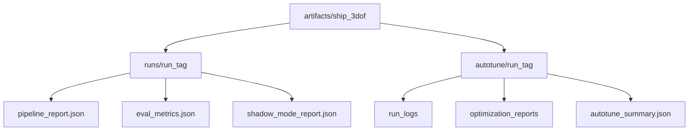

 # 船舶 3 自由度工作流程

完整的中文演练请参见：
[`docs/guide/ship_3dof_user_manual_zh.md`](docs/guide/ship_3dof_user_manual_zh.md)

原理级技术报告（构建流程图、奖励函数设计、数学推导）请参见：
[`docs/guide/ship_3dof_technical_report_zh.md`](docs/guide/ship_3dof_technical_report_zh.md)

**可单独部署到服务器的独立包**（含 Docker、例程、说明）：
[`ship3dof_standalone/`](../../../ship3dof_standalone/README.md)（位于 `intelligent_shipping_ws/ship3dof_standalone`）

## 服务器部署

代码上传到服务器后，推荐使用以下脚本（详见用户手册 §1.3）：

| 脚本 | 用途 |
|------|------|
| [`../../scripts/create_ssh_container.sh`](../../scripts/create_ssh_container.sh) | 创建 SSH 开发容器（默认 `isaac-lab-ssh:v3.0`） |
| [`../../scripts/load_isaac_image.sh`](../../scripts/load_isaac_image.sh) | 从 tar 导入 `isaac-lab-base-koopman:v3.0` |
| [`run_ship3dof_pipeline.sh`](run_ship3dof_pipeline.sh) | 一次性 pipeline 训练（`isaac-lab-base-koopman:v3.0`） |
| [`run_multi_gpu.sh`](run_multi_gpu.sh) | 多 GPU 并行训练（宿主机 / SSH 容器内） |
| [`run_multi_gpu_docker.sh`](run_multi_gpu_docker.sh) | 多 GPU 并行训练（Docker 容器） |
| [`multi_gpu_train.py`](multi_gpu_train.py) | 多 GPU 调度核心脚本 |

```bash
# 导入 isaac 基础镜像（离线服务器）
docker load -i isaac-lab-base-koopman_v3.0.tar

# SSH 开发容器
./scripts/create_ssh_container.sh create
ssh root@<服务器IP> -p 2222

# 一次性训练（后台）
./scripts/ship_3dof/run_ship3dof_pipeline.sh --detach

# 多 GPU 并行（2 卡 pipeline）
GPUS=0,1 MODE=pipeline ./scripts/ship_3dof/run_multi_gpu.sh --detach
```

## 1）准备试验数据

- 收集直线加速/减速、转弯（两侧）、之字形和可选的螺旋测试。
- 将每次运行导出为包含列的 CSV：
ZXQ掩码0X
- 使用 `trial_template.csv` 作为架构参考。
- 如果您还没有重播日志，请引导综合试验：

```bash
python3 scripts/ship_3dof/generate_mmg_trials.py \
  --mmg-params scripts/ship_3dof/mmg_params_example.json \
  --output-dir artifacts/ship_3dof/trials
```

## 1.5) 验证已知的MMG参数（M1门）

```bash
python3 scripts/ship_3dof/check_mmg_baseline.py \
  --mmg-params scripts/ship_3dof/mmg_params_example.json \
  --trials artifacts/ship_3dof/trials/*.csv \
  --output artifacts/ship_3dof/mmg_baseline_report.json
```

## 2) 识别 MMG 和 Nomoto 先验

```bash
python3 scripts/ship_3dof/identify_mmg.py \
  --trials data/trials/*.csv \
  --output artifacts/ship_3dof/identification_result.json \
  --params-yaml artifacts/ship_3dof/mmg_params.json
```

## 3）拟合残差网络

```bash
python3 scripts/ship_3dof/train_residual.py \
  --trials data/trials/*.csv \
  --mmg-params artifacts/ship_3dof/mmg_params.json \
  --output artifacts/ship_3dof/residual_model.npz
```

该脚本还将验证指标写入：
`artifacts/ship_3dof/residual_metrics.json`。

## 4) 培训 SAC 政策

```bash
python3 scripts/ship_3dof/train_ship_3dof.py \
  --log-folder logs \
  --seed 42 \
  --mmg-params scripts/ship_3dof/mmg_params_example.json \
  --learning-starts 5000 \
  --learning-rate 3e-4 \
  --train-freq 4 \
  --gradient-steps 4 \
  --batch-size 512 \
  --net-arch 512,512,512
```

该脚本自动运行课程阶段：

1. 没有打扰
2. 启用干扰
3. 干扰+传感器噪声+执行器滞后

## 5) 评估和阴影模式

```bash
python3 scripts/ship_3dof/evaluate_ship_3dof.py \
  --model logs/sac/ShipPathTracking3DOF-v0_1/ShipPathTracking3DOF-v0.zip \
  --mmg-params scripts/ship_3dof/mmg_params_example.json

python3 scripts/ship_3dof/run_shadow_mode.py \
  --model logs/sac/ShipPathTracking3DOF-v0_1/ShipPathTracking3DOF-v0.zip \
  --mmg-params scripts/ship_3dof/mmg_params_example.json
```

使用 `sim2real_acceptance.json` 控制从重播到有限接管的进程。

## 单一命令管道

```bash
python3 scripts/ship_3dof/run_known_mmg_pipeline.py \
  --mmg-params scripts/ship_3dof/mmg_params_example.json \
  --generate-trials-if-missing \
  --run-tag exp_seed42 \
  --output-dir artifacts/ship_3dof/runs \
  --log-folder logs_pipeline \
  --phase-steps 20000 20000 30000 \
  --learning-starts 5000 \
  --learning-rate 3e-4 \
  --train-freq 4 \
  --gradient-steps 4 \
  --batch-size 512 \
  --net-arch 512,512,512 \
  --eval-episodes 30 \
  --shadow-episodes 50
```

每次运行都会将隔离的工件写入：
`artifacts/ship_3dof/runs/<run-tag>/`。

## 3小时自主调校

```bash
python3 scripts/ship_3dof/autotune_ship_3dof.py \
  --mmg-params scripts/ship_3dof/mmg_params_example.json \
  --generate-trials-if-missing \
  --hours 3 \
  --max-parallel 0 \
  --jobs-per-gpu 2 \
  --batch-size 512 \
  --phase-steps 80000 100000 140000 \
  --eval-episodes 30 \
  --shadow-episodes 50 \
  --output-root artifacts/ship_3dof/autotune \
  --log-root logs_autotune
```

自动调谐输出布局：
- 每次运行报告：`artifacts/ship_3dof/autotune/runs/<run-tag>/pipeline_report.json`
- 迭代文档：`artifacts/ship_3dof/autotune/optimization_reports/iteration_*.md`
- 最终总结：`artifacts/ship_3dof/autotune/autotune_summary.json`

## 参数快速参考

- 动态和奖励默认值：
ZXQ掩码0X
- MMG JSON 注入：
`custom_envs/ship_3dof/env.py` (`mmg_params_path`)
- 训练超参数：
ZXQ掩码0X
  - ZXQ掩码0X
  - ZXQ掩码0X
  - ZXQ掩码0X
  - ZXQ掩码0X
  - `--batch-size`（推荐：`256/512/1024`）
  - ZXQ掩码0X

## 输出目录布局


